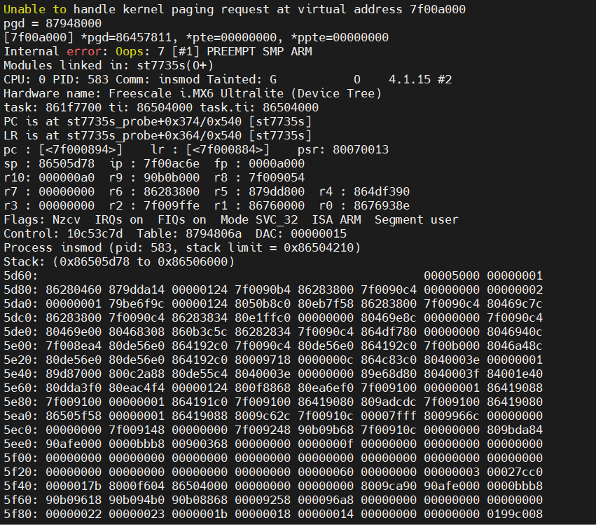

### *-gpios & gpiod_set_value

移植`st7735s`时发现的问题：电平一直不对，`gpiod_set_value`和实测值相反，只有dc引脚设置对应到了，然后对比了一下`dc`引脚和`cs、rst`引脚，发现设备树上如下的第三个参数有差别。

```
cs-gpios = <&gpio3 26 GPIO_ACTIVE_LOW>;

reset-gpios = <&gpio4 23 GPIO_ACTIVE_LOW>；

dc-gpios = <&gpio4 24 GPIO_ACTIVE_HIGH>;
```

都修改成HIGH后正常，原因：设置高电平为有效电平，在`gpiod_set_value`时有个对应设置0/1，其实时对照着有效电平，1为有效。所以按照正常通信需要设置为`GPIO_ACTIVE_HIGH`，不过如果类似`rs232`这种`-3——-15V`为1的需要自己根据判断来设置有效电平

不过图形显示还是有`bug`，全屏显示出现`segmentation fault` ，`oops`  虚拟地址访问出错？



修改`sem_len`？

```
https://blog.csdn.net/yueqian_scut/article/details/50429113//frambuffer框架
https://blog.csdn.net/lee_jimmy/article/details/85919114//解决方案及应用编程
https://blog.csdn.net/manshq163com/article/details/18451135//dma方案
```

### unable to handle kernel paging request at preempt   kernel oops   Segment user

1. 内存访问出错，用了空指针，指针越界，野指针
2. 试图修改`const`变量
3. 仔细分析一下例如`include/asm-arm/arch-s3c2410/map.h`这个文件，就知道这个文件定义了许多硬件的物理地址和虚拟地址，如果虚拟地址分配时重复，则会导致硬件请求虚拟地址不成功

```
https://blog.csdn.net/dearbaba_1666/article/details/80610945
https://www.zhihu.com/question/530997689

```

`addr2line`、`gdb`、`objdump`三种方法

```
https://linux-kernel-labs.github.io/refs/heads/master/lectures/debugging.html#decoding-an-oops-panic
```

- `addr2line`：定位到出错的文件和行
- `objdump`：反汇编定义到发生位置前后
- `gdb`：自己去调式发生错误所在位置

**注意：还有另一种`Segment kernel`  调式方式不一样**

## 教训

1. 首先需要确定原理图、硬件规格书，和实物对照，最好提前意识到可能出错的点，标注出来，如果可能损坏器件的地方，更需要提前在草稿纸上标注
2. 其次需要多尝试，怎样在最小损耗的条件下最接近真实目的。
2. 空指针、越界问题也会引起segment fault