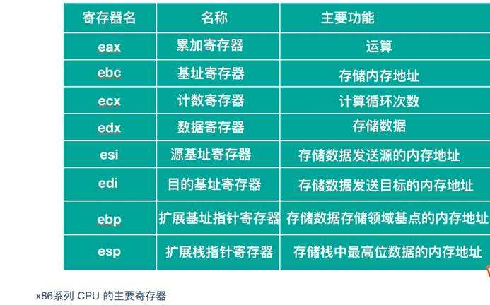
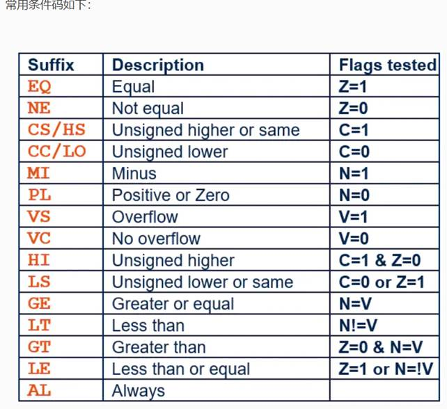

反汇编：


`$(CROSS_COMPILE)objdump -S` 

```
TEXT segment dword public use32 'CODE'

_TEXT ends

_DATA segment dword public use32 'DATA'

_DATA ends

_BSS segment dword public use32 'BSS'

_BSS ends

Segment和ends围起来的称为段定义，段定义是一段连续的内存空间。

_TEXT是被指定（代码段）的段定义，_DATA是有初始化的段定义，_BSS是未初始化的段定义。
```


## X86

### 寄存器



普通寄存器：AX BX CX DX

段寄存器：CS（代码段） DS（数据段） SS（栈段） ES（附加段）

SS：SP栈顶指针

CS：IP当前执行代码地址


### 精简指令集



## ARM

```
https://www.jianshu.com/p/d5a35a659d7f
```

### 寄存器

R0~R7：通用寄存器

R8~R12：16位不可用，Thumb不可见，Thumb2可见

R13：SP；堆栈指针 MSP PSP

R14：LR；链接指针  R14、R14_svc、R14_abt、R14_und、R14_irq、R14_fiq（如SP、R8-R12也有这些状态，具体还要查看内核指南）

R15：PC；程序计数器，指向下一个要运行的指令

XPSR：状态寄存器（CPSR 当前状态   SPSR：5组备份状态）

### 精简指令集

**注意：操作系统位数**

#### 数据传输指令语法

```
CMD{cond}  Rn{!}, reglist{^}

CMD  为命令有LDM*/STM* 
cond  为条件码（可选）
Rn    为基址寄存器
{!}   可选后缀，选用后缀后表示请求回写，即当数据传输完成后将最后的地址写入到基址寄存器Rn中，不选用则基址寄存器内容不改变
{^}  该后缀表示后面的寄存器都是用户模式下的寄存器；其次当CMD为LDM且寄存器列表中包含R5（PC）时，除正常传输数据还需要将SPSR复制到CPSR
```

#### LDR

`LDR{条件} 目的寄存器，<存储器地址>`

用于将内存或缓冲区数据传入寄存器

 `ldr r0,[r1,#4]` ;`r0 <- [r1+0]`

```
LDR指令用于从存储器中将一个32位的字数据传送到目的寄存器中。该指令通常用于从存储器中读取32位的字数据到通用寄存器，然后对数据进行处理。当程序计数器PC作为目的寄存器时，指令从存储器中读取的字数据被当作目的地址，从而可以实现程序流程的跳转。该指令在程序设计中比较常用，且寻址方式灵活多样，请读者认真掌握。

LDR r, label  和 LDR r, =label的区别：

LDR r, =label
会把label表示的值加载到寄存器中。

LDR r, label
会把label当做地址，把label指向的地址中的值加载到寄存器中。譬如 label的值是 0x8000， LDR r, =label会将 0x8000加载到寄存器中，而LDR r, label则会将内存0x8000处的值加载到寄存器中。

指令示例：

LDR   R0，[R1]                  ；将存储器地址为R1的字数据读入寄存器R0。

LDR   R0，[R1，R2]             ；将存储器地址为R1+R2的字数据读入寄存器R0。

LDR   R0，[R1，＃8]             ；将存储器地址为R1+8的字数据读入寄存器R0。

LDR   R0，[R1，R2] ！           ；将存储器地址为R1+R2的字数据读入寄存器R0，并将新地址R1＋R2写入R1。

LDR   R0，[R1，＃8] ！          ；将存储器地址为R1+8的字数据读入寄存器R0，并将新地址R1＋8写入R1。

LDR   R0，[R1]，R2              ；将存储器地址为R1的字数据读入寄存器R0，并将新地址R1＋R2写入R1。

LDR   R0，[R1，R2，LSL＃2]！   ；将存储器地址为R1＋R2×4的字数据读入寄存器R0，并将新地址R1＋R2×4写入R1。

LDR   R0，[R1]，R2，LSL＃2     ；将存储器地址为R1的字数据读入寄存器R0，并将新地址R1＋R2×4写入R1。
```

##### ADR 和 ADRL 伪指令

```
ADR 和 ADRL 伪指令用于将一个地址加载到寄存器中。

ADR为小范围的地址读取伪指令。ADR指令将基于PC相对偏移的地址值读取到寄存器中。在汇编编译源程序时，ADR伪指令被编译器替换在一条合适的指令，通常，编译器用一条ADD指令或SUB指令来实现该ADR伪指令的功能，若不能使用一条指令实现，则产生错误。其能加载的地址范围，当为字节对齐时，是-1020~1020，当为非字对齐时在-255~255之间。

ADRL是中等范围的地址读取指令。会被编译器翻译成两条指令。如果不能用两条指令表示，则产生错误。

ADRL能加载的地址范围当为非字节对齐时是-64K~64K之间；当为字节对齐时是-256K~256K之间。
```

##### LDRB

`LDR{条件}B 目的寄存器，<存储器地址>`

```
用于从存储器中将一个8位的字节数据传送到目的寄存器中，同时将寄存器的高24位清零。
该指令通常用于从存储器中读取8位的字节数据到通用寄存器，然后对数据进行处理。
当程序计数器PC作为目的寄存器时，指令从存储器中读取的字数据被当作目的地址，从而可以实现程序流程的跳转。
```

##### LDRH

`LDR{条件}H 目的寄存器，<存储器地址>`

```
用于从存储器中将一个16位的半字数据传送到目的寄存器中，同时将寄存器的高16位清零。
该指令通常用于从存储器中读取16位的半字数据到通用寄存器，然后对数据进行处理。
当程序计数器PC作为目的寄存器时，指令从存储器中读取的字数据被当作目的地址，从而可以实现程序流程的跳转。
指令示例：

LDRH R0，[R1]         ；将存储器地址为R1的半字数据读入寄存器R0，并将R0的高16位清零。

LDRH R0，[R1，＃8]    ；将存储器地址为R1＋8的半字数据读入寄存器R0，并将R0的高16位清零。

LDRH R0，[R1，R2]    ；将存储器地址为R1＋R2的半字数据读入寄存器R0，并将R0的高16位清零。
```

##### LDM

```
L的含义仍然是LOAD，即是Load from memory into register。

虽然貌似是LDR的升级，但是，千万要注意，这个指令运行的方向和LDR是不一样的，是从左到右运行的。该指令是将内存中堆栈内的数据，批量的赋值给寄存器，即是出栈操作；其中堆栈指针一般对应于SP，注意SP是寄存器R13，实际用到的却是R13中的内存地址，只是该指令没有写为[R13]，同时，LDM指令中寄存器和内存地址的位置相对于前面两条指令改变了，下面的例子：

LDMFD     SP! ,   {R0, R1, R2}

实际上可以理解为：    LDMFD     [SP]!,    {R0, R1, R2}

意思为：把sp指向的3个连续地址段（应该是3*4=12字节（因为为r0,r1,r2都是32位））中的数据拷贝到r0,r1,r2这3个寄存器中去。
```


#### STR 

`STR{条件} 源寄存器，<存储器地址>`

用于将寄存器中传入内存或者缓冲区

 `str r0,[r1,#0]` ;`r0 -> [r1+0]`

```
LDR是内存数据放到寄存器，即装载，是读  
STR是寄存器数据放到内存，即存储，是写
```

##### STRB

`STR{条件}B 源寄存器，<存储器地址>`

```
STRB指令用于从源寄存器中将一个8位的字节数据传送到存储器中。该字节数据为源寄存器中的低8位。

指令示例：

STRB R0，[R1]         ；将寄存器R0中的字节数据写入以R1为地址的存储器中。

STRB R0，[R1，＃8]    ；将寄存器R0中的字节数据写入以R1＋8为地址的存储器中。
```

##### STRH

`STR{条件}B 源寄存器，<存储器地址>`

```
STRH指令用于从源寄存器中将一个16位的半字数据传送到存储器中。该半字数据为源寄存器中的低16位。

指令示例：

STRH R0，[R1]         ；将寄存器R0中的半字数据写入以R1为地址的存储器中。

STRH R0，[R1，＃8]    ；将寄存器R0中的半字数据写入以R1＋8为地址的存储器中。
```

##### STM

```
S的含义仍然是STORE，与LDM是配对使用的，其指令格式上也相似，即区别于STR，是将堆栈指针写在左边，而把寄存器组写在右边。

   STMFD      SP!,   {R0}

同样的，该指令也可理解为：  STMFD      [SP]!,   {R0}

意思是：把R0保存到堆栈（sp指向的地址）中。
```

#### LDM和STM

```
根据调用规则ATPCS，程序一般都使用FD（FullDescending）类型的数据栈（满栈），那么对立的就由空栈类型的数据栈。空栈是指SP操作完后指向的地址空间是未使用的，反之满栈就是SP指向的地址已经使用了。所以对应到压栈出站时的操作就有一点点不一样。如果是满栈模型则会先执行栈指针的操作后在向栈指针指向的位置写入，反之就是先写入在移动栈指针。
```

LDM和STM还分为两种情况，一种是普通数据传送，还有一个是用于堆栈的操作时。

普通数据传输过程中使用IA IB DA DB区别基址的移动方向，其中A和B分别表示befor和after，I和D分别表示Increment和Decrement。

```
xxxIA     传送后地址增加4
xxxIB     传送前地址增加4 
xxxDA     传送后地址减少4
xxxDB     传送前地址减少4 
```

用于堆栈时用FD，ED，FA，EA来区别栈操作的方式其实就是区别一下方式是相同的。F表示Full （满栈）而E表示Empty(空栈)。A表示Ascenging（递增），D表示Descending（递减）。组合起来就是：

```
xxxFD  满栈递减栈（ARM核通常时这种）
xxxFA   满栈递增栈
xxxED  满栈递减栈
xxxEA  空栈递增栈
```

总结一下就是如下：

```
LD : load 加载，出栈操作
ST : store 存储，入栈操作
M : multi 多次
F: full 满栈，SP指向最后一个数据
E: empty 空栈，SP指向与最后一个数据相邻的下一个可写入存储单元
D: descending 递减，代表栈的增长方向
A: ascending 递增，代表栈的增长方向
```

示例

```
STMFD  SP，｛R0-R3｝

；执行伪指令大致是：
；SP-4  = R3
；SP-8  = R2
；SP-12 = R1
；SP-16 = R0
；SP 的值未修改。

LDMFD  SP，｛R0-R3｝
；执行伪指令大致是：
；R3 = SP-4  
；R2 = SP-8  
；R1 = SP-12
；R0 = SP-16 
；SP 的值未修改。

STMFD  SP！，｛R0-R3｝
；执行伪指令大致是：
；SP-=4 
；SP = R3
；SP-=4 
；SP= R2
；SP-=4 
；SP= R1
；SP-=4 
；SP = R0
；SP-=4 
；SP 的值已修改。

STMED  SP！，｛R0-R3｝
；执行伪指令大致是：
；SP = R3
；SP-=4 
；SP= R2
；SP-=4 
；SP= R1
；SP-=4 
；SP = R0
；SP-=4 
；SP 的值已修改。
```

#### MRS

`MRS{条件}  通用寄存器，程序状态寄存器（CPSR或SPSR）`

将CPSR/SPSR（程序状态寄存器/程序状态保护寄存器）的内容读取到通用寄存器中 

`MRS  R1，CPSR`  ;`r1 <- [CPSR]`

```
Ⅰ.当需要改变程序状态寄存器的内容时，可用MRS将程序状态寄存器的内容读入通用寄存器，修改后再写回程序状态寄存器。
Ⅱ.当在异常处理或进程切换时，需要保存程序状态寄存器的值，可先用该指令读出程序状态寄存器的值，然后保存。
指令示例：
MRS R0，CPSR  @传送CPSR的内容到R0
MRS R0，SPSR  @传送SPSR的内容到R0
```

#### MSR

`MSR{条件}  程序状态寄存器（CPSR或SPSR）_<域>，操作数`

 将通用寄存器的值写到CPSR/SPSR的特定位域（f，c）中

`MSR CPSR，R0`   ;`[CPSR] <- r0`

```
MSR指令用亍将操作数的内容传送到程序状态寄存器的特定域中。其中，操作数可以为通用寄存器或立即数。<域>用于设置程序状态寄存器中需要操作的位，32位的程序状态寄存器可分为4个域：
位[31：24]为条件标志位域，用f表示；
位[23：16]为状态位域，用s表示；
位[15：8]为扩展位域，用x表示；
位[7：0]为控制位域，用c表示；

该指令通常用于恢复或改变程序状态寄存器的内容，在使用时，一般要在MSR指令中指明将要操作的域。
指令示例：
MSR CPSR，R0    @传送R0的内容到CPSR
MSR SPSR，R0    @传送R0的内容到SPSR
MSR CPSR_c，R0   @传送R0的内容到SPSR，但仅仅修改CPSR中的控制位域
```

#### BIC

```
BIC指令的格式为： BIC{条件}{S}  目的寄存器，操作数1，操作数2

BIC指令用于清除操作数1的某些位，并把结果放置到目的寄存器中。

操作数1应是一个寄存器， 操作数2可以是一个寄存器、被移位的寄存器、或一个立即数。

操作数2为32位的掩码，如果在掩码中置了某一位1，则清除这一位。未设置的掩码位保持不变。

BIC  R0,R0,#0x1F

0x1F=0001 1111

含义：清除R0的bit[4:0]位
```

#### B

- 跳转指令
- BL 带返回的跳转指令
- BLX 带返回和状态切换的跳转指令
- BX 带状态切换的跳转指令

#### 条件码


