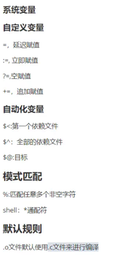

make可以找出修改过的文件，根据依赖关系，找出受影响的文件，最后根据规则单独编译这些文件。

makefile\Makefile:记录依赖关系和编译规则

makefile本质：面向依赖

三要素：目标、依赖、命令

目标：依赖的文件或者其他目标

<tab>命令1

<tab>命令2

<tab>命令3

<tab>……

.PHONY:targetb（指定伪目标）表示不需要targetb这一目标文件，保证每次执行就算改文件不修改也能执行，要执行创建的伪目标需要make target

make or make -f file

ifeq (a,b) or ifneq

else ifeq(a,b)

else

endif

函数：

$(filter pattern, text)  //在text中取出符合pattern格式的值

$(filter-out pattern, $(C))   //在text中取出不 符合pattern格式的值

$(patsubst %.c,%.o,x.c.c bar.c)

把x.c.c、bar.c改成x.c.o bar.o ，用来生成目标文件和依赖文件

 

$(notdir src/foo.c hacks)返回为  foo.c hacks 意为除去目录，经常用来生成目标文件

dirs := a b c d

files := $(foreach dir,$(dirs),$(wildcard $(dir)/*))

输出：a,b,c,d目录下的所有文件

foreach 用于多个目录的寻访  

wildcard用于找目录下的特定文件  wildcard dir/*.c or /*.h

链接问题   gcc -c *.c -o *.o -I include_dir(这里是目录不是文件)

D:\a_youwant\LINUX\100ask\01_all_series_quickstart\04_嵌入式Linux应用开发基础知识\source\05_general_Makefile\Makefile_and_readme

D:\a_youwant\LINUX\100ask\01_all_series_quickstart\04_嵌入式Linux应用开发基础知识\doc_pic\04.2018_Makefile
