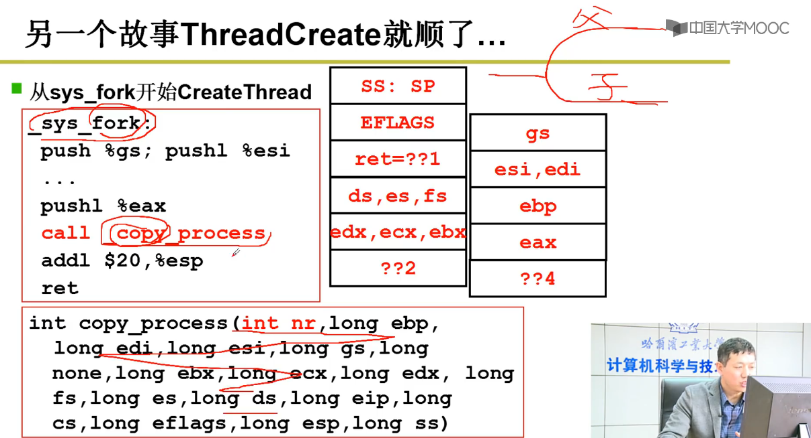

### 概念

是计算机硬件和应用之间的一层软件

- 方便我们使用硬件，如使用显存
- 高效的使用硬件，如开多个终端

### 管理

- CPU管理
- 内存管理
- 终端管理
- 磁盘管理
- 文件管理
- 网络管理
- 电源管理
- 多核管理

### 启动流程


ROM（BIOS） -> Bootloader(bootsect.s(读入)->setup.s（初始化）) -> system(head.s mem_init main OS code)  //**不是很懂是不是这样的表述，对应的阶段是否符合，而且第一个BIOS对应的不只是windows，而是一类通用模型**

linux: ROM -> u-boot -> kernel(dtb -> kernel) -> rootfs

### 接口（Interface）

连接两个东西、信号转换、屏蔽细节


### 用户态进入内核态

```
从用户态到内核态切换可以通过三种方式：

系统调用：其实系统调用本身就是中断，但是软件中断，跟硬中断不同。
异常： 当CPU正在执行运行在用户态的程序时，突然发生某些预先不可知的异常事件，这个时候就会触发从当前用户态执行的进程转向内核态执行相关的异常事件，典型的如缺页异常。
外设中断（硬中断）：当外围设备完成用户的请求操作后，会像CPU发出中断信号，此时，CPU就会暂停执行下一条即将要执行的指令，转而去执行中断信号对应的处理程序，如果先前执行的指令是在用户态下，则自然就发生从用户态到内核态的转换。
注意：

系统调用的本质其实也是中断，相对于外围设备的硬中断，这种中断称为软中断，这是操作系统为用户特别开放的一种中断，如Linux int 80h中断。
从触发方式和效果上来看，这三种切换方式是完全一样的，都相当于是执行了一个中断响应的过程。但是从触发的对象来看，系统调用是进程主动请求切换的，而异常和硬中断则是被动的。
```

#### 原理

DPL（destination privilege level）：目标特权层次

CPL：当前目标层次

当对方特权层次比自己更高时（0级别最高，层次最低），才可以访问。

进入GDT查表


Intel X86通过int 80从用户态进入内核态

进入IDT查表

#### GDT和LDT

```
https://blog.csdn.net/darmao/article/details/78981649
```


### CPU管理

进程控制块 PCB process control block

线程控制块 TCB thread control block

#### 进程管理


具有就绪队列、等待（阻塞）队列

#### 灵魂

队列操作+调度+切换


- getnext调度
  - fifo
  - priority
  - min_left_time
  - min_task
  - ......

- switch_to切换
  - 一般用汇编操作寄存器进行精细化操作


#### 线程管理

- 用户级线程是内核级线程的子部分。

- 用户级线程可以通过自己编写Yield实现线程切换，记得**保存LR等进入TCB中的STACK**。

- 进程只有内核级，没有用户级，因为进程占有资源

- 用户级线程：

  - 可以实现在不支持线程的操作系统中实现

  - 开销小,所以不需要线程回收

  - 切换效率高（不需要上下文切换、陷入内核）

  - 且允许每个进程都有自己定制的调度算法。

  - **缺点**：

  - 如何实现阻塞系统调用

  - 缺页中断引起页面故障后直接阻塞直到磁盘I/O完成

  - 阻塞后并不会切换其他线程、会一直占据（除非用时钟中断进入时间片轮转调度）一直到内核剥夺它的CPU或者它自己主动放弃（/滑稽）

    另外线程本身也可能需要时钟中断，可能会扰乱运行时系统使用的时钟（切换开销）。

- 内核级线程

  - 在阻塞时，可以切换到就绪队列，运行统一进程中的其它线程或者不同进程中的线程
  - 缺页中断内核会检查当前进程就绪队列找到就绪线程
  - **缺点：**
  - 开销大，所以需要线程回收


cmpl $0,state(%eax) 	//判断当前是否则塞，阻塞则重新分配

cmpl $0,counter(%eax)	//判断时间片是否用光，用光了则重新分配


TR：段寄存器

GDT：全局描述符表

- ```
  GDT可以被放在内存的任何位置，那么当程序员通过段寄存器来引用一个段描述符时，CPU必须知道GDT的入口，也就是基地址放在哪里，所以Intel的设计者门提供了一个寄存器GDTR用来存放GDT的入口地址，程序员将GDT设定在内存中某个位置之后，可以通过LGDT指令将GDT的入口地址装入此积存器，从此以后，CPU就根据此积存器中的内容作为GDT的入口来访问GDT了。
  ```

_TSS(n)找到下一个TCB切换到要运行的task





总结：


