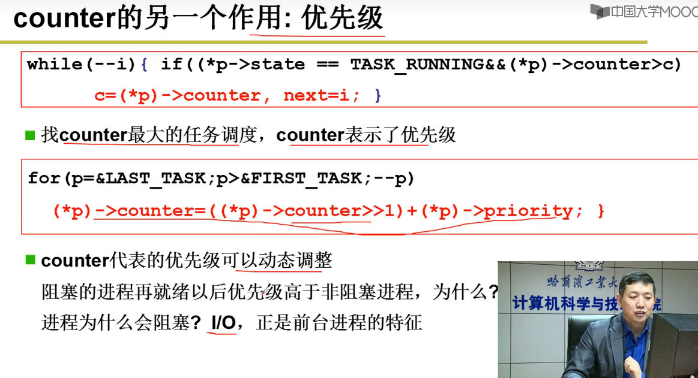

### 概念

是计算机硬件和应用之间的一层软件

- 方便我们使用硬件，如使用显存
- 高效的使用硬件，如开多个终端

### 管理

- CPU管理
- 内存管理
- 终端管理
- 磁盘管理
- 文件管理
- 网络管理
- 电源管理
- 多核管理

### 启动流程


ROM（BIOS） -> Bootloader(bootsect.s(读入)->setup.s（初始化）) -> system(head.s mem_init main OS code)  //**不是很懂是不是这样的表述，对应的阶段是否符合，而且第一个BIOS对应的不只是windows，而是一类通用模型**

linux: ROM -> u-boot -> kernel(dtb -> kernel) -> rootfs

### 接口（Interface）

连接两个东西、信号转换、屏蔽细节


### 用户态进入内核态

```
从用户态到内核态切换可以通过三种方式：

系统调用：其实系统调用本身就是中断，但是软件中断，跟硬中断不同。
异常： 当CPU正在执行运行在用户态的程序时，突然发生某些预先不可知的异常事件，这个时候就会触发从当前用户态执行的进程转向内核态执行相关的异常事件，典型的如缺页异常。
外设中断（硬中断）：当外围设备完成用户的请求操作后，会像CPU发出中断信号，此时，CPU就会暂停执行下一条即将要执行的指令，转而去执行中断信号对应的处理程序，如果先前执行的指令是在用户态下，则自然就发生从用户态到内核态的转换。
注意：

系统调用的本质其实也是中断，相对于外围设备的硬中断，这种中断称为软中断，这是操作系统为用户特别开放的一种中断，如Linux int 80h中断。
从触发方式和效果上来看，这三种切换方式是完全一样的，都相当于是执行了一个中断响应的过程。但是从触发的对象来看，系统调用是进程主动请求切换的，而异常和硬中断则是被动的。
```

#### 原理

DPL（destination privilege level）：目标特权层次

CPL：当前目标层次

当对方特权层次比自己更高时（0级别最高，层次最低），才可以访问。

进入GDT查表


Intel X86通过int 80从用户态进入内核态

进入IDT查表

#### GDT和LDT

```
https://blog.csdn.net/darmao/article/details/78981649
```


### CPU管理

进程控制块 PCB process control block

线程控制块 TCB thread control block

#### 进程管理


具有就绪队列、等待（阻塞）队列

#### 灵魂

队列操作+调度+切换


- getnext调度
  - fifo
  - priority
  - min_left_time
  - min_task
  - ......

- switch_to切换
  - 一般用汇编操作寄存器进行精细化操作


#### 线程管理

- 用户级线程是内核级线程的子部分。

- 用户级线程可以通过自己编写Yield实现线程切换，记得**保存LR等进入TCB中的STACK**。

- 进程只有内核级，没有用户级，因为进程占有资源

- 用户级线程：

  - 可以实现在不支持线程的操作系统中实现

  - 开销小,所以不需要线程回收

  - 切换效率高（不需要上下文切换、陷入内核）

  - 且允许每个进程都有自己定制的调度算法。

  - **缺点**：

  - 如何实现阻塞系统调用

  - 缺页中断引起页面故障后直接阻塞直到磁盘I/O完成

  - 阻塞后并不会切换其他线程、会一直占据（除非用时钟中断进入时间片轮转调度）一直到内核剥夺它的CPU或者它自己主动放弃（/滑稽）

    另外线程本身也可能需要时钟中断，可能会扰乱运行时系统使用的时钟（切换开销）。

- 内核级线程

  - 在阻塞时，可以切换到就绪队列，运行统一进程中的其它线程或者不同进程中的线程
  - 缺页中断内核会检查当前进程就绪队列找到就绪线程
  - **缺点：**
  - 开销大，所以需要线程回收

子进程fork创建返回值为0，父进程返回非0


cmpl $0,state(%eax) 	//判断当前是否则塞，阻塞则重新分配

cmpl $0,counter(%eax)	//判断时间片是否用光，用光了则重新分配


TR：段寄存器

GDT：全局描述符表

- ```
  GDT可以被放在内存的任何位置，那么当程序员通过段寄存器来引用一个段描述符时，CPU必须知道GDT的入口，也就是基地址放在哪里，所以Intel的设计者门提供了一个寄存器GDTR用来存放GDT的入口地址，程序员将GDT设定在内存中某个位置之后，可以通过LGDT指令将GDT的入口地址装入此积存器，从此以后，CPU就根据此积存器中的内容作为GDT的入口来访问GDT了。
  ```

_TSS(n)找到下一个TCB切换到要运行的task


eip=int 80	;在iret的下一句，存储CPU要读取指令的地址。


总结：


#### Linux Kernel Tree


```
#include <unistd.h>
#include <stdlib.h>
#include <stdio.h>
int main(int argc,char **argv)
{
	if(!fork)
	{while(1)printf("A function %d",getpid());}
	if(!fork)
	{while(1)printf("A function %d",getpid());}
	return 0;
}
```

分析底层命令：

fork

​		_NR_fork

​		int 0x80

​				system_call

​				call system_table

​						sys_fork

​								copy_process	;申请内存空间，创建TCB/PCB，创建并填充用户栈和内核栈，关联栈和TCB/PCB

​				jne reschedule

​						next = ready_list_schedule	;就绪队列中找出最前面的进程描述符

​						switch_to (next)

​				iret

​		cmpl

​		jne  ;判断返回值的比较，为0则则跳转到子进程，非零则在父进程


​	

​			


counter	1.时间片作用	2.优先级作用



在就绪队列找到最大优先级的任务，然后返回。如果当前等待任务一直没有得到执行，则优先级会越来越高。


#### 调度

FIFO

SJF短作业优先算法（最短平均响应时间，但是有饥饿问题）

SPF短进程优先

最短剩余时间优先算法

时间片轮转调度

优先级调度（饥饿问题，可以在运行时改变优先级解决）

多级队列

后台任务等待时间越长优先级越高

##### 需要解决的问题（如何折中）

前台任务的响应时间

饥饿问题

平均响应时间

#### 信号量


生产者和消费者问题

- 进入临界区

- 没有资源提供就阻塞
- 有资源就去唤醒就绪的线程
- 由于获取信号量可能会引起线程切换，所以不能用在中断上下文，但是可以在中断中释放信号量
- 开销大
- 可能引起死锁
- 持有信号量期间，可以调用调度器，但是需要注意死锁

##### 关中断

最简单的方法就是采用关中断的方式进行数据的保护。但是这样会增加中断响应时间。

在什么情况下需要关闭中断呢？

1、操作的对象是共享资源(全局变量)，其他任务可能在整个操作流程中打断你的操作，并且会更改你的全局变量，最终会引起非常严重的后果的情况下需要关中断。

2、当任务在执行对时序要求非常高的操作，因为被其它任务中断浪费了很多时间，当回来的时候错过了dead time，最终导致操作失败。

#### 互斥量

**特殊的二值信号量**

- 实现了资源的互斥访问，同一时间只能有一个线程访问
- 必须同一上下文进行上锁和解锁
- 不能用于中断上下文
- 不能递归，和自旋锁一样
- 持有期间，可以调用可能引起线程切换的函数
- 相比自旋锁，不会引起线程切换，开销小执行快。
- 根据不同场景，优先使用自旋锁，其次互斥量，最后信号量。

### 挂起、睡眠和阻塞的区别

它们表现形式很相似：正在执行的进程/线程，由于某些原因(主、被动)释放CPU，暂停执行。

#### **从触发机制上：**

睡眠是主动触发的，

挂起也是主动触发

而阻塞是被动的

#### **从资源占用角度来说**：

阻塞进程不再占用CPU资源，但还在占用调度器和内存资源

挂起进程不再占用CPU和内存资源了

睡眠进程既占用内存资源又占用CPU资源

补充：

任务调度是操作系统来实现的，任务调度时，直接忽略挂起状态的任务，但是会顾及处于pend下的任务，当pend下的任务等待的资源就绪后，就可以转为ready了。ready只需要等待CPU时间，当然，任务调度也占用开销，但是不大，可以忽略。可以这样理解，只要是挂起状态，操作系统就不再管理这个任务了。

#### **从恢复上来看：**

睡眠恢复是自动完成的，因为睡眠有一个睡眠时间，睡眠时间到则恢复到就绪态。

而阻塞是被动的，是在等待某种事件或者资源的表现，一旦获得所需资源或者事件信息就自动回到就绪态。

最后挂起情况最多，如果是用户将进程挂起的话，那么只有用户才能解除进程的挂起状态，而如果是被操作系统挂起的，这要根据系统资源情况，优先级，挂起中的状态来判定什么时候解除挂起状态。

拜读了其他博主的文章，找到一个很好的理解挂起，阻塞，睡眠三者区别的例子，我这里引用一下：

挂起线程的意思就是你对主动对雇工说：“你睡觉去吧，用着你的时候我主动去叫你，然后接着干活”。
使线程睡眠的意思就是你主动对雇工说：“你睡觉去吧，某时某刻过来报到，然后接着干活”。
线程阻塞的意思就是，你突然发现，你的雇工不知道在什么时候没经过你允许，自己睡觉呢，但是你不能怪雇工，肯定你这个雇主没注意，本来你让雇工扫地，结果扫帚被偷了或被邻居家借去了，你又没让雇工继续干别的活，他就只好睡觉了。至于扫帚回来后，雇工会不会知道，会不会继续干活，你不用担心，雇工一旦发现扫帚回来了，他就会自己去干活的。因为雇工受过良好的培训。这个培训机构就是操作系统。

### 进程通信

```
https://blog.csdn.net/qq_19018277/article/details/98446415
```

#### 共享存储

#### 管道通信

#### 消息传递
