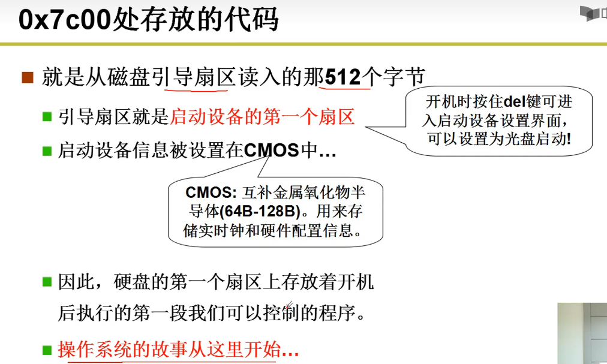

### 概念

是计算机硬件和应用之间的一层软件

- 方便我们使用硬件，如使用显存
- 搞笑的使用硬件，如开多个终端

### 管理

- CPU管理
- 内存管理
- 终端管理
- 磁盘管理
- 文件管理
- 网络管理
- 电源管理
- 多核管理

### 启动流程




ROM（BIOS） -> Bootloader(bootsect.s(读入)->setup.s（初始化）) -> system(head.s mem_init main OS code)  //**不是很懂是不是这样的表述，对应的阶段是否符合，而且第一个BIOS对应的不只是windows，而是一类通用模型**

linux: ROM -> u-boot -> kernel(dtb -> kernel) -> rootfs

### 接口（Interface）

连接两个东西、信号转换、屏蔽细节


### 用户态进入内核态

```
从用户态到内核态切换可以通过三种方式：

系统调用：其实系统调用本身就是中断，但是软件中断，跟硬中断不同。
异常： 当CPU正在执行运行在用户态的程序时，突然发生某些预先不可知的异常事件，这个时候就会触发从当前用户态执行的进程转向内核态执行相关的异常事件，典型的如缺页异常。
外设中断（硬中断）：当外围设备完成用户的请求操作后，会像CPU发出中断信号，此时，CPU就会暂停执行下一条即将要执行的指令，转而去执行中断信号对应的处理程序，如果先前执行的指令是在用户态下，则自然就发生从用户态到内核态的转换。
注意：

系统调用的本质其实也是中断，相对于外围设备的硬中断，这种中断称为软中断，这是操作系统为用户特别开放的一种中断，如Linux int 80h中断。
从触发方式和效果上来看，这三种切换方式是完全一样的，都相当于是执行了一个中断响应的过程。但是从触发的对象来看，系统调用是进程主动请求切换的，而异常和硬中断则是被动的。
```

#### 原理

DPL（destination privilege level）：目标特权层次

CPL：当前目标层次

当对方特权层次比自己更高时（0级别最高，层次最低），才可以访问。

进入GDT查表


Intel X86通过int 80从用户态进入内核态

进入IDT查表


