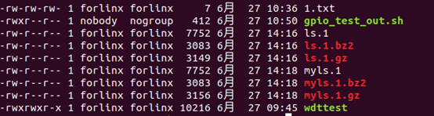
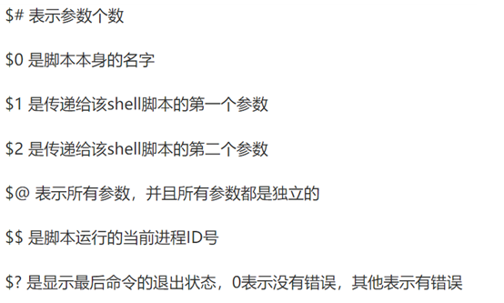
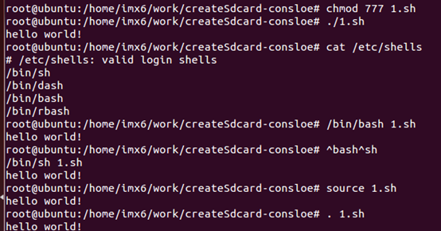
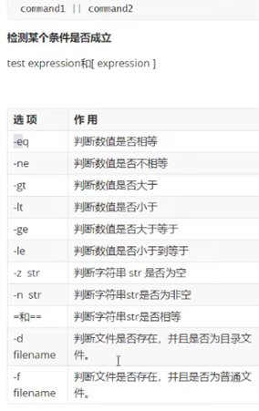
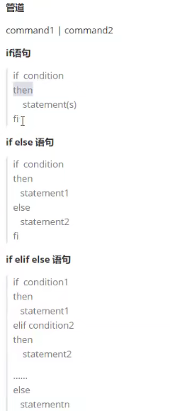
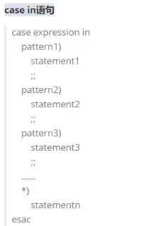
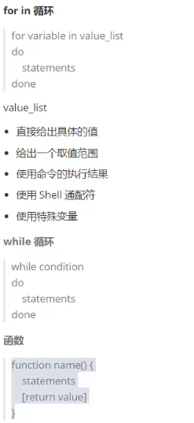
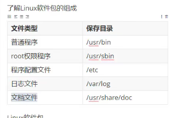
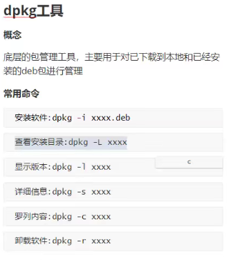
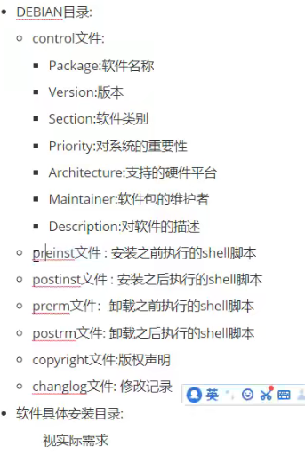

 

 

lsb_release -c ：查看版本代号用于更新源

ls -a 查看包括隐藏文件在内的文件

ls -l 属性

ls -lh 属性里包括文件大小(K M G)

tab键补全命令，如果参数相同字符过多无法补全，按两下tab键。

查看命令拥有者which / whereis(查看命令所属位置和手册页位置)

查找  find （目录）-name “**” （-mtime -2）(两天时间内修改的)

查看用户w who whoami

压缩/解压：

单个文件：gzip（.gz） bzip2(.bz2)

-l:list:列出压缩文件内容

-k:keep:在压缩或者解压时，保留输入文件

-d:decompress:将压缩文件进行解压缩

小文件用gzip，大文件用bzip2（压缩效率更高）

​                  

注：不同名字相同内容压缩后也不一样 解压出来也不一样

多个文件打包和压缩:tar

-c:create:创建用来生成文件包

-x:表示提取，从文件中提取文件

-t:可以查看压缩的文件

-j:使用bzip2方式处理，与c结合表示压缩，与x结合表示解压缩

-z:用gzip方式处理，与c压缩，x解压缩

-v:verbose:详细报告tar处理信息

-f:file：表示文件，后面可以接文件名

-C <指定目录> ：解压到指定目录

Tar czvf 压缩包名  内容   ：压缩到

Tar xzvf 压缩包名  -C 指定目录  ：解压到指定目录

vim

查找替换  

%s/sourlist/destlist 全部替换

3,5s/ sourlist/destlist 3-5行被替换

命令行：、

esc+i:光标位置前插入

esc+o:光标所在位置后插入新行

shift+g:跳转到最末行

gg:跳转到第一行

/word:在vim中查找关键字  n下一关键字  N上一关键字

dd:删除当前行（0：返回行首）

ndd:删除光标行往下n行(含光标行)内容

dgg:删除光标当前行及以上内容

dG:删除光标当前行及以下内容

dH:删除当前页面第1行至光标行

p:粘贴到光标下一行

u:撤销一次操作

Ctrl + r:反撤销（一次）

末行：

r <filename>读取另一文件  追加进光标后

w <filename>另存为filename,源文件还在

cd /etc/vim/vimrc

set nu

set nonu

set hlsearch搜索结果高亮

set nohlsearch搜索结果关闭高亮

colorscheme tab  切换颜色主题

目前喜欢 colorscheme evening/koehler/

！command 在不退出vim的情况下执行命令，之后按任意键返回vim

\1. 在终端下：

​     复制命令：Ctrl + Shift + C 组合键.

​     粘贴命令：Ctrl + Shift + V 组合键.

​     移动到命令行首部：Ctrl+a

移动到命令行尾部：Ctrl+e

移动到命令行前一单词：Esc+b（back）

移动到命令行下一单词：Esc+f(forward)

\2. 在控制台下：

​     复制命令：Ctrl + Insert 组合键　　或　　用鼠标选中即是复制。

​     粘贴命令：Shift + Insert 组合键　　或　　单击鼠标滚轮即为粘贴。

 

cd /:根目录

ls:展开  ls -s file 查看文件执行权限  chmod 777 file  

7: (1)所有者(sudo)执行权限：可读可写可执行

(2)组用户(平常模式)执行权限

​    (3)其他人

r:4 w:2 x:1

ls file -l 查看属性

tree:树状目录

 

sudo apt-get install <package> \yum install <package>

sudo adduser xiaoming sudo 

xiaoming 加入到sudo 的权限中（在已经有sudo权限的用户下）

 

从根目录（/）开始的路径：绝对路径（~在/的/home/用户名/）

从当前目录进入：相对路径

 

用户和用户组

用户：管理员用户、系统用户(Linux自己创建的用户用来服务维护的)、普通用户

用户组：一（用户）对一（用户组）、一对多、多对一、多对多

UID:用户的标识

GID:群组的标识

/etc/passwd:用户名的相对应UID

imx6:x:1000:1000:forlinx,,,:/home/imx6:/bin/bash

i.mx:用户名

x:以前用来存储密码，但是因为可读可写，后来改为存在shadow

1000:用户UID，区分不同用户

1000:用户组GID

forlinx,,,:无意义，记录用户名相关信息

/home/imx6:用户目录在根目录下的地址

/bin/bash:可登录终端（Ubuntu默认shell）

 

/etc/shadow:用户的加密密码

imx6:$1$efeauilt$h2L4Lm/gB/F8Eo1DmuPpn/:17717:0:99999:7:::

$1$efeauilt$h2L4Lm/gB/F8Eo1DmuPpn/:用户加密密码，不能直接看懂

17717：最后一次加密密码修改时间（从系统创建1970.01.01到修改的总天数）

0:最小修改时间间隔

99999：密码有效期

7：密码需要变更前的天数

密码过期后的宽限时间，账号失效时间，保留字段

 

/etc/group:用户对应的GID

imx6:x:1000:

组名：群组密码:GID:（此群组支持的账号名称，本身1的话不显示）

| 文件类型 | 用户权限   | 用户组权限 | 其他用户权限 |
| -------- | ---------- | ---------- | ------------ |
| d:目录   | 1\2\3位    | 4\5\6      | 7\8\9        |
| -:文件   | r\w\x      | r\w\x      | r\w\x        |
|          | 读\写\执行 | 读\写\执行 | 读\写\执行   |
|          |            |            |              |

 -rwxr-xr-x 1 root root 6615 Dec 15 2017 createSDcard.sh

各种全新    归属拥有者  归属用户组  

命令的格式与帮助

commands [-options] [arguments]

命令名   选项    参数

多用-h  --help  获取帮助

 

Bang(!)命令 !号开头的快捷命令

!!：执行上一条命令。

!pw：执行最近以pw开头的命令。

!pw:p：仅打印最近pw开头的命令，但不执行。

!num：执行历史命令列表的第num(数字)条命令。

^foo^bar ：把上一条命令里的foo替换为bar，并执行。

!wget ：执行最近的以wget开头的命令。

!wget:p ：仅打印最近的以wget开头的命令，不执行。

!$ ：上一条命令的最后一个参数， 与 Alt - . 和 $_ 相同，相当于Esc+.(点)。

!* ：上一条命令的所有参数

!*:p ：打印上一条命令是所有参数，也即 !*的内容。

^abc ：删除上一条命令中的abc。

^foo^bar ：将上一条命令中的 foo 替换为 bar

^foo^bar^ ：将上一条命令中的 foo 替换为 bar

!-n ：执行前n条命令，执行上一条命令：!-1， 执行前5条命令的格式是：!-5

ESC相关

Esc+.(点)

获取上一条命令的最后的部分(空格分隔)*

Esc+b

移动到当前单词的开头

Esc+f

移动到当前单词的结尾

Esc+t

颠倒光标所在处及其相邻单词的位置

Ctrl+左右键：在单词之间跳转

Alt – d ：由光标位置开始，往右删除单词。往行尾删

Ctrl – k: 先按住 Ctrl 键，然后再按 k 键；

Alt – k: 先按住 Alt 键，然后再按 k 键；

M – k：先单击 Esc 键，然后再按 k 键。

编辑命令

Ctrl – h ：删除光标左方位置的字符

Ctrl – d ：删除光标右方位置的字符(注意：当前命令行没有任何字符时，会销系统或结束终端)

Ctrl – w ：由光标位置开始，往左删除单词。往行首删

Alt – d ：由光标位置开始，往右删除单词。往行尾删

M – d ：由光标位置开始，删除单词，直到该单词结束。

Ctrl – k ：由光标所在位置开始，删除右方所有的字符，直到该行结束。

Ctrl – u ：由光标所在位置开始，删除左方所有的字符，直到该行开始。

Ctrl – y ：粘贴之前删除的内容到光标后。

ctrl – t ：交换光标处和之前两个字符的位置。

Alt + . ：使用上一条命令的最后一个参数。

Ctrl – _ ：回复之前的状态。撤销操作。

Ctrl -a + Ctrl -k 或 Ctrl -e + Ctrl -u 或 Ctrl -k + Ctrl -u 组合可删除整行。

控制命令

Ctrl – l ：清除屏幕，然后，在最上面重新显示目前光标所在的这一行的内容。

Ctrl – o ：执行当前命令，并选择上一条命令。

Ctrl – s ：阻止屏幕输出

Ctrl – q ：允许屏幕输出

Ctrl – c ：终止命令

Ctrl – z ：挂起命令

 

​       

   $*也是所有参数，但在””中不同。p        

p:当 $* 和 $@ 不被双引号" "包围时，它们之间没有任何区别，都是将接收到的每个参数看做一份数据，彼此之间以空格来分隔。

但是当它们被双引号" "包含时，就会有区别了：

"$*"会将所有的参数从整体上看做一份数据，而不是把每个参数都看做一份数据。

"$@"仍然将每个参数都看作一份数据，彼此之间是独立的。

比如传递了 5 个参数，那么对于"$*"来说，这 5 个参数会合并到一起形成一份数据，它们之间是无法分割的；而对于"$@"来说，这 5 个参数是相互独立的，它们是 5 份数据。

如果使用 echo 直接输出"$*"和"$@"做对比，是看不出区别的；但如果使用 for 循环来逐个输出数据，立即就能看出区别来。

命令本质

内置命令/外部命令

shell属于解释型语言

常见shell·解释器：/etc/shells

C属于编译型语言

 

echo -e shell “I am \n iron-man”加入小写e,\n成立

head -20 file //告诉head程序输出file的前20行，-20作为可选参数标志。

head 20 file //告诉head 程序输出20和file两个文件的前10行

ls *.c / ls [abc]* //输出符合.c后缀的文件，输出a\b\c开头的文件

grep std *.c 找到并输出.c结尾文件中带std的所有行

grep -rn “字符串” 文件名

r:recursive:递归查找

n:number:显示位置的行号

file 查看文件类型

file /dev/*  character(字符设备文件) block(块设备文件) 

wc -l <a >b & //统计字数程序wc 统计所有行（-l）,并把结果输出到b中，后台运行（&）

 

管道是在command1的条件下执s行command2

 

 

 

全局变量VS环境变量

全局变量子进程不能访问，子进程能访问的是环境变量

export将全局变量->环境变量，但再开一个终端访问不了，这时候就看配置文件了

shell配置文件初始化   

全部用户、全部进程共享：/etc/bash.bashrc

一个用户、全部进程共享：/.bashrc

shell启动方式对变量的影响

子shell进程执行:/bin/bash 和./（母进程unset后不能访问）

当前进程中执行:source和.(unset后再重新执行也能输出)

二进制包（安装速度快）和Linux软件包（可查看修改，自由裁剪）

 

nfs:

\#apt-get install nfs-kernel-server(ubuntu) nfs-common(armv7) portmap

/etc/exports  配置信息

/home/imx6/work(共享文件目录) *（rw,sync,no_root_squash）

 *任意网段主机可访问  rw 可读可写  sync 同步对文件夹读写实时，不经过缓冲区   no_root_sqush 文件夹控制权限 别的主机root拥有控制权限

exportfs -arv 刷新exports配置

deb包：Debian、ubuntu、Deepin等Linux发行版的软件安装包

rpm包：Redhat、CentOS、Fedora等Linux发行版的软件安装包   

 

    

 

apt是16.04之后支持的

vsftpd:

sudo apt install vsftpd

如需修改的话还是需要在root权限下修改 使用命令：

sudo  gedit  /etc/vsftpd.conf 

chmod 777 ftpdir 

sudo service vsftpd restart

 

（1）匿名用户相关设置

anonymous_enable=YES,将YES改为NO,禁止匿名用户登陆

\#anon_mkdir_write_enable=YES,将#注释去掉，允许匿名用户创建目录

\#non_upload_enalbe=YES,将#去掉，允许匿名用户上传

anon_world_readable_only=YES,允许匿名用户下载，默认是禁止的，这个可以自行添加。

Anon_other_write_enable=YES,将其设为YES的话，就除了上传和创建目录外，还可以重命名，删除文件，默认是NO

no_anon_password=NO,将其设为YES,匿名用户不会查询用户密码直接登陆。

ftp_username=ftp,匿名用户登陆系统的账号默认为ftp,此项最好不要改；

chroot_local_user=YES #把本地用户限制在自己的home文件夹中，这样子登录之后就不能访问自己home之外的文件了，这样子是出于安全上的考虑

anon_root=/var/ftp/anon #指定匿名登录后的根文件夹，也就是对于匿名用户，会把/var/ftp/anon映射为它的根目录

（2）FTP服务端口的指定

listen_port=8021,指定命令通道为8021,默认为21

listen_data_port=8020,指定数据通道为8020,默认为20

（3）上传模式的设置

pasv_enable=YES,是否允使用被动模式，默认是允许的。

pasv_min_port=10000，指定使用被动模式时打开端口的最小值

pasv_max_port=10004，指定使用被动模式时打开端口的最大值。

（4）Vsftp服务器指定IP地址

listen_address=192.168.0.21，指定FTP，IP地址

注：只有当vsftp运行于独立模式时才允许使用指定IP,如果在/etc/xinetd.d目录下已经建立了vsfpd文件，就要将该文件中的disable设置为yes，方可。

（5）锁定用户，禁止用户离开用户主目录

chroot_local_user=YES,将其设为YES，就锁定在用户主目录，设为NO，可以切换

 

 

预处理：gcc -E 1.c -o 1.i -v

/usr/lib/gcc/i686-linux-gnu/4.6/cc1 -E -quiet -v -imultilib . -imultiarch i386-linux-gnu 1.c -o 1.i -mtune=generic -march=i686 -fstack-protector

编译：gcc -S 1.i -o 1.s -v

/usr/lib/gcc/i686-linux-gnu/4.6/cc1 -fpreprocessed 1.i -quiet -dumpbase 1.i -mtune=generic -march=i686 -auxbase-strip 1.s -version -o 1.s -fstack-protector

汇编：gcc -c 1.s -o demo1.o -v

as --32 -o demo1.o 1.s

（动态）链接：gcc demo1.o -o demo1 -v

ld链接器 collect2封装链接器

/usr/lib/gcc/i686-linux-gnu/4.6/collect2 --sysroot=/ --build-id --no-add-needed --as-needed --eh-frame-hdr -m elf_i386 --hash-style=gnu -dynamic-linker（动态链接） /lib/ld-linux.so.2 -z relro -o demo1 /usr/lib/gcc/i686-linux-gnu/4.6/../../../i386-linux-gnu/crt1.o /usr/lib/gcc/i686-linux-gnu/4.6/../../../i386-linux-gnu/crti.o /usr/lib/gcc/i686-linux-gnu/4.6/crtbegin.o -L/usr/lib/gcc/i686-linux-gnu/4.6 -L/usr/lib/gcc/i686-linux-gnu/4.6/../../../i386-linux-gnu -L/usr/lib/gcc/i686-linux-gnu/4.6/../../../../lib -L/lib/i386-linux-gnu -L/lib/../lib -L/usr/lib/i386-linux-gnu -L/usr/lib/../lib -L/usr/lib/gcc/i686-linux-gnu/4.6/../../.. demo1.o -lgcc --as-needed -lgcc_s --no-as-needed -lc -lgcc --as-needed -lgcc_s --no-as-needed /usr/lib/gcc/i686-linux-gnu/4.6/crtend.o /usr/lib/gcc/i686-linux-gnu/4.6/../../../i386-linux-gnu/crtn.o（glibc入口）

静态链接：gcc -static demo1.o -o demo1 -v 

/usr/lib/gcc/i686-linux-gnu/4.6/collect2 --sysroot=/ --build-id --no-add-needed --as-needed -m elf_i386 --hash-style=gnu -static（静态链接） -z relro -o demo1_static /usr/lib/gcc/i686-linux-gnu/4.6/../../../i386-linux-gnu/crt1.o /usr/lib/gcc/i686-linux-gnu/4.6/../../../i386-linux-gnu/crti.o /usr/lib/gcc/i686-linux-gnu/4.6/crtbeginT.o -L/usr/lib/gcc/i686-linux-gnu/4.6 -L/usr/lib/gcc/i686-linux-gnu/4.6/../../../i386-linux-gnu -L/usr/lib/gcc/i686-linux-gnu/4.6/../../../../lib -L/lib/i386-linux-gnu -L/lib/../lib -L/usr/lib/i386-linux-gnu -L/usr/lib/../lib -L/usr/lib/gcc/i686-linux-gnu/4.6/../../.. demo1.o --start-group -lgcc -lgcc_eh -lc --end-group /usr/lib/gcc/i686-linux-gnu/4.6/crtend.o /usr/lib/gcc/i686-linux-gnu/4.6/../../../i386-linux-gnu/crtn.o

静态链接和动态链接

静态链接有自己独立的库，但是生成的程序大了很多。

动态链接是用的时候去加载，通过链接找。

-I：指定开始查找头文件路径  gcc -c main.c -o main.o -I ./

-l：指定链接哪一个库文件

-L: 指定链接时库文件目录

gcc main.o -o test -lsub -L /libsub.so/所在目录

-shared：可以把多个.o生成动态库 gcc -shared -o lib.so sub.o sub2.o

gcc -E main.c  // 查看预处理结果，比如头文件是哪个

gcc -E -dM main.c > 1.txt // 把所有的宏展开，存在1.txt里

gcc -Wp,-MD,abc.dep -c -o main.o main.c // 生成依赖文件abc.dep，后面Makefile会用

 

echo 'main(){}'| gcc -E -v - // 它会列出头文件目录、库目录(LIBRARY_PATH)

make可以找出修改过的文件，根据依赖关系，找出受影响的文件，最后根据规则单独编译这些文件。

 

\#### 前台进程组

shell进程启动时，默认是前台进程组的首进程。

前台进程组的首进程会占用会话所关联的终端来运行，shell启动其他应用程序时，其他程序成为首进程

\#### 后台进程组

后台进程中的程序是不会占用终端

在shell进程里启动程序时，加上&符号可以指定程序运行在后台进程组里面

ctrl+z使运行进程变成后台进程，停止执行（挂起）

ctrl+| 进程退出，核心转储，可以进行分析

ctrl+c中断进程，进程终止

jobs:查看有哪些后台进程组

fg+job id可以把后台进程组切换为前台进程组

\#### 终端

\- 物理终端

 \- 串口终端

 \- lcd终端

\- 伪终端

 \- ssh远程连接产生的终端

 \- 桌面系统启动的终端

\- 虚拟终端

 linux内核自带的，ctrl+alt+f0~f6可以打开7个虚拟终端

 

aux

axjf

\- a:显示一个终端所有的进程

\- u:显示进程的归属用户及内存使用情况

\- x:显示没有关联控制终端的进程

\- j:显示进程归属的进程组id、会话id、父进程id

\- f:以ascii形式显示出进程的层次关系

\## ps aux

\- user：进程是哪个用户产生的

\- pid:进程的身份证号码

\- %cpu:表示进程占用了cpu计算能力的百分比

\- %mem:表示进程占用了系统内存的百分比

\- vsz:进程使用的虚拟内存大小

\- rss:进程使用的物理内存大小

\- tty:表示进程关联的终端

\- stat:表示进程当前状态

\- start:表示进程的启动时间

\- time:记录进程的运行时间

\- command:表示进程执行的具体程序

 

\#### ps axjf

\- ppid:表示进程的父进程id

\- pid:进程的身份证号码

\- pgid:进程所在进程组的id

\- sid：进程所在会话的id

\- tty:表示进程关联的终端

\- tpgid:值为-1，表示进程为守护进程

\- stat:表示进程当前状态

\- uid:启动进程的用户id

\- time:记录进程的运行时间

\- command:表示进程的层次关系

 

\### ps -l

列说明：

 

F： 代表这个程序的旗标 (flag)， 4 代表使用者为 super user

S： 睡眠 Sleeping 休眠中, 受阻, 在等待某个条件的形成或接受到信号。

UID： 用户ID（User ID）

PID： 进程ID（Process ID）

PPID： 父进程的进程ID（Parent Process id）

C： CPU 使用的资源百分比

PRI： 这个是 Priority (优先执行序) 的缩写，详细后面介绍

NI： 这个是 Nice 值，在下一小节我们会持续介绍

ADDR： 这个是 kernel function，指出该程序在内存的那个部分。如果是个 running的程序，一般就是 "-"

SZ： 使用掉的内存大小

WCHAN： 目前这个程序是否正在运作当中，若为 - 表示正在运作

TTY： 登入者的终端机位置

TIME： 使用掉的 CPU 时间。

CMD 所下达的指令为何

