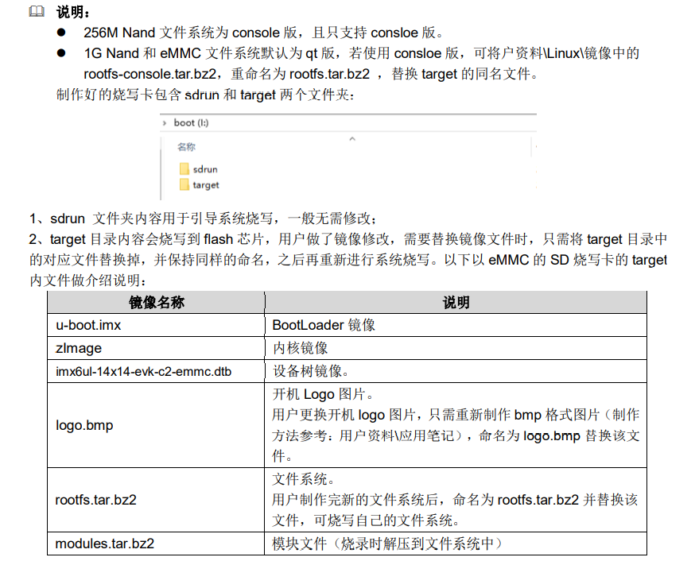

`imx6ul-14x14-evk-c2-256m.dts` `imx6ul-14x14-evk-c2-256m.dtb` 适用于 `256M-NAND` 核心板

### 编译

```
make okmx6ul_defconfig	//预配置
make zImage	-j12//编译内核
make dtbs	-j12//编译设备树
```


### 挂载

```
mount -t nfs -o nolock 192.168.0.8:/home/forlinx/nfs_rootfs /mnt/nfs
 
eth0      Link encap:Ethernet  HWaddr 5A:A4:53:1D:87:CE
          inet addr:192.168.0.232  Bcast:192.168.0.255  Mask:255.255.255.0
          inet6 addr: fe80::58a4:53ff:fe1d:87ce%1996256976/64 Scope:Link
          UP BROADCAST RUNNING MULTICAST  MTU:1500  Metric:1
          RX packets:234 errors:0 dropped:0 overruns:0 frame:0
          TX packets:31 errors:0 dropped:0 overruns:0 carrier:0
          collisions:0 txqueuelen:1000
          RX bytes:34559 (33.7 KiB)  TX bytes:5381 (5.2 KiB)


setenv ethaddr 00:E0:0C:BC:E5:60
setenv ipaddr 192.168.137.2
setenv serverip 192.168.137.8
setenv gatewayip 192.168.137.1
setenv netmask 255.255.255.0
setenv bootcmd run nandargs \;tftp 0x80800000 zImage \; tftp 0x83000000 imx6ul-14x14-evk-c2-256m.dtb \; bootz 0x80800000 - 0x83000000
setenv bootargs console=tty1 console=ttymxc0,115200 cma=96M root=/dev/nfs rw ip=192.168.137.2:192.168.137.8:192.168.137.1:255.255.255.0::eth0:off nfsroot=192.168.137.8:/home/forlinx/nfs_rootfs,v3,tcp rootfstype=yaffs2,calibrate=${calibrate}
boot


echo "7 4 1 7" > /proc/sys/kernel/printk
```

### QT移植

```
 	   export  QT_QPA_PLATFORM=linuxfb:tty=/dev/fb0

       export LD_LIBRARY_PATH=$LD_LIBRARY_PATH:/mnt/nfs/Qt/lib

       export QT_QPA_PLATFORM_PLUGIN_PATH=/mnt/nfs/Qt/plugins

       export  QT_PLUGIN_PATH=/mnt/nfs/lib/plugins

       export  QT_QPA_FONTDIR=/mnt/nfs/lib/fonts

       export  QT_DEBUG_PLUGINS=1
这里说明下fonts是字体所在的目录，按实际配置，plugins是QT的插件，lib是QT库（可按需加载）。
```

