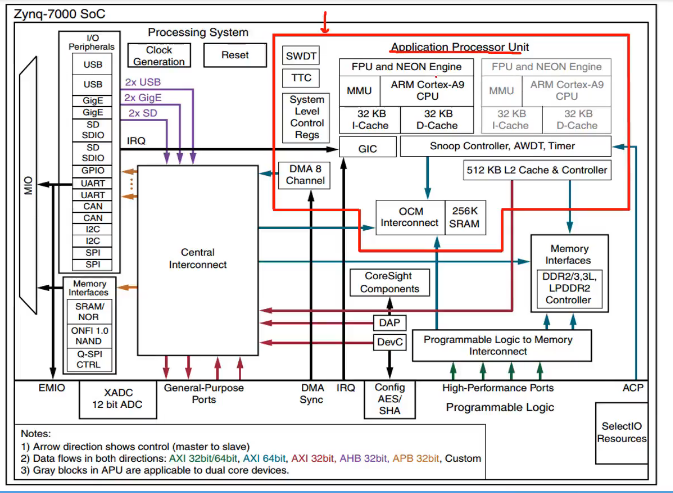
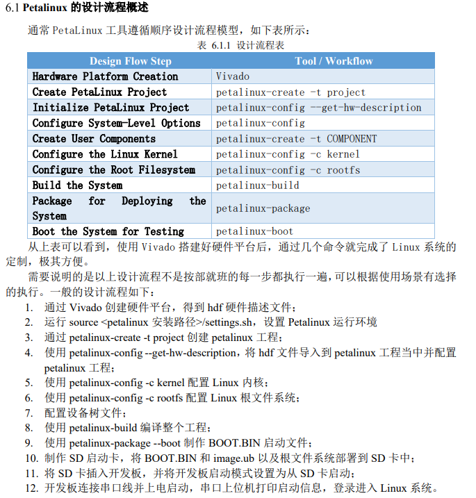
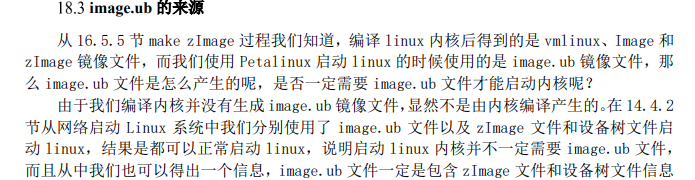
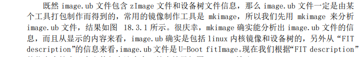

### 概述

PL：（programmable logic）可编程逻辑电路

PS：（Processing system）逻辑处理系统

### PS

“`PetaLinux` 工具提供在 `Xilinx` 处理系统上定制、构建和调配嵌入式 Linux 解决方案所 需的所有组件。该解决方案旨在提升设计生产力，可与 Xilinx 硬件设计工具配合使用，以简化针对 `Versal、Zynq UltraScale MPSoC、Zynq 7000 SoC` 和 `MicroBlaze` 的 Linux 系统开发。”

如果需要配置设备树，可以编辑当前 `petalinux` 工程目 录下的 `project-spec/meta-user/recipes-bsp/device-tree/files/system-user.dtsi` 文件。

