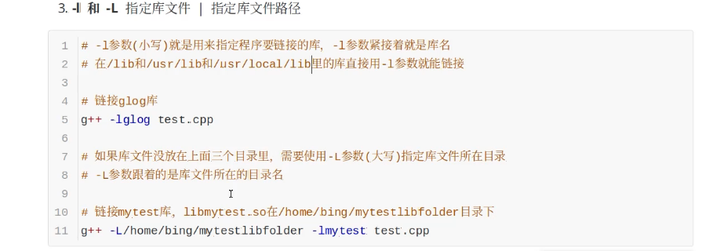
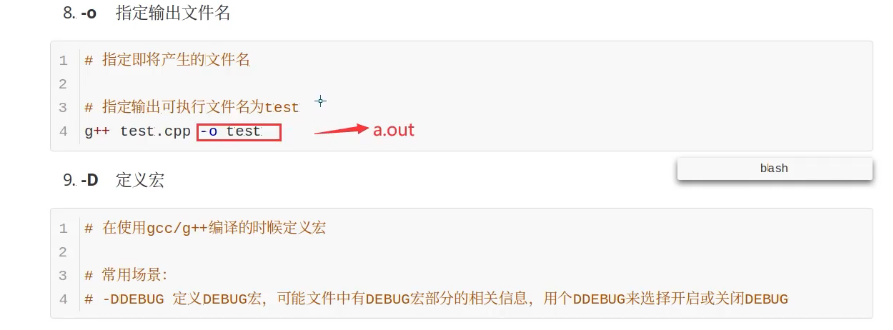
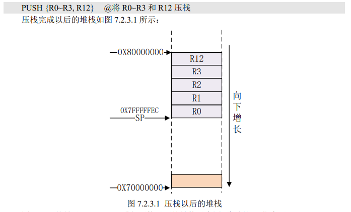

### 输出文件类型

```

```


### 主流编译器

```
https://blog.csdn.net/ZCShouCSDN/article/details/89553323
```

#### 编译过程

1. 预处理		//.i文件

   #扩展预处理宏定义、头文件

   gcc -E test.c -o test.i

2. 编译            //.s文件

   #-S编译选项告诉gcc在为C代码生成汇编文件后停止

   gcc -S test.i -o test.s

3. 汇编           //.o文件

   #-c选项告诉gcc编译器把代码编译成机器语言的目标代码

   gcc -c test.s -o test.o

4. 链接           //bin文件

   #生成可执行文件

   gxx test.o -o test

#### 参数








### Cortex A7 

```
《Cortex-A7 Technical ReferenceManua.pdf》和《ARM Cortex-A(armV7)编程手册 V4.0.pdf》
```

`Cortex-A7 MPcore` 处理器支持 1~4 核，通常是和 `Cortex-A15` 组成 `big.LITTLE` 架构的， Cortex-A15 作为大核负责高性能运算，比如玩游戏啥的，Cortex-A7 负责普通应用，因为 Cortex-A7 省电。Cortex-A7 本身性能也不弱，不要看它叫做 Cortex-A7 但是它可是比 Cortex-A8 性能 要强大，而且更省电。

Cortex-A7 在获得与 Cortex-A9 相似性能的情况下， 其功耗更低。

#### 特性

①、SIMDv2 扩展整形和浮点向量操作。

②、提供了与 ARM VFPv4 体系结构兼容的高性能的单双精度浮点指令，支持全功能的 IEEE754。 

③、支持大物理扩展(LPAE)，最高可以访问 40 位存储地址，也就是最高可以支持 1TB 的 内存。 

④、支持硬件虚拟化。 

⑤、支持 Generic Interrupt Controller(GIC)V2.0。 

⑥、支持 NEON，可以加速多媒体和信号处理算法

⑦、三级流水线，取指->译码->执行

运行模型

以前的 ARM 处理器有 7 中运行模型：`User、FIQ、IRQ、Supervisor(SVC)、Abort、Undef 和 System`，其中 User 是非特权模式，其余 6 中都是特权模式。但新的 Cortex-A 架构加入了 `TrustZone` 安全扩展，所以就新加了一种运行模式：`Monitor`，新的处理器架构还支持虚拟化扩 展，因此又加入了另一个运行模式：Hyp，所以 Cortex-A7 处理器有 9 种处理模式，如表 6.2.1 所示：


sp堆栈指针


pc程序计数器：

R15 (PC)值 = 当前执行的程序位置 + 8 个字节。（ARM 处理器 3 级流水线：取指->译码->执行，这三级流水线循环执行， 比如当前正在执行第一条指令的同时也对第二条指令进行译码，第三条指令也同时被取出存放 在 R15(PC)中。）


CPSR程序状态寄存器

**所有的处理器模式都共用一个 CPSR 物理寄存器**，因此 CPSR 可以在任何模式下被访问。

CPSR 是当前程序状态寄存器，该寄存器包含了条件标志位、中断禁止位、当前处理器模式标志 等一些状态位以及一些控制位。所有的处理器模式都共用一个 CPSR 必然会导致冲突，为此， 除了 User 和 Sys 这两个模式以外，其他 7 个模式每个都配备了一个专用的物理状态寄存器，叫 做 SPSR(备份程序状态寄存器)，当特定的异常中断发生时，SPSR 寄存器用来保存当前程序状 态寄存器(CPSR)的值，当异常退出以后可以用 SPSR 中保存的值来恢复 CPSR。 因为 User 和 Sys 这两个模式不是异常模式，所以并没有配备 SPSR，因此不能在 User 和 Sys 模式下访问 SPSR，会导致不可预知的结果。由于 SPSR 是 CPSR 的备份，因此 SPSR 和 CPSR 的寄存器结构相同，如图 6.3.2.1 所示：


对于 Cortex-A 芯片来讲，大部分芯片在上电以后 C 语言环境还没准备好，所以第一行程序 肯定是汇编的，至于要写多少汇编程序，那就看你能在哪一步把 C 语言环境准备好。所谓的 C 语言环境就是保证 C 语言能够正常运行。

C 语言中的函数调用涉及到出栈入栈，出栈入栈就要 对堆栈进行操作，所谓的堆栈其实就是一段内存，这段内存比较特殊，由 SP 指针访问，SP 指 针指向栈顶。芯片一上电 SP 指针还没有初始化，所以 C 语言没法运行，对于有些芯片还需要 初始化 DDR，因为芯片本身没有 RAM，或者内部 RAM 不开放给用户使用，用户代码需要在 DDR 中运行，因此一开始要用汇编来初始化 DDR 控制器。

#### 汇编

在GNU ARM嵌入式汇编源程序中的注释方式有：
1、/**/ 块注释，跟C语言的一样。
2、// 行注释，跟C语言的一样。
3、@ 行注释。
4、# 行注释。

另外，汇编指令大小写也是可以混合的。

**注意！ARM 中的指令、伪指令、伪操作、寄存器名等可以全部使用大写，也可以全部使用 小写，但是不能大小写混用。**

Mov r0,[r1]	//不被允许


.text 表示代码段。

.data 初始化的数据段。 

.bss 未初始化的数据段。 

.rodata 只读数据段。

```
.section .testsection @定义一个 testsetcion 段
.global _start 
_start:
ldr r0, =0x12 @r0=0x12

.byte 定义单字节数据，比如.byte 0x12。
.short 定义双字节数据，比如.short 0x1234。
.long 定义一个 4 字节数据，比如.long 0x12345678。
.equ 赋值语句，格式为：.equ 变量名，表达式，比如.equ num, 0x12，表示 num=0x12。
.align 数据字节对齐，比如：.align 4 表示 4 字节对齐。
.end 表示源文件结束。
.global 定义一个全局符号，格式为：.global symbol，比如：.global _start。
```

```
函数名:
	函数体
	返回语句(不是必须的)

/* 未定义中断 */
Undefined_Handler:
	ldr r0, =Undefined_Handler
	bx r0
/* SVC 中断 */
SVC_Handler:
	ldr r0, =SVC_Handler
	bx r0
/* 预取终止中断 */
PrefAbort_Handler:
	ldr r0, =PrefAbort_Handler 
	bx r0

```

```
1 LDR R0, =0X0209C004 @将寄存器地址 0X0209C004 加载到 R0 中，即 R0=0X0209C004
2 LDR R1, [R0] @读取地址 0X0209C004 中的数据到 R1 寄存器中

1 LDR R0, =0X0209C004 @将寄存器地址 0X0209C004 加载到 R0 中，即 R0=0X0209C004
2 LDR R1, =0X20000002 @R1 保存要写入到寄存器的值，即 R1=0X20000002
3 STR R1, [R0] @将 R1 中的值写入到 R0 中所保存的地址中
```




#### GPIO

I.MX6U 的 GPIO 一共有 5 组：GPIO1、GPIO2、GPIO3、GPIO4 和 GPIO5， 其中 GPIO1 有 32 个 IO，GPIO2 有 22 个 IO，GPIO3 有 29 个 IO、GPIO4 有 29 个 IO，GPIO5 最少，只有 12 个 IO，这样一共有 124 个 GPIO。
