# <<linux 驱动开发>>学习日志

```
MODULE_LICENSE（“GPL”）//申明采用了开源协议，可以使用一些开源GPL代码API
_init/_exit   在加载前占据内存，加载完后自动销毁留出空间
obj-m:模块，生成ko文件，但需要手动加载
obj-y:直接.o编进内核
objs:多.o文件编译成模块

```

#### 疑问：all和modules在Makefile中的区别?

答：没什么区别，就是别名而已，make默认执行第一个目标。

内核模块可以设置参数，在加载时进行控制  例如串口模块可以设置波特率、端口、名字等等

```
EXPORT_SYMBOL	//内部对变量或者函数可以让该函数或变量可以被其他模块使用，使用前用extern申明

EXPORT_SYMBOL_GPL	//内部对变量或者函数可以让该函数或变量可以被其他模块使用（申明了GPL协议）的使用
```

#### 疑问：`static`不是可以限制函数或者变量只可以在当前文件中吗？为什么依然可以`EXPORT_SYMBOL`申明为外部，那这样申明有意义吗？只为了在某个文件中使用？

答：`Linux-2.6`之后默认**不导出**所有的符号，所以使用`EXPORT_SYMBOL()` 做标记。static增加可读性。`EXPORT_SYMBOL`标签内定义的函数或者符号对全部内核代码公开，不用修改内核代码就可以在内核模块中直接调用，
即使用`EXPORT_SYMBOL`可以将一个函数/变量以符号的方式导出给其他模块使用。
符号的意思就是函数的入口地址，或者说是把这些符号和对应的地址保存起来的，在内核运行的过程中，可以找到这些符号对应的地址的。

`EXPORT_SYMBOL`使用方法

1. 在模块函数定义之后使用`EXPORT_SYMBOL`（函数/变量名）
2. 用该函数的模块中使用`extern`对要使用的符号或者函数进行声明
3. 首先加载定义该函数的模块，再加载调用该函数的模块

```
modprobe优于insmod: 自动加载被依赖的模块，insmod要注意自己模块加载的先后可能导致的问题。

depmod: 生成模块的依赖信息。

modinfo: 生成模块的具体版本信息
```

**另外，如果当前模块板块与内核版本不一致，那么模块将会被拒绝载入。**

卸载模块时也要注意，可能一个模块在使用另一个模块的函数，需要先把当前模块卸载再卸载另一个模块。

#### 内核模块和应用程序之间的差异：

- 内核模块是操作系统内核的一部分，运行在内核空间；应用程序在用户空间。
- 内核模块被动调用，只在初始化和清除函数分别在被加载和被卸载时调用；应用程序则是顺序执行，或者在某一循环反复调用。
- 内核函数在C库函数之下，不能调用；应用则在之上，可以调用。
- 内核模块通常要做一些清除性质的工作，通常在加载失败或者内核的清除函数中。
- 内核模块如果发生非法访问，则整个系统可能都会崩溃。应用程序只会影响自己。
- 内核的并发有很多，如中断、多处理器等；应用程序一般只考虑多线程或者多进程。
- 内核空间一般只有4KB、8KB的栈，如果需要更大的内存空间，通常需要动态申请（`vmalloc\kmalloc`）分配。
- `printk`不能打印浮点类型，否则编译时会出警告，并且模块加载不会成功。

### 中断

可以分为上半部和下半部

上半部：硬件中断，处理一些紧急且快速的事情；

下半部：软件中断，处理一些不是那么紧急或者慢的事情；

软件中断可以被硬件中断打断；

软件中断技术：

事情不是太长：`tasklet`

事情多且复杂：工作队列

新技术：`thread_irq(`针对多核设备，工作队列和`tasklet`只能在单核运行，浪费CPU资源)

（`hardwareirq,irq`）同时注册在domain域中


#### 疑问：如果一个硬件中断同时对应比如按键中断和外部输入中断，那么究竟是怎么详细区分的呢？

答：载入每一个irq去执行确定到底是哪一个（**但是概念很模糊啊，还是没搞清具体怎么判断**）。

#### 异步通知


### 高端内存

```
https://www.jianshu.com/p/0b8e1879729a
```

当内核模块代码或线程访问内存时，代码中的内存地址都为逻辑地址，而对应到真正的物理内存地址，需要地址一对一的映射。

32位Linux的虚拟地址空间也为0～4G，而内核空间只有1G，要想内核空间访问到所有的虚拟内存，需要一段空间来作为映射区域（中间桥梁、换算），临时占用一部分内存，等待用完释放，这也是线程的实现方式。

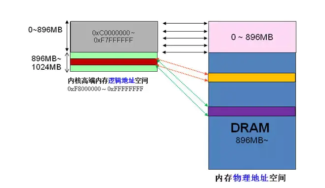


### kzalloc/kmalloc/vmalloc

```
https://www.cnblogs.com/sky-heaven/p/7390370.html
```

用kzalloc申请内存的时候， 效果等同于先是用 *kmalloc()* 申请空间 *,* 然后用 *memset()* 来初始化 *,*所有申请的元素都被初始化为 *0.*

`kmalloc()、kzalloc()、vmalloc()` 的共同特点是：

1. 用于申请内核空间的内存；
2. 内存以字节为单位进行分配；
3. 所分配的内存虚拟地址上连续；

`kmalloc()、kzalloc()、vmalloc()` 的区别是：

1. kzalloc 是强制清零的 kmalloc 操作；（以下描述不区分 kmalloc 和 kzalloc）
2. kmalloc 分配的内存大小有限制（128KB），而 vmalloc 没有限制；
3. kmalloc 可以保证分配的内存物理地址是连续的，但是 vmalloc 不能保证；
4. kmalloc 分配内存的过程可以是原子过程（使用 `GFP_ATOMIC`），而 vmalloc 分配内存时则可能产生阻塞；
5. kmalloc 分配内存的开销小，因此 kmalloc 比 vmalloc 要快；

一般情况下，内存只有在要被 DMA 访问的时候才需要物理上连续，但为了性能上的考虑，内核中一般使用 kmalloc()，而只有在需要获得**大块内存**时才使用 vmalloc()。例如，当模块被**动态加载**到内核当中时，就把模块装载到由 vmalloc() 分配的内存上。

### fcntl/ioctl

```
http://blog.chinaunix.net/uid-21651676-id-60392.html
https://www.cnblogs.com/kelamoyujuzhen/p/9688307.html
```

### dup

```
https://www.cnblogs.com/pengdonglin137/p/3286627.html
```


### 自动加载&手动加载

设备插入主板后自动加载驱动，可以用udev/mdev，推荐用udev。

使用modprobe前需要把设备驱动移入/lib/modules/$(uname -r)/ 中，并且depmod更行依赖。

### container_of

```
https://www.linuxidc.com/Linux/2012-02/53701.htm#:~:text=containe,%E9%87%8F%E7%9A%84%E6%8C%87%E9%92%88%E7%9A%84%E5%8A%9F%E8%83%BD%E3%80%82
```

根据数据成员的地址确定包含该数据成员结构体的地址

### 驱动编写步骤

1. 看sch:怎么操作
2. 看芯片手册
3. 规划驱动功能
4. 写驱动、测试程序 

​        首先查看驱动 kernel/drivers/**目录里面有没有编写对应的驱动，有必要可以参照对应的LRM手册。

- 如果驱动已经实现，则make ARCH=arm menuconfig配置内核，配置好后保存，执行make ARCH=arm uImage 然后拷贝到tftpboot中。然后参照Documentation/devicetree/bindings/**中的文件，修改设备树节点，compatible属性要和驱动相互匹配，保存好执行make ARCH=arm dtbs，并且拷贝到tftboot中，重启开发板
- 如果驱动没有实现，则需要去通用设备树找到相关节点，因为一般厂家都把对应的节点初始化好了，或者自己加入子节点，注意在这之气那要看寄存器配置和手册，不过要看父节点定义，然后在板级设备树中使能相应节点，重新编译，再重新编写驱动，注意看会不会和原来的冲突。

### kset/kobject/ktype

```
https://www.cnblogs.com/xiaojiang1025/p/6193959.html
```

​        **kset**表示一组**kobject**的集合，**kobject**通过**kset**组织成层次化的结构，所有属于该**kset**的**kobject**结构的**parent**指针指向**kset**包含的**kobject**对象，构成一个父子层次关系这些**kobject**可以是不同或相同的类型(kobj_type)。

​        sysfs中的设备组织结构很大程度上都是根据**kset**进行组织的，比如**"/sys/drivers"**目录就是一个**kset**对象，包含系统中的驱动程序对应的目录，驱动程序的目录由kobject表示。

​        比如在平台设备模型中，当我们注册一个设备或驱动到平台总线，其实是将对应的**kobject**挂接到platform总线的**kset**上，每种总线都是维护两条链表(两个kset)，一条用于链接挂接在上面的驱动(驱动kset)，一条用于链接挂接在上面的设备(设备kset)。

- kset就是管理节点，负责挂靠kobject
- kobject负责挂靠设备和驱动节点
- ktype表示当前kobject的类型
- 都是设备管理中的基本结构体

​        其中kset里面有个：

​        **list_head**还是那个用来挂在链表上的结构，包含在一个**kset**的所有kobject构成了一个**双向循环链表**，**list_head**就是这个链表的头部，这个链表用来连接第一个和最后一个kobject对象，第一个kobject使用entry连接kset集合以及第二个kobject对象，第二个kobject对象使用entry连接第一个kobject对象和第三个kobject对象，依次类推，最终形成一个kobject对象的链表。


### 互斥和同步

1. 为什么自旋锁的临界区不能睡眠？
2. arm 64处理器当中，我们如何实现独占访问内存。
3. 排队自旋锁是如何实现MCS锁的？
4. 乐观自旋锁等待的判断条件是什么？
5. 请你说出MCS锁机制的实现原理？


临界区（critical region）是指访问和操作共享数据的代码段，其中的资源无法同时被所得执行线程访问，访问临界区的执行线程或代码路径成为并发源。我们为了避免并发访问临界区，软件工程师必须保证访问临界区的原子性，即在临界区被不能有多个并发源同时执行，整个临界区就像一个不可分割的整体。

在linux内核当中产生访问的并发源主要有：中断和异常、内核抢占、多处理器并发执行、软中断和tasklet。

考虑SMP（Share memory processor）系统：

- 同一类型的中断程序不会并发执行，但是不同类型的中断可能送达可能送达不同的CPU，因此不同类型的中断处理程序可能会并发执行。
- 同一类型的软中断会在不同的CPU上并发执行。
- 同意类型的tasklet是串行执行的，不会在多个PCU上并发执行。
- 不同CPU上的进程上下文会并发执行。


#### 中断屏蔽

#### 原子变量

原子操作保证指令以原子的反射光hi执行，执行过程中不会被打断。假设两个线程thread_afunc和thread_bfunc执行i++操作，那么i最后等于？

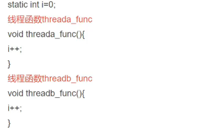


#### 自旋锁

自旋锁一直占据线程不阻塞。自旋锁时间必须短且不可以引入进程切换，否则可能死锁。

#### 读写锁

#### 顺序锁

#### 信号量

#### 互斥量

#### RCU机制

### 驱动检测设备原理

#### 不支持热插拔设备

系统启动或者加载.ko文件时检测对应端口，如果有对应ID则加载、初始化并且添加到对应的/dev设备文件中

#### 支持热插拔设备

支持热插拔的设备分为两种

1. 单独的引脚检测是否有设备插入
2. 有对应接口一直检测设备

### 疑问：根目录下/sys、/proc和/dev文件夹有什么区别？

/dev表示已经挂载的设备

/proc表示正在运行的内存信息映射

/sys硬件设备的驱动程序信息，其中/sys/devices/platform里面有基于平台的所有驱动

### 内联汇编

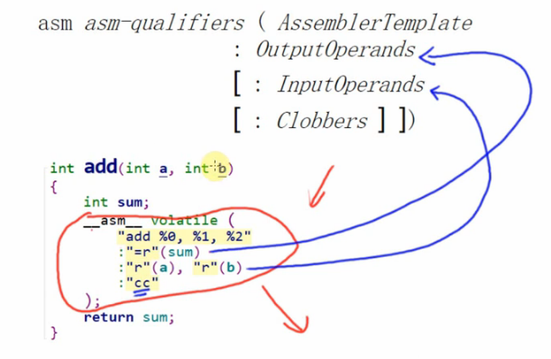

### 设备树和驱动匹配

platform_match


platform_driver

​	.driver

​		of_match_table

​			of_device_id

​				.compatible

​	(或者).id_table

### GPIO子系统常用函数

gpio子系统对于驱动层的API位于“/kernel/include/linux/gpio.h”中。

【1】检查gpio是否可用

```
int gpio_is_valid(int number); 
参数/				含义
number			gpio序号
返回			可用返回true，不可用返回false
```

【2】申请使用一个gpio

使用一个gpio前，必须向内核申请该gpio。

```
int gpio_request(unsigned gpio, const char *label)
参数			含义
gpio		待申请gpio序号
label		gpio命名
返回		成功返回0，失败返回负数
```

【3】释放已申请gpio

  如果不使用该gpio，则需要释放，否则其他模块申请不到该gpio序号。

```
int gpio_free(unsigned gpio)
参数		含义
gpio	待释放gpio序号
label	gpio命名
```

【4】设置gpio输入模式

```
int gpio_direction_input(unsigned gpio)
参数			含义
gpio		待设置gpio序号
返回		成功返回0，失败返回负数
```

【5】设置gpio输出模式

```
void gpio_set_value(unsigned gpio, int value)
参数		含义
gpio	待设置gpio序号
value	默认输出状态
返回	成功返回0，失败返回负数
```

【6】读取 gpio状态

```
int gpio_get_value(unsigned int gpio)
参数	含义
gpio	待读取gpio序号
返回	成功返回gpio状态（1/0），失败返回负数
```

【7】设置 gpio状态

```
void gpio_set_value(unsigned int gpio, int value)
参数	含义
gpio	待设置gpio序号
value	待设置值
```

【8】中断号映射

```
int gpio_to_irq(unsigned gpio)
参数	含义
gpio	待设置gpio序号
返回	成功返回中断号，失败返回负数
```

#### 应用

利用pinctrl和gpio子系统实现一个io翻转控制LED。firefly-rk3399板子上有两个LED，分别是power led和user led。linux自带的“gpio-leds”驱动是在linux led框架的基础上实现的，我们使用user led的gpio口，不使用led框架，直接使用gpio子系统实现io输出状态控制和读取。

-  修改设备树

  【1】首先屏蔽rk3399原有的“led user”设备树，否则驱动会冲突。

    leds {
                compatible = "gpio-leds";
                ......
                /*user {
                 *      label = "firefly:yellow:user";
                 *      linux,default-trigger = "ir-user-click";
                 *      gpios = <&gpio0 13 GPIO_ACTIVE_HIGH>;
                 *      pinctrl-names = "default";
                 *      pinctrl-0 = <&led_user>;
                 *      default-state = "off";
                 *};
                 */
        };
	  在“kernel/arch/arm64/boot/dts/rockchip/rk3399-firefly.dtsi”

      gpiopin{
                compatible = "gpiopin";	/*驱动兼容属性*/
                gpios = <&gpio0 13 GPIO_ACTIVE_HIGH>;/* gpio描述，提供给pinctrl子系统使用*/
                pinctrl-names = "default";	/*pin脚默认状态*/
                pinctrl-0 = <&led_user>;	/*直接使用rk原命名的pin脚设备树,也可以单独重新命名*/
                default-state = "off";		/*默认gpio输出0*/
        };
	#源自rk3399-firefly-port.dtsi
	led_user: led-user {
			rockchip,pins = <0 13 RK_FUNC_GPIO &pcfg_pull_none>;/*pin脚为普通gpio模式*/
		};
	};
	  修改完设备树，可以编译内核，更新板子boot区域（内核和设备树文件）。
### struct inode 和struct file

```
https://www.cnblogs.com/QJohnson/archive/2011/06/24/2089414.html
```

### 设备树节点匹配platform_deivce和驱动

```
https://blog.csdn.net/Aa_lihua/article/details/106064773
```

### &gpio*

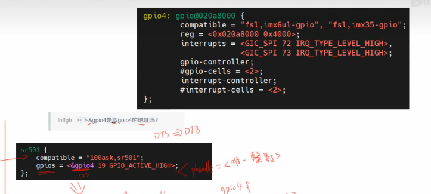

dtc -I dtb -O dts *** .dtb > ***.dts反汇编

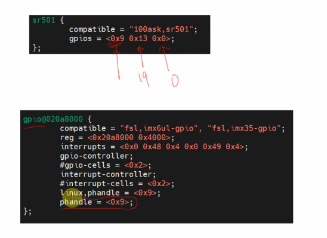

### 节点构造函数解析

**注意：节点有关文件与操作，是重点**

```
https://deepinout.com/linux-kernel-api/device-driver-and-device-management/
```

#### register_chrdev(major,name"/proc/devices",file oerations *)

函数register_chrdev()调用函数register_chrdev()实现其功能，函数register_chrdev()首先调用函数__register_chrdev_region()创建一个字符设备区，此设备区的主设备号相同，由函数register_chrdev()的第一个参数决定，次设备号的变化范围是0～256，设备区的名字为函数register_chrdev()的第二个参数，此函数将更改`/proc/devices`文件的内容；然后动态申请一个新的字符设备cdev结构体变量，对其部分字段进行初始化，初始化完成之后将其加入Linux内核系统中，即向Linux内核系统添加一个新的字符设备。函数register_chrdev()调用函数cdev_alloc()动态申请一个字符设备，调用函数cdev_add()将其加入Linux内核系统中。

- 文件包含：#include <linux/fs.h>
- int __register_chrdev(unsigned int major, unsigned int baseminor,
  		      unsigned int count, const char *name,
                		      const struct file_operations *fops)
  - __register_chrdev_region(major, baseminor, count, name);
  - cdev_alloc();
  - kobject_set_name(&cdev->kobj, "%s", name);
  - cdev_add(cdev, MKDEV(cd->major, baseminor), count);

#### device_create(class,    ,MKDEV(),    ,name""/dev/name"")

函数**device_create()**用于动态地创建逻辑设备，并对新的逻辑设备类进行相应的初始化，将其与此函数的第一个参数所代表的逻辑类关联起来，然后将此逻辑设备加到Linux内核系统的设备驱动程序模型中。函数能够自动地在`/sys/devices/virtual`目录下创建新的逻辑设备目录，在`/dev`目录下创建与逻辑类对应的设备文件。

- 文件包含：#include <linux/device.h>

- 定义

  ```
  struct device *device_create(struct class *cls, struct device *parent, dev_t devt, void *drvdata, const char *fmt, ...);
  ```

  

#### class_create(MODULE,name"/sys/class/name")

宏**class_create()**用于动态创建设备的逻辑类，并完成部分字段的初始化，然后将其添加进Linux内核系统中。此函数的执行效果就是在目录`/sys/class`下创建一个新的文件夹，此文件夹的名字为此函数的第二个输入参数，但此文件夹是空的。宏class_create()在实现时，调用了函数[__class_create](https://deepinout.com/linux-kernel-api/device-driver-and-device-management/linux-kernel-api__class_create.html)()，作用和函数__class_create()基本相同。

- 文件包含：#include <linux/device.h>

- 宏定义：

  ```
  #define class_create(owner, name)		\
  ({						\
  	static struct lock_class_key __key;	\
  	__class_create(owner, name, &__key);	\
  })	
  ```

  - 参数`owner`是一个struct module结构体类型的指针，指向函数__class_create()即将创建的struct class类型对象的拥有者，一般赋值为THIS_MODULE，此结构体的详细定义见文件linux-3.19.3/include/linux/module.h。
  - 参数`name`是char类型的指针，代表即将创建的struct class变量的名字，用于给struct class的name字段赋值。

### u-boot rk3399加载设备树

```
https://blog.csdn.net/sements/article/details/104795430
```

需要知道的一点是，在arm64架构下，linux已经弃用mach_xx等文件夹来描述板级信息供linux内核启动时去匹配根节点下的compatible属性来找到对应设备树。

取而代之是单纯的接收bootloader传递过来的单一设备树文件dtb所在的内存地址。所以当多个dtb文件存在镜像中或者内存中时，如何找到需要的dtb的这个任务，就落在了bootloader肩上。


### make menuconfig

- Kconfig
- Makefile
- .config

在drivers每个子目录下都有以上三项，作为make menuconfig的适配项，可以图形化配置，并且把子目录下的drv.c生成相应的.o/.ko文件等等，依据依赖可以重新编译内核，M编成模块自己添加，*直接编进内核，在/sys/class/dev中可以找到。

当然，可以自己修改对应的Kconfig\Makefile文件自己生成menuconfig里面的项，不建议直接修改.config文件，如果有依赖的话，修改不成功。

menuconfig 依据.config文件对内核进行选项配置。

修改完后记得make ***_defconfig对应的文件需要被.config替换掉，注意名字不改改内容。

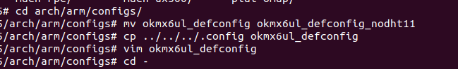

配置好记得save，再根据需要自己重新make ***_defconfig、编译内核

其实就是把已经有的内核编译进去，适合批量编译和多依赖编译；少量模块完全可以自己交叉编译，生成模块然后insmod，当然，两个方法都要根据需要改设备树。

### gpio&gpiod

之前旧的方式从dts获取gpio，基本都要用of函数，现在新的方式（大约4.4之后）可以直接使用“gpiod_”开头的函数。

```
https://zhuanlan.zhihu.com/p/115657651
```

- devm_gpiod_get_optional
  - devm_gpiod_get_index_optional
    - devm_gpiod_get_index
      - gpiod_get_index

- gpiod_get
  - gpiod_get_index

```
struct gpio_desc *__must_check gpiod_get_index(struct device *dev,
					       const char *con_id,
					       unsigned int idx,
					       enum gpiod_flags flags)
/* 	获取GPIO，可以得到一系列GPIO设备描述符
 *	例：
 *	dev_desc = gpiod_get(&dev, "dc", GPIOD_OUT_HIGH);
 *	对应dts:
 *	dc-gpios = <SPI 124 0>;
 *	con_id在这里为dc
 *	idx可以自己设置序列完成设备描述符的获取
 *	flags并不重要，后面自己可以根据需要gpiod_set_value（dev_desc，0/1）
 *	或者可以获取flags,然后设置有效位???
 */
```


### mmap

关键是共享和私有

- ioremap实现了内核的空间映射，在内核层file_operations.mmap里面`virt_to_phys(kernel_buf)`让用户层通过`buf=mmap(NULL, 1024*8, PROT_READ | PROT_WRITE, MAP_SHARED, fd, 0)`操作buf数据

```

```

### 内核打印信息

```
echo "7 4 1 7" > /proc/sys/kernel/printk
```

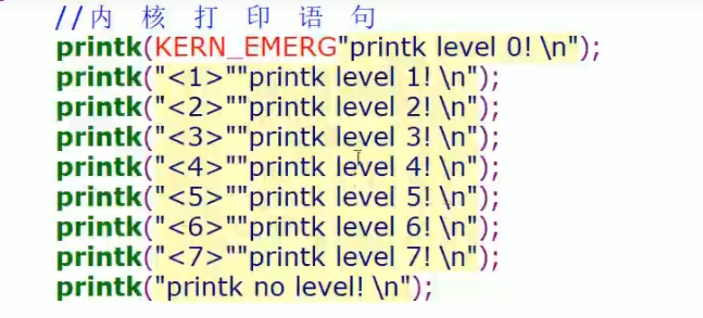

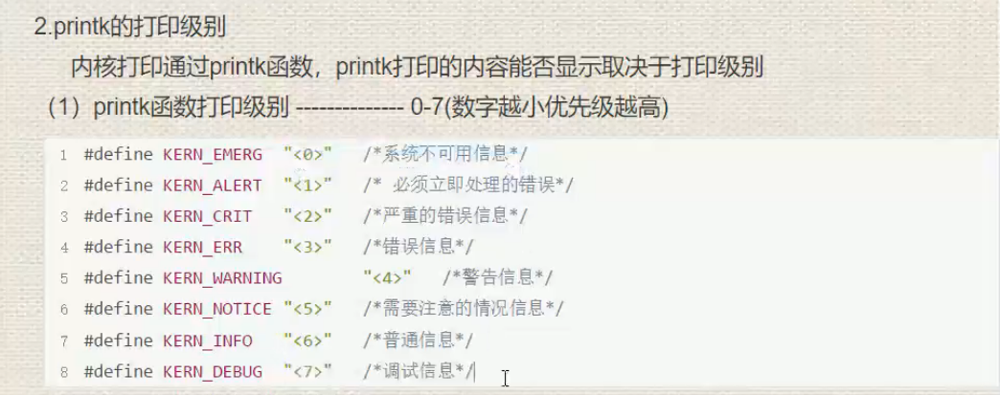

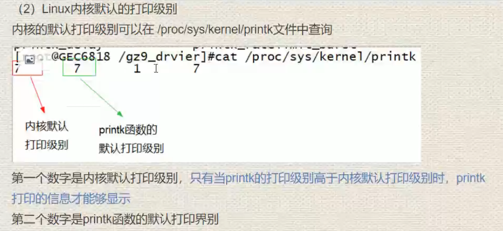


### 内核模块外部修改参数

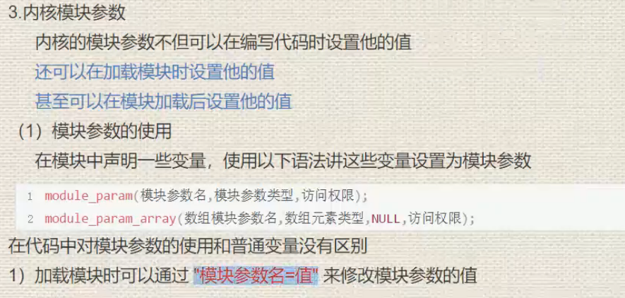

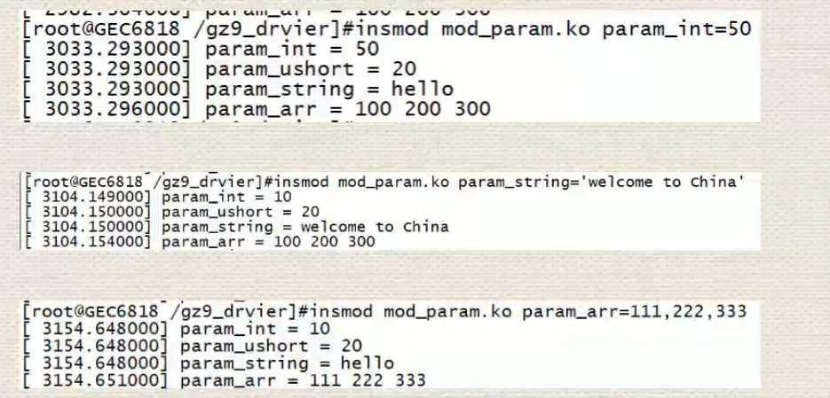


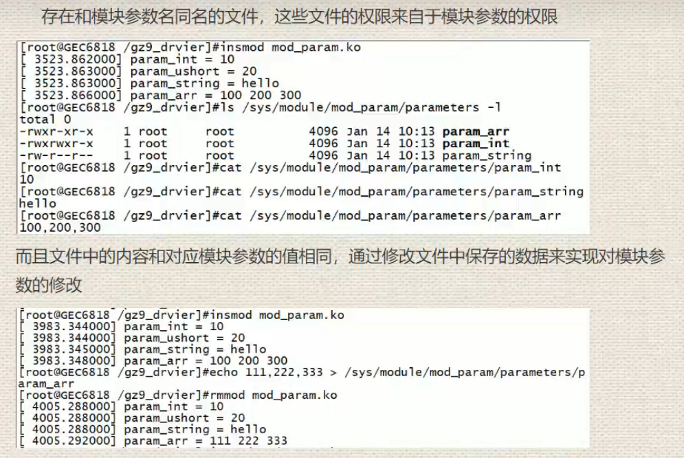

### 调试GPIO

```
cat /sys/kernel/debug/gpio
```

### pinfunc.h

#### IOMUXC chapter30

```
IOMUXC P30章节
	IOMUXC_SW_MUX_CTL_PAD_<PAD_NAME>  	//定义引脚复用属性
	IOMUXC_SW_PAD_CTL_PAD_<PAD_NAME>	//定义引脚电气属性
	SELECT_INPUT
```

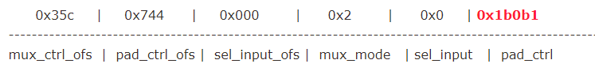

```
mux_ctrl_ofs:复用节点偏移地址MUX_CTL_PAD_
pad_ctrl_ofs:引脚偏移地址PAD_CTL_PAD_
sel_input_ofs:输入引脚引用的偏移地址SELECT_INPUT
mux_mode:复用功能MUX_CTL_PAD_
sel_input:输入引脚引用的源脚SELECT_INPUT
```


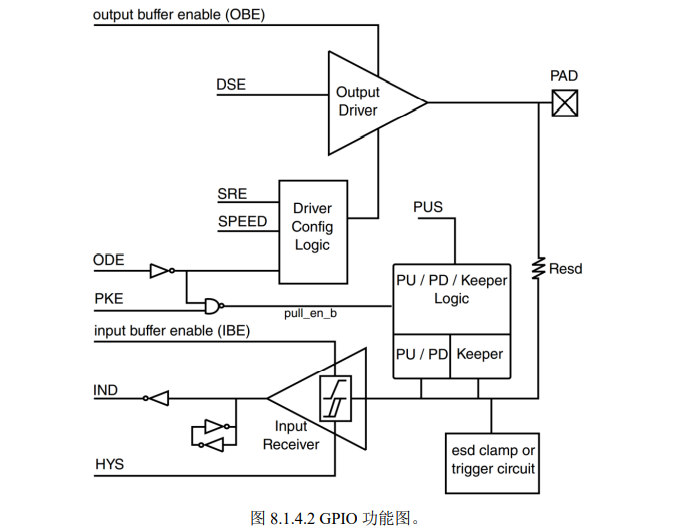

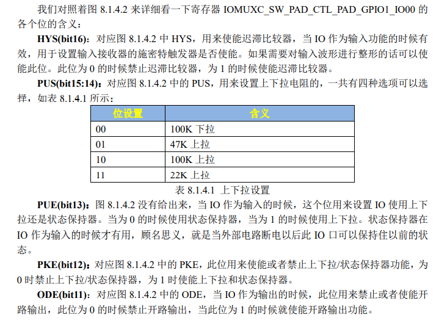

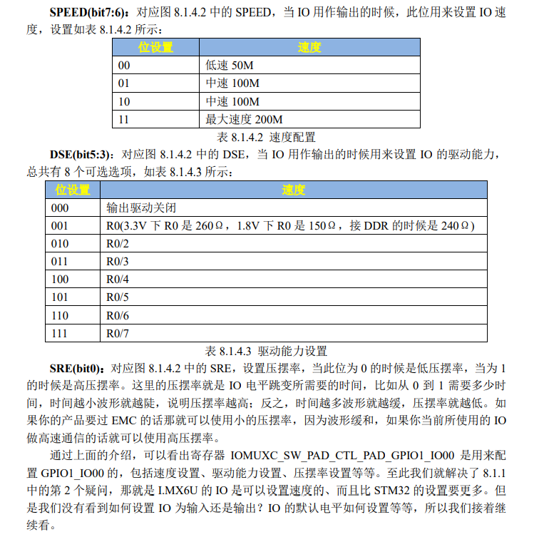

#### GPIO chapter 26

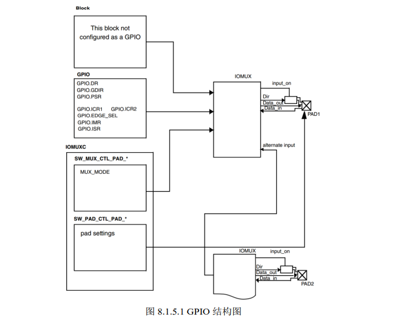


下面寄存器中除了CR1和CR2，都是某位对应族中某个GPIO

- DR 	数据寄存器    

  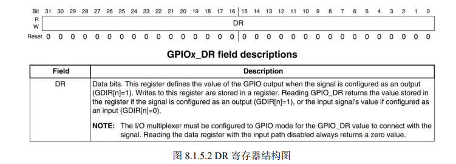

- GDIR 方向寄存器    设置输入0输出1 

  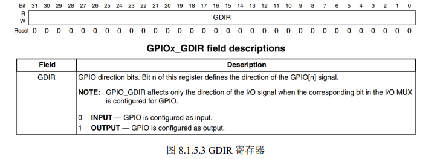

- PSR    状态寄存器    读取某个GPIO，和输入状态下的DR类似

  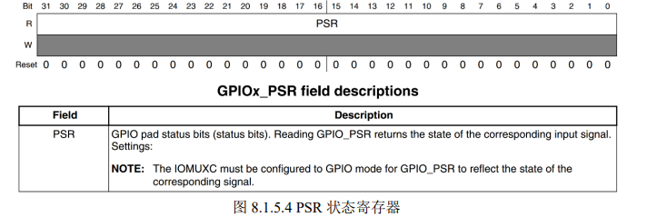

-  接下来看ICR1和ICR2这两个寄存器，都是中断控制寄存器，ICR1用于配置低16个GPIO， ICR2 用于配置高 16 个 GPIO

  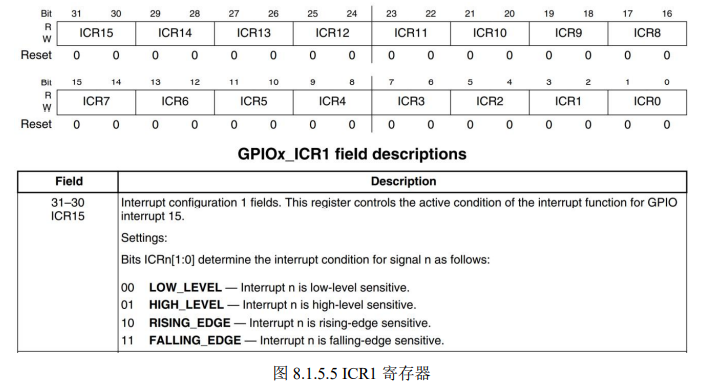

- IMR     中断屏蔽寄存器    屏蔽某个GPIO中断某位 置1

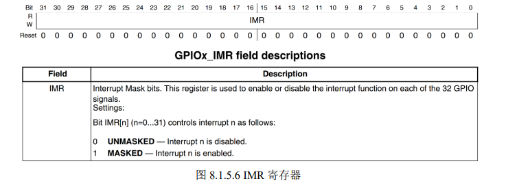

- ISR      中断状态寄存器   某个GPIO发生中断某位 置1

  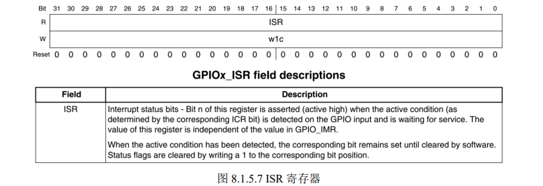

-  EDGE_SEL 边沿选择寄存器 覆盖 ICR1 和 ICR2 的设置 某位置1则为双边沿触发

  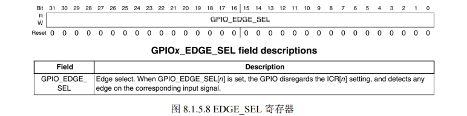

#### Clock chapter 18

- CCM_CCGR0  时钟使能  两位对应一个外设

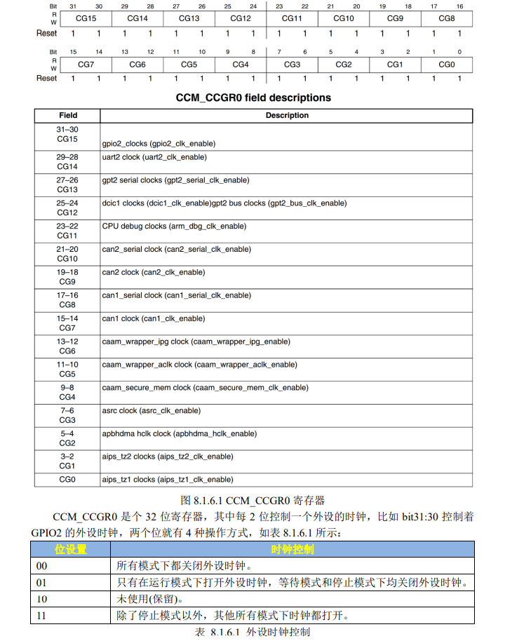

### unable to handle kernel paging request at preempt   kernel oops   Segment user

1. 内存访问出错，用了空指针，指针越界
2. 试图修改const变量
3. 仔细分析一下例如include/asm-arm/arch-s3c2410/map.h这个文件，就知道这个文件定义了许多硬件的物理地址和虚拟地址，如果虚拟地址分配时重复，则会导致硬件请求虚拟地址不成功

```
https://blog.csdn.net/dearbaba_1666/article/details/80610945
https://www.zhihu.com/question/530997689

```

addr2line、gdb、objdump三种方法

```
https://linux-kernel-labs.github.io/refs/heads/master/lectures/debugging.html#decoding-an-oops-panic
```

- addr2line：定位到出错的文件和行
- objdump：反汇编定义到发生位置前后
- gdb：自己去调式发生错误所在位置

**注意：还有另一种Segment kernel  调式方式不一样**

### Sparse

```
# define __user		__attribute__((noderef, address_space(1)))
# define __kernel	__attribute__((address_space(0)))
# define __safe		__attribute__((safe))
# define __force	__attribute__((force))
# define __nocast	__attribute__((nocast))
# define __iomem	__attribute__((noderef, address_space(2)))
# define __must_hold(x)	__attribute__((context(x,1,1)))
# define __acquires(x)	__attribute__((context(x,0,1)))
# define __releases(x)	__attribute__((context(x,1,0)))
# define __acquire(x)	__context__(x,1)
# define __release(x)	__context__(x,-1)
# define __cond_lock(x,c)	((c) ? ({ __acquire(x); 1; }) : 0)
# define __percpu	__attribute__((noderef, address_space(3)))
# define __rcu		__attribute__((noderef, address_space(4)))
# define __private	__attribute__((noderef))
```

```
https://blog.csdn.net/Rong_Toa/article/details/86585086
```

### _pa & _va

```
https://www.cnblogs.com/liuhailong0112/p/14465697.html
```

```
#define __pa(x) __virt_to_phys((unsigned long)(x)) //还能展开
#define __pa(x) __virt_to_phys((unsigned long)(x)) 
```

### 设备树与gpiod_set_value内核的匹配

移植st7735s时发现的问题：电平一直不对，set_value和实测值相反，只有dc引脚设置对应到了，然后对比了一下dc引脚和cs、rst引脚，发现设备树上如下的第三个参数有差别。

```
cs-gpios = <&gpio3 26 GPIO_ACTIVE_LOW>;

reset-gpios = <&gpio4 23 GPIO_ACTIVE_LOW>；

dc-gpios = <&gpio4 24 GPIO_ACTIVE_HIGH>;
```

都修改成HIGH后正常，不过图形显示还是有bug，全屏显示出现segmentation fault ，oops  虚拟地址访问出错？

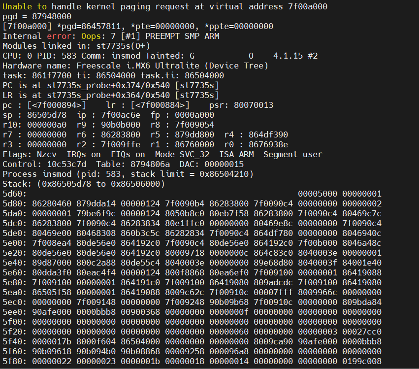
