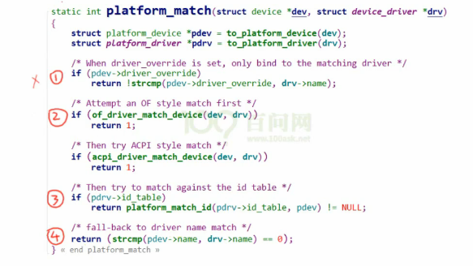
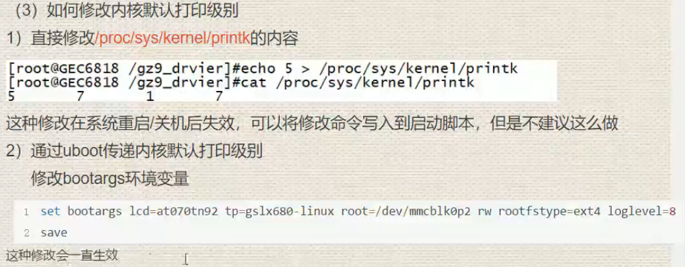

# <<linux 驱动开发>>学习日志

- arch：包含和硬件体系结构相关的代码，每种平台占一个相应的目录，如 i386、arm、arm64、powerpc、mips 等。Linux 内核目前已经支持 30 种左右的体系结构。在 arch 目录下，存放的是各个平台以及各个平台的芯片对 Linux 内核进程调度、内存管理、中断等的支持，以及每个具体的 SoC 和电路板的板级支持代码。
- block：块设备驱动程序 I/O 调度。
- crypto：常用加密和散列算法（如 AES、SHA 等），还有一些压缩和 CRC 校验算法。
- documentation：内核各部分的通用解释和注释。
- drivers：设备驱动程序，每个不同的驱动占用一个子目录，如 char、block、net、mtd、i2c 等。
- fs：所支持的各种文件系统，如 EXT、FAT、NTFS、JFFS2 等。
- include：头文件，与系统相关的头文件放置在 include/linux 子目录下。
- init：内核初始化代码。著名的 start_kernel（）就位于 init/main.c 文件中。
- ipc：进程间通信的代码。
- kernel：内核最核心的部分，包括进程调度、定时器等，而和平台相关的一部分代码放在 arch/*/kernel 目录下。
- lib：库文件代码。
- mm：内存管理代码，和平台相关的一部分代码放在 arch/*/mm 目录下。
- net：网络相关代码，实现各种常见的网络协议。
- scripts：用于配置内核的脚本文件。
- security：主要是一个 SELinux 的模块。
- sound：ALSA、OSS 音频设备的驱动核心代码和常用设备驱动。
- usr：实现用于打包和压缩的 cpio 等。
- include：内核 API 级别头文件。

内核一般要做到 drivers 与 arch 的软件架构分离，驱动中不包含板级信息，让驱动跨平台。同时内核的通用部分（如 kernel、fs、ipc、net 等）则与具体的硬件（arch 和 drivers）剥离。

```
MODULE_LICENSE（“GPL”）//申明采用了开源协议，可以使用一些开源GPL代码API
_init/_exit   在加载前占据内存，加载完后自动销毁留出空间
obj-m:模块，生成ko文件，但需要手动加载
obj-y:直接.o编进内核
objs:多.o文件编译成模块

```

#### 疑问：all和modules在Makefile中的区别?

答：没什么区别，就是别名而已，make默认执行第一个目标。

内核模块可以设置参数，在加载时进行控制  例如串口模块可以设置波特率、端口、名字等等

```
EXPORT_SYMBOL	//内部对变量或者函数可以让该函数或变量可以被其他模块使用，使用前用extern申明

EXPORT_SYMBOL_GPL	//内部对变量或者函数可以让该函数或变量可以被其他模块使用（申明了GPL协议）的使用
```

#### 疑问：`static`不是可以限制函数或者变量只可以在当前文件中吗？为什么依然可以`EXPORT_SYMBOL`申明为外部，那这样申明有意义吗？只为了在某个文件中使用？

答：`Linux-2.6`之后默认**不导出**所有的符号，所以使用`EXPORT_SYMBOL()` 做标记。static增加可读性。`EXPORT_SYMBOL`标签内定义的函数或者符号对全部内核代码公开，不用修改内核代码就可以在内核模块中直接调用，
即使用`EXPORT_SYMBOL`可以将一个函数/变量以符号的方式导出给其他模块使用。
符号的意思就是函数的入口地址，或者说是把这些符号和对应的地址保存起来的，在内核运行的过程中，可以找到这些符号对应的地址的。

`EXPORT_SYMBOL`使用方法

1. 在模块函数定义之后使用`EXPORT_SYMBOL`（函数/变量名）
2. 用该函数的模块中使用`extern`对要使用的符号或者函数进行声明
3. 首先加载定义该函数的模块，再加载调用该函数的模块

```
modprobe优于insmod: 自动加载被依赖的模块，insmod要注意自己模块加载的先后可能导致的问题。

depmod: 生成模块的依赖信息。

modinfo: 生成模块的具体版本信息
```

**另外，如果当前模块板块与内核版本不一致，那么模块将会被拒绝载入。**

卸载模块时也要注意，可能一个模块在使用另一个模块的函数，需要先把当前模块卸载再卸载另一个模块。

#### 内核模块和应用程序之间的差异：

- 内核模块是操作系统内核的一部分，运行在内核空间；应用程序在用户空间。
- 内核模块被动调用，只在初始化和清除函数分别在被加载和被卸载时调用；应用程序则是顺序执行，或者在某一循环反复调用。
- 内核函数在C库函数之下，不能调用；应用则在之上，可以调用。
- 内核模块通常要做一些清除性质的工作，通常在加载失败或者内核的清除函数中。
- 内核模块如果发生非法访问，则整个系统可能都会崩溃。应用程序只会影响自己。
- 内核的并发有很多，如中断、多处理器等；应用程序一般只考虑多线程或者多进程。
- 内核空间一般只有4KB、8KB的栈，如果需要更大的内存空间，通常需要动态申请（`vmalloc\kmalloc`）分配。
- `printk`不能打印浮点类型，否则编译时会出警告，并且模块加载不会成功。

### 中断

可以分为上半部和下半部

上半部：硬件中断，处理一些紧急且快速的事情；

下半部：软件中断，处理一些不是那么紧急或者慢的事情；

软件中断可以被硬件中断打断；

软件中断技术：

事情不是太长：`tasklet`

事情多且复杂：工作队列

新技术：`thread_irq(`针对多核设备，工作队列和`tasklet`只能在单核运行，浪费CPU资源)

（`hardwareirq,irq`）同时注册在`domain`域中(中断都注册在`domain`域  `irq_create_fwspec_mapping`)


#### 疑问：如果一个硬件中断同时对应比如按键中断和外部输入中断，那么究竟是怎么详细区分的呢？

答：载入每一个irq去执行确定到底是哪一个（**但是概念很模糊啊，还是没搞清具体怎么判断**），最好去gpio_request资源申请，确认当前资源没有被其他驱动占用。

#### 异步通知


### 高端内存

```
https://www.jianshu.com/p/0b8e1879729a
```

当内核模块代码或线程访问内存时，代码中的内存地址都为逻辑地址，而对应到真正的物理内存地址，需要地址一对一的映射。

32位Linux的虚拟地址空间也为0～4G，而内核空间只有1G，要想内核空间访问到所有的虚拟内存，需要一段空间来作为映射区域（中间桥梁、换算），临时占用一部分内存，等待用完释放，这也是线程的实现方式。


### kzalloc/kmalloc/vmalloc

```
https://www.cnblogs.com/sky-heaven/p/7390370.html
```

用kzalloc申请内存的时候， 效果等同于先是用 *kmalloc()* 申请空间 *,* 然后用 *memset()* 来初始化 *,*所有申请的元素都被初始化为 *0.*

`kmalloc()、kzalloc()、vmalloc()` 的共同特点是：

1. 用于申请内核空间的内存；
2. 内存以字节为单位进行分配；
3. 所分配的内存虚拟地址上连续；

`kmalloc()、kzalloc()、vmalloc()` 的区别是：

1. kzalloc 是强制清零的 kmalloc 操作；（以下描述不区分 kmalloc 和 kzalloc）
2. kmalloc 分配的内存大小有限制（128KB），而 vmalloc 没有限制；
3. kmalloc 可以保证分配的内存物理地址是连续的，但是 vmalloc 不能保证；
4. kmalloc 分配内存的过程可以是原子过程（使用 `GFP_ATOMIC`），而 vmalloc 分配内存时则可能产生阻塞；
5. kmalloc 分配内存的开销小，因此 kmalloc 比 vmalloc 要快；

一般情况下，内存只有在要被 DMA 访问的时候才需要物理上连续，但为了性能上的考虑，内核中一般使用 kmalloc()，而只有在需要获得**大块内存**时才使用 vmalloc()。例如，当模块被**动态加载**到内核当中时，就把模块装载到由 vmalloc() 分配的内存上。

### 内核中的内存分配

```
https://blog.csdn.net/wang_518/article/details/108913575
```

linux内核中的内存分配
1、devm_kzalloc & devm_kfree
函数devm_kzalloc和kzalloc一样都是内核内存分配函数，但是devm_kzalloc是跟设备（装置）有关的，当设备（装置）被拆卸或者驱动（驱动程序）卸载（空载）时，内存会被自动释放。另外，当内存不再使用时，可以使用函数devm_kfree（）释放。而kzalloc没有自动释放的功能，用的时候需要小心使用，如果忘记释放，会造成内存泄漏。
函数原型为

```
void * devm_kzalloc (struct device * dev, size_t size, gfp_t gfp);
dev
    Device to allocate memory for
    申请内存的目标设备。
size
    Allocation size
    申请的内存大小
gfp
    Allocation gfp flags
    申请内存的类型标志
```

2、kmalloc & kfree
分配的内存物理上连续（虚拟上也连续），只能在低端内存分配（直接内存映射区）。

```
void *kmalloc(size_t size, gfp_t gfp)；
    size： 待分配内存大小（按字节计算）
    gfp: 分配标志，用于控制kmalloc行为。
```

3、get_zeroed_page & free_page

```
unsigned long get_zeroed_page(gfp_t gfp_mask);
	gfp: 分配标志，用于控制kmalloc行为。
```

基于kmalloc实现。
分配的内存物理上连续，分配一个页面（4K），并且该页面内容被清零，只能在低端内存分配。

4、__get_free_pages & free_pages

```
unsigned long __get_free_pages(gfp_t gfp_mask, unsigned int order);
    gfp_mask: 分配标志，用于控制kmalloc行为
    order: 请求或者释放的页数的2的幂，例如：操作1页，该值为0，操作16页该值为4.如果该值太大会寻址分配失败，该值允许的最大值依赖于体系结构。
```

分配的内存物理上连续，分配指定页数的底端内存。（如果分配太大内存几百兆或者上G的内存，一般可以通过Uboot启动参数来实现（bootmemory）。

```
int get_order(unsigned long size)；
    size： 需要计算order值的大小（按字节计算）
    返回：__get_free_pages等函数需要的order值
```

5、alloc_pages & __free_pages
分配的内存物理上连续，分配指定页数的内存，可以从高端内存，也可以从底端内存分配，通过宏指定。

6、 vmalloc & vfree

```
void *vmalloc(unsigned long size);
size：待分配的内存的大小，自动按页对齐。
```

默认在动态内存映射区分配。分配的内存在内核空间中连续（虚拟连续），物理上无需连续。vmalloc由于不需要物理上也连续，所以性能很差，一般只有在必须申请大块内存时才使用，例如动态插入模块时。

7、内存分配标志
1、GFP_KERNEL:
表示该次内存 分配由内核进程调用，凡是内核内存的正常分配，该分配方式最常用。如果空闲空间不足，该次分配将使得进程进入睡眠，等待空闲页出现。不能在中断上下文、自旋锁保护的临界区和中断屏蔽保护的临界区使用。

2、GFP_ATOMIC:
用于分配请求不是来自于进程上下文，而是来自于中断、任务队列处理、内核定时器等中断上下文的情况，此时不能进入休眠。如果空闲内存不足，立即返回。

### fcntl/ioctl

```
http://blog.chinaunix.net/uid-21651676-id-60392.html
https://www.cnblogs.com/kelamoyujuzhen/p/9688307.html
```

### dup

```
https://www.cnblogs.com/pengdonglin137/p/3286627.html
```


### 自动加载&手动加载

设备插入主板后自动加载驱动，可以用udev/mdev，推荐用udev。

使用modprobe前需要把设备驱动移入/lib/modules/$(uname -r)/ 中，并且depmod更新依赖。

### container_of

```
https://www.linuxidc.com/Linux/2012-02/53701.htm#:~:text=containe,%E9%87%8F%E7%9A%84%E6%8C%87%E9%92%88%E7%9A%84%E5%8A%9F%E8%83%BD%E3%80%82
```

根据**数据成员的地址**确定**包含该数据成员结构体**的地址

### 驱动编写步骤

1. 看sch:怎么操作
2. 看芯片手册
3. 规划驱动功能
4. 写驱动、测试程序 

​        首先查看驱动 kernel/drivers/**目录里面有没有编写对应的驱动，有必要可以参照对应的LRM手册。

- 如果驱动已经实现，则make ARCH=arm menuconfig配置内核，配置好后保存，执行make ARCH=arm uImage 然后拷贝到tftpboot中。然后参照Documentation/devicetree/bindings/**中的文件，修改设备树节点，compatible属性要和驱动相互匹配，保存好执行make ARCH=arm dtbs，并且拷贝到tftboot中，重启开发板
- 如果驱动没有实现，则需要去通用设备树找到相关节点，因为一般厂家都把对应的节点初始化好了，或者自己加入子节点，注意在这之气那要看寄存器配置和手册，不过要看父节点定义，然后在板级设备树中使能相应节点，重新编译，再重新编写驱动，注意看会不会和原来的冲突。

### kset/kobject/ktype

```
https://www.cnblogs.com/xiaojiang1025/p/6193959.html
```

​        **kset**表示一组**kobject**的集合，**kobject**通过**kset**组织成层次化的结构，所有属于该**kset**的**kobject**结构的**parent**指针指向**kset**包含的**kobject**对象，构成一个父子层次关系，这些**kobject**可以是不同或相同的类型(kobj_type)。

​        sysfs中的设备组织结构很大程度上都是根据**kset**进行组织的，比如**"/sys/drivers"**目录就是一个**kset**对象，包含系统中的驱动程序对应的目录，驱动程序的目录由kobject表示。

​        比如在平台设备模型中，当我们注册一个设备或驱动到平台总线，其实是将对应的**kobject**挂接到platform总线的**kset**上，每种总线都是维护两条链表(两个kset)，一条用于链接挂接在上面的驱动(驱动kset)，一条用于链接挂接在上面的设备(设备kset)。

- kset就是管理节点，负责挂靠kobject
- kobject负责挂靠设备和驱动节点
- ktype表示当前kobject的类型
- 都是设备管理中的基本结构体

​        其中kset里面有个：

​        **list_head**还是那个用来挂在链表上的结构，包含在一个**kset**的所有kobject构成了一个**双向循环链表**，**list_head**就是这个链表的头部，这个链表用来连接第一个和最后一个kobject对象，第一个kobject使用entry连接kset集合以及第二个kobject对象，第二个kobject对象使用entry连接第一个kobject对象和第三个kobject对象，依次类推，最终形成一个kobject对象的链表。


### 中断

#### 中断号

每个中断都有一个中断号，通过中断号即可区分不同的中断，有的资料也把中断号叫做中断线。在 Linux 内核中使用一个 int 变量表示中断号。

编写驱动的时候需要用到中断号，我们用到中断号，中断信息已经写到了设备树里面，因此可以通过 irq_of_parse_and_map 函数从 interupts 属性中提取到对应的设备号

```
unsigned int irq_of_parse_and_map(struct device_node *dev, int index) 
     dev：设备节点。
     index：索引号，interrupts 属性可能包含多条中断信息，通过 index 指定要获取的信息。 
     返回值：中断号。
```

如果使用 GPIO 的话，可以使用 gpio_to_irq 函数来获取 gpio 对应的中断号

```
int gpio_to_irq(unsigned int gpio) 
    gpio：要获取的 GPIO 编号。 
    返回值：GPIO 对应的中断号。
```

#### request_irq 

在 Linux 内核中要想使用某个中断是需要申请的，request_irq 函数用于申请中断，**request_irq 函数可能会导致睡眠**，因此不能在中断上下文或者其他禁止睡眠的代码段中使用 request_irq 函 数。

request_irq 函数会激活(使能)中断，所以不需要我们手动去使能中断。

```
int request_irq(unsigned int irq, 
				irq_handler_t handler, 
				unsigned long flags,
 				const char *name, 
				void *dev)
```

- irq：要申请中断的中断号。 

- handler：中断处理函数，当中断发生以后就会执行此中断处理函数。

-  flags：中断标志，可以在文件 include/linux/interrupt.h 里面查看所有的中断标志，这里我们 介绍几个常用的中断标志，如表 51.1.1.1 所示：

  

#### 中断处理函数 

使用 `request_irq` 函数申请中断的时候需要设置中断处理函数

```
 irqreturn_t (*irq_handler_t) (int, void *) 
```

第一个参数是要中断处理函数要相应的中断号。

第二个参数是一个指向 void 的指针，也就是个通用指针，需要与 request_irq 函数的 dev 参数保持一致。用于区分共享中断的不同设备， dev 也可以指向设备数据结构。中断处理函数的返回值为 irqreturn_t 类型，irqreturn_t 类型定义 如下所示：

```
enum irqreturn {
    IRQ_NONE = (0 << 0),
    IRQ_HANDLED = (1 << 0),
    IRQ_WAKE_THREAD = (1 << 1),
};
typedef enum irqreturn irqreturn_t;
可以看出 irqreturn_t 是个枚举类型，一共有三种返回值。一般中断服务函数返回值使用如下形式：
return IRQ_RETVAL(IRQ_HANDLED)

```

#### 中断使能与禁止函数 

```
void enable_irq(unsigned int irq)

void disable_irq(unsigned int irq)	//要等到当前正在执行的中断处理函数执行完才返回，因此使用者需要保证不会产生新的中断，并且确保所有已经开始执行的中断处理程序已经全部退出。
```

```
void disable_irq_nosync(unsigned int irq) 
```

`disable_irq_nosync` 函数调用以后立即返回，不会等待当前中断处理程序执行完毕。上面三个函数都是使能或者禁止某一个中断，有时候我们需要关闭当前处理器的整个中断系统，也就是在学习 STM32 的时候常说的关闭全局中断，这个时候可以使用如下两个函数：

```
local_irq_enable() //使能当前处理器中断系统

local_irq_disable() //禁止当前处理器中断系统
```

假如 A 任务调用 local_irq_disable 关闭全局中断 10S，当关闭了 2S 的时候 B 任务开始运 行，B 任务也调用 local_irq_disable 关闭全局中断 3S，3 秒以后 B 任务调用 local_irq_enable 函 数将全局中断打开了。

此时才过去 2+3=5 秒的时间，然后全局中断就被打开了，此时 A 任务要关闭 10S 全局中断的愿望就破灭了，然后 A 任务就“生气了”，结果很严重，可能系统都要被 A 任务整崩溃。

为了解决这个问题，B 任务不能直接简单粗暴的通过 `local_irq_enable` 函数来打开全局中断，而是将中断状态恢复到以前的状态，要考虑到别的任务的感受，此时就要用到下 面两个函数：

```
local_irq_save(flags) //禁止中断，并且将中断状态保存在 flags

local_irq_restore(flags)  //恢复中断，将中断到 flags 状态。
```


#### free_irq 函数

使用中断的时候需要通过 request_irq 函数申请，使用完成以后就要通过 free_irq 函数释放 掉相应的中断。

如果中断不是共享的，那么 free_irq 会删除中断处理函数并且禁止中断。

```
 void free_irq(unsigned int irq,  void *dev) 
```

-  irq：要释放的中断。
-  dev：如果中断设置为共享(IRQF_SHARED)的话，此参数用来区分具体的中断。共享中断只有在释放最后中断处理函数的时候才会被禁止掉。 
- 返回值：无。

#### 上半部与下半部

上半部：上半部就是中断处理函数，那些处理过程比较快，不会占用很长时间的处理就可以放在上半部完成。

 下半部：如果中断处理过程比较耗时，那么就将这些比较耗时的代码提出来，交给下半部去执行，这样中断处理函数就会快进快出。

- ```
  - 如果要处理的内容不希望被其他中断打断，那么可以放到上半部。
  - 如果要处理的任务对时间敏感，可以放到上半部。 
  - 如果要处理的任务与硬件有关，可以放到上半部 
  - 除了上述三点以外的其他任务，优先考虑放到下半部。
  ```

1. 软中断

   ```
   struct softirq_action{
    	void (*action)(struct softirq_action *);
   };
   ```

   在 kernel/softirq.c 文件中一共定义了 10 个软中断，如下所示：

   ```
   static struct softirq_action softirq_vec[NR_SOFTIRQS];
   ```

   NR_SOFTIRQS 是枚举类型，定义在文件 include/linux/interrupt.h 中，定义如下：

   ```
   enum{
        HI_SOFTIRQ=0, /* 高优先级软中断 */
        TIMER_SOFTIRQ, /* 定时器软中断 */
        NET_TX_SOFTIRQ, /* 网络数据发送软中断 */
        NET_RX_SOFTIRQ, /* 网络数据接收软中断 */
        BLOCK_SOFTIRQ, 
        BLOCK_IOPOLL_SOFTIRQ, 
        TASKLET_SOFTIRQ, /* tasklet 软中断 */
        SCHED_SOFTIRQ, /* 调度软中断 */
        HRTIMER_SOFTIRQ, /* 高精度定时器软中断 */
        RCU_SOFTIRQ, /* RCU 软中断 */
        NR_SOFTIRQS
   };
   ```

   可以看出，一共有 10 个软中断，因此 NR_SOFTIRQS 为 10，因此数组 softirq_vec 有 10 个元素。

   softirq_action 结构体中的 action 成员变量就是软中断的服务函数，数组 softirq_vec 是个全局数组，因此所有的 CPU(对于 SMP 系统而言)都可以访问到，每个 CPU 都有自己的触发和控制机制，并且只执行自己所触发的软中断。

   但是各个 CPU 所执行的软中断服务函数确是相同的，都是数组 softirq_vec 中定义的 action 函数。

   要使用软中断，必须先使用 open_softirq 函数注册对应的软中断处理函数，open_softirq 函数原型如下：

   ```
   void open_softirq(int nr, void (action)(struct softirq_action ))
       nr：要开启的软中断，NR_SOFTIRQS中选择一个。
       action：软中断对应的处理函数。
       返回值：没有返回值。
   ```

   注册好软中断以后需要通过 raise_softirq 函数触发

   ```
   void raise_softirq(unsigned int nr) 
       nr：要触发的软中断，NR_SOFTIRQS中选择一个。
       返回值：没有返回值。
   ```

   **软中断必须在编译的时候静态注册！**Linux 内核使用 softirq_init 函数初始化软中断。

   ```
   void __init softirq_init(void)
   {
        int cpu;
        for_each_possible_cpu(cpu) {
            per_cpu(tasklet_vec, cpu).tail =
            &per_cpu(tasklet_vec, cpu).head;
            per_cpu(tasklet_hi_vec, cpu).tail =
            &per_cpu(tasklet_hi_vec, cpu).head;
        }
        open_softirq(TASKLET_SOFTIRQ, tasklet_action);
        open_softirq(HI_SOFTIRQ, tasklet_hi_action);
   }
   ```

2. tasklet

   tasklet 是利用软中断来实现的另外一种下半部机制，在软中断和 tasklet 之间，建议大家使 用 tasklet。

   ```
   struct tasklet_struct{
       struct tasklet_struct *next; /* 下一个 tasklet */
       unsigned long state; /* tasklet 状态 */
       atomic_t count; /* 计数器，记录对 tasklet 的引用数 */
       void (*func)(unsigned long); /* tasklet 执行的函数 */
       unsigned long data; /* 函数 func 的参数 */
   };
   ```

3. 工作队列

   工作队列在进程上下文执行，工作队列将要推后的 工作交给一个内核线程去执行，因为工作队列工作在进程上下文，因此工作队列允许睡眠或重 新调度。因此如果你要推后的工作可以睡眠那么就可以选择工作队列，否则的话就只能选择软 中断或 tasklet。

   ```
   /* work_struct 结构体表示一个工作 */
   struct work_struct {
    atomic_long_t data; 
    struct list_head entry;
    work_func_t func; /* 工作队列处理函数 */
   };
   /* 工作队列 */
   struct workqueue_struct {
        struct list_head pwqs; 
        struct list_head list; 
        struct mutex mutex; 
        int work_color;
        int flush_color; 
        atomic_t nr_pwqs_to_flush;
        struct wq_flusher *first_flusher;
        struct list_head flusher_queue; 
        struct list_head flusher_overflow;
        struct list_head maydays; 
        struct worker *rescuer; 
        int nr_drainers; 
        int saved_max_active;
        struct workqueue_attrs *unbound_attrs;
        struct pool_workqueue *dfl_pwq;  
        char name[WQ_NAME_LEN];
        struct rcu_head rcu;
        unsigned int flags ____cacheline_aligned;
        struct pool_workqueue __percpu *cpu_pwqs;
        struct pool_workqueue __rcu *numa_pwq_tbl[];
   };
   
   /*用工作者线程(worker thread)*/
   struct worker {
        union {
            struct list_head entry; 
            struct hlist_node hentry;
        };
        struct work_struct *current_work; 
        work_func_t current_func; 
        struct pool_workqueue *current_pwq;
        bool desc_valid;
        struct list_head scheduled; 
        struct task_struct *task; 
        struct worker_pool *pool; 
        struct list_head node; 
        unsigned long last_active; 
        unsigned int flags; 
        int id; 
        char desc[WORKER_DESC_LEN];
        
        struct workqueue_struct *rescue_wq;
        //每个 worker 都有一个工作队列
   };
   
   ```

在实际的驱动开发中，我们只需要定义工作(work_struct)即可，关于工作 队列和工作者线程我们基本不用去管。

简单创建工作很简单，直接定义一个 work_struct 结构体 变量即可，然后使用 INIT_WORK 宏来初始化工作，INIT_WORK 宏定义如下：

```
#define INIT_WORK(_work, _func)
```

work 表示要初始化的工作，_func 是工作对应的处理函数。 

也可以使用 DECLARE_WORK 宏一次性完成工作的创建和初始化

```
#define DECLARE_WORK(n, f)
    n 表示定义的工作(work_struct)
    f 表示工作对应的处理函数。 
```

和 tasklet 一样，工作也是需要调度才能运行的，工作的调度函数为schedule_work

```
bool schedule_work(struct work_struct *work) 
    work：要调度的工作。 
    返回值：0 成功，其他值 失败。
```

当然如果想推迟工作可以INIT_DELAYED_WORK()声明，schedule_delayed_work延后执行

### 定时器

Linux 内核使用全局变量 jiffies 来记录系统从启动以来的系统节拍数，系统启动的时候会 将 jiffies 初始化为 0，jiffies 定义在文件 include/linux/jiffies.h 中，定义如下： 

```
 extern u64 __jiffy_data jiffies_64; 

 extern unsigned long volatile __jiffy_data jiffies; 
```

`jiffies_64` 和 `jiffies` 其实是同一个东西，`jiffies_64` 用于 64 位系统，而 `jiffies` 用于 32 位系统。 为了兼容不同的硬件，`jiffies` 其实就是 `jiffies_64` 的低 32 位。

`jiffies_64` 和 `jiffies` 其实是同一个东西，`jiffies_64` 用于 64 位系统，而 `jiffies` 用于 32 位系统。 为了兼容不同的硬件，`jiffies` 其实就是 `jiffies_64` 的低 32 位。

假如 HZ 为最大值 1000 的时候，`32 位的 jiffies` 只需要 49.7 天就发生了绕回，对于 `64 位的 jiffies` 来说大概需要 5.8 亿年才能绕回，因此 `jiffies_64` 的绕回忽略不计。处理 `32 位 jiffies` 的绕回显得尤为重要， Linux 内核提供了如表 50.1.1.1 所示的几个 API 函数来处理绕回。 


Linux 内核使用 timer_list 结构体表示内核定时器，timer_list 定义在文件 include/linux/timer.h 中。

```
struct timer_list {
     struct list_head entry;
     unsigned long expires; /* 定时器超时时间，单位是节拍数 */
     struct tvec_base *base;
     void (*function)(unsigned long); /* 定时处理函数 */
     unsigned long data; /* 要传递给 function 函数的参数 */
     int slack;
};
```

#### API

1、init_timer

 init_timer 函数负责初始化 timer_list 类型变量，当我们定义了一个 timer_list 变量以后一定 要先用 init_timer 初始化一下。

```
void init_timer(struct timer_list *timer)
 	timer：要初始化定时器。
 	返回值：没有返回值。 
```

2、add_timer

 add_timer 函数用于向 Linux 内核注册定时器，使用 add_timer 函数向内核注册定时器以后， 定时器就会开始运行

```
void add_timer(struct timer_list *timer) 
    timer：要注册的定时器。 
    返回值：没有返回值。
```

 3、del_timer

del_timer 函数用于删除一个定时器，不管定时器有没有被激活，都可以使用此函数删除。

 在多处理器系统上，定时器可能会在其他的处理器上运行，因此在调用 del_timer 函数删除定时器之前要先等待其他处理器的定时处理器函数退出。 

```
int del_timer(struct timer_list * timer) 
    timer：要删除的定时器。 
    返回值： 0，定时器还没被激活；
    		1，定时器已经激活。 
```

4、del_timer_sync 

 del_timer_sync 函数是 del_timer 函数的同步版，会等待其他处理器使用完定时器再删除， del_timer_sync 不能使用在中断上下文中。del_timer_sync 函数原型如下所示： 

```
int del_timer_sync(struct timer_list *timer) 
    timer：要删除的定时器。 
    返回值： 0，定时器还没被激活；
    		1，定时器已经激活。
```

5、mod_timer

mod_timer 函数用于修改定时值，如果定时器还没有激活的话，mod_timer 函数会激活定时器！

```
int mod_timer(struct timer_list *timer, unsigned long expires) 
    timer：要修改超时时间(定时值)的定时器。 
    expires：修改后的超时时间。 
    返回值： 0，调用 mod_timer 函数前定时器未被激活；
    		1，调用 mod_timer 函数前定时器已 被激活。
```


### 互斥和同步

1. 为什么自旋锁的临界区不能睡眠？

2. arm 64处理器当中，我们如何实现独占访问内存。

   ```
   ldrex&strex
   https://blog.csdn.net/Roland_Sun/article/details/47670099
   ```

3. 排队自旋锁是如何实现MCS锁的？

4. 乐观自旋锁等待的判断条件是什么？

5. 请你说出MCS锁机制的实现原理？


临界区（critical region）是指访问和操作共享数据的代码段，其中的资源无法同时被所得执行线程访问，访问临界区的执行线程或代码路径成为并发源。我们为了避免并发访问临界区，软件工程师必须保证访问临界区的原子性，即在临界区被不能有多个并发源同时执行，整个临界区就像一个不可分割的整体。

在linux内核当中产生访问的并发源主要有：中断和异常、内核抢占、多处理器并发执行、软中断和tasklet。

考虑SMP（Share memory processor）系统：

- 同一类型的中断程序不会并发执行，但是不同类型的中断可能送达可能送达不同的CPU，因此不同类型的中断处理程序可能会并发执行。
- 同一类型的软中断会在不同的CPU上并发执行。
- 同意类型的tasklet是串行执行的，不会在多个PCU上并发执行。
- 不同CPU上的进程上下文会并发执行。


#### 中断屏蔽

#### 原子变量

原子操作保证指令以原子的方式执行，执行过程中不会被打断。假设两个线程thread_afunc和thread_bfunc执行i++操作，那么i最后等于？


#### 自旋锁

自旋锁一直占据线程不阻塞。自旋锁时间必须短且不可以引入进程切换，被自旋锁保护的临界区一定不能调用任何能够引起睡眠和阻塞的 API 函数，否则可能死锁。

```
typedef struct spinlock {
    union {
        struct raw_spinlock rlock;

        #ifdef CONFIG_DEBUG_LOCK_ALLOC
        # define LOCK_PADSIZE (offsetof(struct raw_spinlock, dep_map))
        struct {
        u8 __padding[LOCK_PADSIZE];
        struct lockdep_map dep_map;
        };
        #endif
    };
} spinlock_t;
```


使用 `spin_lock_irq/spin_unlock_irq` 的时候需要用户能够确定加锁之前的中断状态，但实际 上内核很庞大，运行也是“千变万化”，我们是很难确定某个时刻的中断状态，因此**不推荐**使用`spin_lock_irq/spin_unlock_irq`。建议使用 `spin_lock_irqsave/spin_unlock_irqrestore`，因为这一组函 数会保存中断状态，在释放锁的时候会恢复中断状态。一般在**线程中**使用 `spin_lock_irqsave/ spin_unlock_irqrestore`，在**中断中**使用 `spin_lock/spin_unlock`。


#### 读写锁

#### 顺序锁

#### 信号量

1. 因为信号量可以使等待资源线程进入休眠状态，因此适用于那些占用资源比较久的场合。
2. 因此信号量不能用于中断中，因为信号量会引起休眠，中断不能眠。
3. 如果共享资源的持有时间比较短，那就不适合使用信号量了，因为频繁的休眠、切换线程引起的开销要远大于信号量带来的那点优势。

```
struct semaphore {
     raw_spinlock_t lock;
     unsigned int count;
     struct list_head wait_list;
};
```


#### 互斥量（mutex）

1. mutex 可以导致休眠，因此不能在中断中使用 mutex，**中断中只能使用自旋锁**。
2. 和信号量一样，mutex 保护的临界区可以调用引起阻塞的 API 函数。 
3. 因为一次只有一个线程可以持有 mutex，因此，必须由 mutex 的持有者释放 mutex。并且 mutex 不能递归上锁和解锁。

```
struct mutex {
     /* 1: unlocked, 0: locked, negative: locked, possible waiters */
     atomic_t count;
     spinlock_t wait_lock;
};
```


#### RCU机制

### 驱动检测设备原理

#### 不支持热插拔设备

系统启动或者加载.ko文件时检测对应端口，如果有对应ID则加载、初始化并且添加到对应的/dev设备文件中

#### 支持热插拔设备

支持热插拔的设备分为两种

1. 单独的引脚检测是否有设备插入
2. 有对应接口一直检测设备

### 疑问：根目录下/sys、/proc和/dev文件夹有什么区别？

/dev表示已经挂载的设备

/proc表示正在运行的内存信息映射

/sys硬件设备的驱动程序信息，其中/sys/devices/platform里面有基于平台的所有驱动

### 内联汇编


```
1. Clobbers 是一个以逗号分隔的寄存器列表（该列表中还可以存放一些特殊值，用于表示一些特殊用途）。
2. 它的目的是为了告知编译器，Clobbers 列表中的寄存器会被该asm语句中的汇编代码隐性修改。
3. 由于 Clobbers 里的寄存器会被asm语句中的汇编代码隐性修改，编译器在为 input operands 和 output operands 挑选寄存器时，就不会使用 Clobbers 里指定的寄存器，这样就避免了发生数据覆盖等逻辑错误。
4. 通俗来讲，Clobbers 的用途就是为了告诉编译器，我这里指定的这些寄存器在该asm语句的汇编代码中用了，你在编译这条asm语句时，如果需要用到寄存器，别用我这里指定的这些，否则就都乱了。
5. Clobbers 里的特殊值可以为 cc，用于表示该平台的 flags 寄存器会被隐性修改（比如 x86 平台的 eflags 寄存器）。
6. Clobbers 里的特殊值也可以为 memory，用于表示某些内存数据会被隐性使用或隐性修改，所以在执行这条asm语句之前，编译器会保证所有相关的、涉及到内存的寄存器里的内容会被刷到内存中，然后再执行这条asm语句。在执行完这条asm语句之后，这些寄存器的值会再被重新load回来，然后再执行这条asm语句后面的逻辑。这样就保证了所有操作用到的数据都是最新的，是正确的。
```


### 设备树和驱动匹配

platform_match



platform_driver

​	.driver

​		of_match_table

​			of_device_id

​				.compatible

​	(或者).id_table

### GPIO子系统常用函数

gpio子系统对于驱动层的API位于“/kernel/include/linux/gpio.h”中。

【1】检查gpio是否可用

```
int gpio_is_valid(int number); 
参数/				含义
number			gpio序号
返回			可用返回true，不可用返回false
```

【2】申请使用一个gpio

使用一个gpio前，必须向内核申请该gpio。

```
int gpio_request(unsigned gpio, const char *label)
参数			含义
gpio		待申请gpio序号
label		gpio命名
返回		成功返回0，失败返回负数
```

【3】释放已申请gpio

  如果不使用该gpio，则需要释放，否则其他模块申请不到该gpio序号。

```
int gpiod_put(unsigned gpio)
参数		含义
gpio	待释放gpio序号
label	gpio命名
```

【4】设置gpio输入模式

```
int gpio_direction_input(unsigned gpio)
参数			含义
gpio		待设置gpio序号
返回		成功返回0，失败返回负数
```

【5】设置gpio输出模式

```
int gpio_direction_output(unsigned gpio, int value)
参数		含义
gpio	待设置gpio序号
value	默认输出状态
返回	成功返回0，失败返回负数
```

【6】读取 gpio状态

```
int gpio_get_value(unsigned int gpio)
参数	含义
gpio	待读取gpio序号
返回	成功返回gpio状态（1/0），失败返回负数
```

【7】设置 gpio状态

```
void gpio_set_value(unsigned int gpio, int value)
参数	含义
gpio	待设置gpio序号
value	待设置值
```

【8】中断号映射

```
int gpio_to_irq(unsigned gpio)
参数	含义
gpio	待设置gpio序号
返回	成功返回中断号，失败返回负数
```

#### 应用

利用pinctrl和gpio子系统实现一个io翻转控制LED。firefly-rk3399板子上有两个LED，分别是power led和user led。linux自带的“gpio-leds”驱动是在linux led框架的基础上实现的，我们使用user led的gpio口，不使用led框架，直接使用gpio子系统实现io输出状态控制和读取。

-  修改设备树

  【1】首先屏蔽rk3399原有的“led user”设备树，否则驱动会冲突。

    leds {
                compatible = "gpio-leds";
                ......
                /*user {
                 *      label = "firefly:yellow:user";
                 *      linux,default-trigger = "ir-user-click";
                 *      gpios = <&gpio0 13 GPIO_ACTIVE_HIGH>;
                 *      pinctrl-names = "default";
                 *      pinctrl-0 = <&led_user>;
                 *      default-state = "off";
                 *};
                 */
        };
	  在“kernel/arch/arm64/boot/dts/rockchip/rk3399-firefly.dtsi”

      gpiopin{
                compatible = "gpiopin";	/*驱动兼容属性*/
                gpios = <&gpio0 13 GPIO_ACTIVE_HIGH>;/* gpio描述，提供给pinctrl子系统使用*/
                pinctrl-names = "default";	/*pin脚默认状态*/
                pinctrl-0 = <&led_user>;	/*直接使用rk原命名的pin脚设备树,也可以单独重新命名*/
                default-state = "off";		/*默认gpio输出0*/
        };
	#源自rk3399-firefly-port.dtsi
	led_user: led-user {
			rockchip,pins = <0 13 RK_FUNC_GPIO &pcfg_pull_none>;/*pin脚为普通gpio模式*/
		};
	};
	  修改完设备树，可以编译内核，更新板子boot区域（内核和设备树文件）。

### pinctrl

```
https://www.cnblogs.com/hellokitty2/p/12501493.html
```

### struct inode 和struct file

```
https://www.cnblogs.com/QJohnson/archive/2011/06/24/2089414.html
```

### 设备树节点匹配platform_deivce和驱动

```
https://blog.csdn.net/Aa_lihua/article/details/106064773
```

### &gpio*


dtc -I dtb -O dts *** .dtb > ***.dts反编译


### 节点构造函数解析

**注意：节点有关文件与操作，是重点**

```
https://deepinout.com/linux-kernel-api/device-driver-and-device-management/
```

#### register_chrdev(major,name"/proc/devices",file oerations *)

函数register_chrdev()调用函数register_chrdev()实现其功能，函数register_chrdev()首先调用函数__register_chrdev_region()创建一个字符设备区，此设备区的主设备号相同，由函数register_chrdev()的第一个参数决定，次设备号的变化范围是0～256，设备区的名字为函数register_chrdev()的第二个参数，此函数将更改`/proc/devices`文件的内容；然后动态申请一个新的字符设备cdev结构体变量，对其部分字段进行初始化，初始化完成之后将其加入Linux内核系统中，即向Linux内核系统添加一个新的字符设备。函数register_chrdev()调用函数cdev_alloc()动态申请一个字符设备，调用函数cdev_add()将其加入Linux内核系统中。

- 文件包含：#include <linux/fs.h>
- int __register_chrdev(unsigned int major, unsigned int baseminor,
  		      unsigned int count, const char *name,
                		      const struct file_operations *fops)
  - __register_chrdev_region(major, baseminor, count, name);
  - cdev_alloc();
  - kobject_set_name(&cdev->kobj, "%s", name);
  - cdev_add(cdev, MKDEV(cd->major, baseminor), count);

#### device_create(class,    ,MKDEV(),    ,name""/dev/name"")

函数**device_create()**用于动态地创建逻辑设备，并对新的逻辑设备类进行相应的初始化，将其与此函数的第一个参数所代表的逻辑类关联起来，然后将此逻辑设备加到Linux内核系统的设备驱动程序模型中。函数能够自动地在`/sys/devices/virtual`目录下创建新的逻辑设备目录，在`/dev`目录下创建与逻辑类对应的设备文件。

- 文件包含：#include <linux/device.h>

- 定义

  ```
  struct device *device_create(struct class *cls, struct device *parent, dev_t devt, void *drvdata, const char *fmt, ...);
  ```

  

#### class_create(MODULE,name"/sys/class/name")

宏**class_create()**用于动态创建设备的逻辑类，并完成部分字段的初始化，然后将其添加进Linux内核系统中。此函数的执行效果就是在目录`/sys/class`下创建一个新的文件夹，此文件夹的名字为此函数的第二个输入参数，但此文件夹是空的。宏class_create()在实现时，调用了函数[__class_create](https://deepinout.com/linux-kernel-api/device-driver-and-device-management/linux-kernel-api__class_create.html)()，作用和函数__class_create()基本相同。

- 文件包含：#include <linux/device.h>

- 宏定义：

  ```
  #define class_create(owner, name)		\
  ({						\
  	static struct lock_class_key __key;	\
  	__class_create(owner, name, &__key);	\
  })	
  ```

  - 参数`owner`是一个struct module结构体类型的指针，指向函数__class_create()即将创建的struct class类型对象的拥有者，一般赋值为THIS_MODULE，此结构体的详细定义见文件linux-3.19.3/include/linux/module.h。
  - 参数`name`是char类型的指针，代表即将创建的struct class变量的名字，用于给struct class的name字段赋值。

### u-boot rk3399加载设备树

```
https://blog.csdn.net/sements/article/details/104795430
```

需要知道的一点是，在arm64架构下，linux已经弃用mach_xx等文件夹来描述板级信息供linux内核启动时去匹配根节点下的compatible属性来找到对应设备树。

取而代之是单纯的接收bootloader传递过来的单一设备树文件dtb所在的内存地址。所以当多个dtb文件存在镜像中或者内存中时，如何找到需要的dtb的这个任务，就落在了bootloader肩上。


### make menuconfig

- Kconfig
- Makefile
- .config

在drivers每个子目录下都有以上三项，作为make menuconfig的适配项，可以图形化配置，并且把子目录下的drv.c生成相应的.o/.ko文件等等，依据依赖可以重新编译内核，M编成模块自己添加，*直接编进内核，在/sys/class/dev中可以找到。

当然，可以自己修改对应的Kconfig\Makefile文件自己生成menuconfig里面的项，不建议直接修改.config文件，如果有依赖的话，修改不成功。

menuconfig 依据.config文件对内核进行选项配置。

修改完后记得make ***_defconfig对应的文件需要被.config替换掉，注意名字不改改内容。


配置好记得save，再根据需要自己重新make ***_defconfig、编译内核

其实就是把已经有的内核编译进去，适合批量编译和多依赖编译；少量模块完全可以自己交叉编译，生成模块然后insmod，当然，两个方法都要根据需要改设备树。

### gpio&gpiod

之前旧的方式从dts获取gpio，基本都要用of函数，现在新的方式（大约4.4之后）可以直接使用“gpiod_”开头的函数。

```
https://zhuanlan.zhihu.com/p/115657651
```

- devm_gpiod_get_optional
  - devm_gpiod_get_index_optional
    - devm_gpiod_get_index
      - gpiod_get_index
        - of_find_gpio
          - of_get_named_gpiod_flags


```
命名需要为*-gpios,且长度不能大于32
```

- gpiod_get
  - gpiod_get_index
    - of_find_gpio
      - of_get_named_gpiod_flags

```
struct gpio_desc *__must_check gpiod_get_index(struct device *dev,
					       const char *con_id,
					       unsigned int idx,
					       enum gpiod_flags flags)
/* 	获取GPIO，可以得到一系列GPIO设备描述符
 *	例：
 *	dev_desc = gpiod_get(&dev, "dc", GPIOD_OUT_HIGH);
 *	对应dts:
 *	dc-gpios = <SPI 124 0>;
 *	con_id在这里为dc
 *	idx可以自己设置序列完成设备描述符的获取
 *	flags并不重要，后面自己可以根据需要gpiod_set_value（dev_desc，0/1）
 *	或者可以获取flags,然后设置有效位???
 */
```

- of_get_named_gpio
  - of_get_named_gpio_flags(nd, name, index, NULL)
- of_get_gpio_flags
  - of_get_named_gpio_flags（nd, "gpios", index, flags）

### gpio_chip

```
https://www.cnblogs.com/wanglouxiaozi/p/14480296.html
```

### mmap

关键是共享和私有

- ioremap在应用层实现了内核的空间映射，在内核层file_operations.mmap里面`virt_to_phys(kernel_buf)`让应用层层通过`buf=mmap(NULL, 1024*8, PROT_READ | PROT_WRITE, MAP_SHARED, fd, 0)`操作buf数据。

  

`\#include <sys/mman.h>`

```
void *mmap(void *addr, size_t length, int prot, int flags,
        int fd, off_t offset);
int munmap(void *addr, size_t length);
```

mmap实现了将设备驱动在内核空间的部分地址**直接映射**到用户空间，使得用户程序可以**直接访问和操作**相应的内容。**减少了额外的拷贝**，而一般的read，write函数虽然表面上直接向设备写入，其实**还需要进行一次拷贝**。

```
https://blog.csdn.net/manshq163com/article/details/18451135
```

```
mmap
void *mmap(void *addr, size_t length, int prot, int flags,
        int fd, off_t offset);
```

把文件或者设备映射到内存。

这个函数在调用进程的虚拟地址空间中创建一块映射区域。

**这个函数返回新创建的页面的地址。**

映射区域的首地址在addr中指定，length指定映射区域的长度。如果addr是NULL，那么**由内核来选择一个地址**来创建映射的区域,否则创建的时候会尽可能地使用addr的地址。在linux系统中，创建映射的时候应该是在下一个页面的边界创建,**addr是NULL的时候，程序的可移植性最好**。
length指定文件被映射的长度。

offset指定从文件的哪个偏移位置开始映射**，offset必须是页面大小的整数倍**，页面的大小可以由`sysconf(_SC_PAGE_SIZE)`来返回。
prot指定内存的保护模式（具体参见man）。
flags指定区域在不同进程之间的共享方式，以及区域是否同步到相应的文件等等（具体参见man）。


munmap

取消address指定地址范围的映射。以后再引用取消的映射的时候就会导致非法内存的访问。这里address应该是页面的整数倍。

成功的时候这个函数返回0。

失败的时候，两者都返回-1.

### 内核打印信息

```
echo "7 4 1 7" > /proc/sys/kernel/printk
```




### 内核模块外部修改参数


### 调试GPIO

```
cat /sys/kernel/debug/gpio
```

### pinfunc.h

#### IOMUXC chapter30

```
IOMUXC P30章节
	IOMUXC_SW_MUX_CTL_PAD_<PAD_NAME>  	//定义引脚复用属性
	IOMUXC_SW_PAD_CTL_PAD_<PAD_NAME>	//定义引脚电气属性
	SELECT_INPUT
```


```
mux_ctrl_ofs:复用节点偏移地址MUX_CTL_PAD_
pad_ctrl_ofs:引脚偏移地址PAD_CTL_PAD_
sel_input_ofs:输入引脚引用的偏移地址SELECT_INPUT
mux_mode:复用功能MUX_CTL_PAD_
sel_input:输入引脚引用的源脚SELECT_INPUT
```


#### GPIO chapter 26


下面寄存器中除了CR1和CR2，都是某位对应族中某个GPIO

- DR 	数据寄存器    

  

- GDIR 方向寄存器    设置输入0输出1 

  

- PSR    状态寄存器    读取某个GPIO，和输入状态下的DR类似

  

-  接下来看ICR1和ICR2这两个寄存器，都是中断控制寄存器，ICR1用于配置低16个GPIO， ICR2 用于配置高 16 个 GPIO

  

- IMR     中断屏蔽寄存器    屏蔽某个GPIO中断某位 置1


- ISR      中断状态寄存器   某个GPIO发生中断某位 置1

  

-  EDGE_SEL 边沿选择寄存器 覆盖 ICR1 和 ICR2 的设置 某位置1则为双边沿触发

  

#### Clock chapter 18

- CCM_CCGR0  时钟使能  两位对应一个外设


### unable to handle kernel paging request at preempt   kernel oops   Segment user

1. 内存访问出错，用了空指针，指针越界
2. 试图修改const变量
3. 仔细分析一下例如include/asm-arm/arch-s3c2410/map.h这个文件，就知道这个文件定义了许多硬件的物理地址和虚拟地址，如果虚拟地址分配时重复，则会导致硬件请求虚拟地址不成功

```
https://blog.csdn.net/dearbaba_1666/article/details/80610945
https://www.zhihu.com/question/530997689

```

addr2line、gdb、objdump三种方法

```
https://linux-kernel-labs.github.io/refs/heads/master/lectures/debugging.html#decoding-an-oops-panic
```

- addr2line：定位到出错的文件和行
- objdump：反汇编定义到发生位置前后
- gdb：自己去调式发生错误所在位置
- 额外加一个printk大法好。

**注意：还有另一种Segment kernel  调式方式不一样**

### Sparse

```
# define __user		__attribute__((noderef, address_space(1)))
# define __kernel	__attribute__((address_space(0)))
# define __safe		__attribute__((safe))
# define __force	__attribute__((force))
# define __nocast	__attribute__((nocast))
# define __iomem	__attribute__((noderef, address_space(2)))
# define __must_hold(x)	__attribute__((context(x,1,1)))
# define __acquires(x)	__attribute__((context(x,0,1)))
# define __releases(x)	__attribute__((context(x,1,0)))
# define __acquire(x)	__context__(x,1)
# define __release(x)	__context__(x,-1)
# define __cond_lock(x,c)	((c) ? ({ __acquire(x); 1; }) : 0)
# define __percpu	__attribute__((noderef, address_space(3)))
# define __rcu		__attribute__((noderef, address_space(4)))
# define __private	__attribute__((noderef))
```

```
https://blog.csdn.net/Rong_Toa/article/details/86585086
```

### _pa & _va

```
https://www.cnblogs.com/liuhailong0112/p/14465697.html
```

```
#define __pa(x) __virt_to_phys((unsigned long)(x)) //还能展开
#define __pa(x) __virt_to_phys((unsigned long)(x)) 
```

### *-gpios & gpiod_set_value

移植st7735s时发现的问题：电平一直不对，set_value和实测值相反，只有dc引脚设置对应到了，然后对比了一下dc引脚和cs、rst引脚，发现设备树上如下的第三个参数有差别。

```
cs-gpios = <&gpio3 26 GPIO_ACTIVE_LOW>;

reset-gpios = <&gpio4 23 GPIO_ACTIVE_LOW>；

dc-gpios = <&gpio4 24 GPIO_ACTIVE_HIGH>;
```

都修改成HIGH后正常，不过图形显示还是有bug，全屏显示出现segmentation fault ，oops  虚拟地址访问出错？


### 内核从设备树获取属性&节点

首先翻译内核的dtb文件，然后对节点进行适配性匹配，最后配置属性值。

```
https://blog.csdn.net/thisway_diy/article/details/84336817//原理
https://www.cnblogs.com/TaXueWuYun/p/15389889.html	//API
```

开发板中，`/sys/firmware/fdt`查看原始dtb文件

 `/sys/firmware/devicetree` // 以目录结构程现的dtb文件, 根节点对应base目录, 每一个节点对应一个目录, 每一个属性对应一个文件
比如查看 `#address-cells` 的16进制

```
hexdump -C “#address-cells”
```

查看compatible

```
cat compatible
```


如果你在设备树设备节点中设置一个错误的中断属性，那么就导致led对应的平台设备节点没办法创建
 `/sys/devices/platform` // 系统中所有的`platform_device`, 有来自设备树的, 也有来自.c文件中注册的。

对于来自设备树的`platform_device`, 可以进入 `/sys/devices/platform/<设备名>/of_node` 查看它的设备树属性。

 `/proc/device-tree` 是链接文件, 指向 `/sys/firmware/devicetree/base`

### devm_**

```
https://blog.csdn.net/jgw2008/article/details/52691568
```

函数`devm_kzalloc`和`kzalloc`一样都是内核内存分配函数，但是`devm_kzalloc`是跟设备（装置）有关的，当设备（装置）被拆卸或者驱动（驱动程序）卸载（空载）时，内存会被自动释放。另外，当内存不再使用时，可以使用函数`devm_kfree（）`释放。而`kzalloc`没有自动释放的功能，用的时候需要小心使用，如果忘记释放，会造成内存泄漏。

### regmap API

Linux 下大部分设备的驱动开发都是操作其内部寄存器。

如使用 i2c_transfer 来读写 I2C 设备中的寄存器，SPI 接口的话使用 spi_write/spi_read 等。

**由于需要大量的寄存器操作，模型复用性会降低，所以引入了通用的regmap函数进行操作**

regmap 是 Linux 内核为了减少慢速 I/O 在驱动上的冗余开销，提供了一种通用的接口来操 作硬件寄存器。

另外，regmap 在驱动和硬件之间添加了 cache，降低了低速 I/O 的操作次数，提高了访问效率，缺点是实时性会降低。 

**什么情况下会使用 regmap：**

①、硬件寄存器操作，比如选用通过 I2C/SPI 接口来读写设备的内部寄存器，或者需要读 写 SOC 内部的硬件寄存器。 

②、提高代码复用性和驱动一致性，简化驱动开发过程。 

③、减少底层 I/O 操作次数，提高访问效率。

**`regmap` 框架分为三层：** 

①、底层物理总线：regmap 就是对不同的物理总线进行封装，目前 regmap 支持的物理总线有 `i2c、i3c、spi、mmio、sccb、sdw、slimbus、irq、spmi 和 w1`。

②、regmap 核心层，用于实现 regmap，我们不用关心具体实现。 

③、regmapAPI 抽象层，regmap 向驱动编写人员提供的 API 接口，驱动编写人员使用这些 API 接口来操作具体的芯片设备，也是驱动编写人员重点要掌握的。

### IS_ERR& PTR_ERR& ERR_PTR

```
https://www.jianshu.com/p/36ed811e9a1b
```

```
#define MAX_ERRNO   4095 //0xfff   -4095   0xfffff000  正好4K分配给错误空间

#ifndef __ASSEMBLY__

#define IS_ERR_VALUE(x) unlikely((x) >= (unsigned long)-MAX_ERRNO)

static inline void * __must_check ERR_PTR(long error)
{
    return (void *) error;
}

static inline long __must_check PTR_ERR(const void *ptr)
{
    return (long) ptr;
}

static inline long __must_check IS_ERR(const void *ptr)
{
    return IS_ERR_VALUE((unsigned long)ptr);
}

static inline long __must_check IS_ERR_OR_NULL(const void *ptr)
{
    return !ptr || IS_ERR_VALUE((unsigned long)ptr);
}
```

### oops

```
https://www.cnblogs.com/wwang/archive/2010/11/14/1876735.html
```

 \* error_code:
 \*   bit 0 == 0 means no page found, 1 means protection fault
 \*   bit 1 == 0 means read, 1 means write
 \*   bit 2 == 0 means kernel, 1 means user-mode
 \*    bit 3 == 0 means data, 1 means instruction

有时候，Oops还会打印出Tainted信息。这个信息用来指出内核是因何种原因被tainted（直译为“玷污”）。具体的定义如下：

> ```
>  1: 'G' if all modules loaded have a GPL or compatible license, 'P' if any proprietary module has been loaded.  Modules without a MODULE_LICENSE or with a MODULE_LICENSE that is not recognised by insmod as GPL compatible are assumed to be proprietary.
>  2: 'F' if any module was force loaded by "insmod -f", ' ' if all modules were loaded normally.
>  3: 'S' if the oops occurred on an SMP kernel running on hardware that hasn't been certified as safe to run multiprocessor. Currently this occurs only on various Athlons that are not SMP capable.
>  4: 'R' if a module was force unloaded by "rmmod -f", ' ' if all modules were unloaded normally.
>  5: 'M' if any processor has reported a Machine Check Exception, ' ' if no Machine Check Exceptions have occurred.
>  6: 'B' if a page-release function has found a bad page reference or some unexpected page flags.
>  7: 'U' if a user or user application specifically requested that the Tainted flag be set, ' ' otherwise.
>  8: 'D' if the kernel has died recently, i.e. there was an OOPS or BUG.
>  9: 'A' if the ACPI table has been overridden.
>  10: 'W' if a warning has previously been issued by the kernel. (Though some warnings may set more specific taint flags.)
>  11: 'C' if a staging driver has been loaded.
>  12: 'I' if the kernel is working around a severe bug in the platform firmware (BIOS or similar).
> ```
>
> 

### inlcude/uapi

在此目录下表示用户空间同样**拥有和可以使用**里面的成员。
