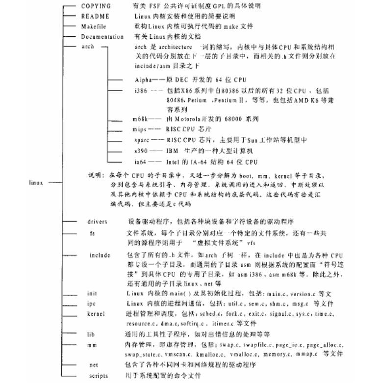
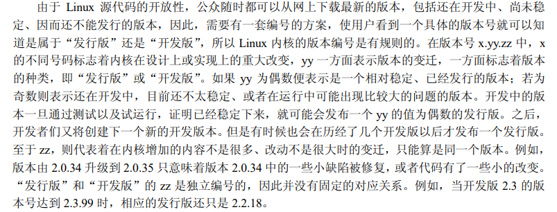
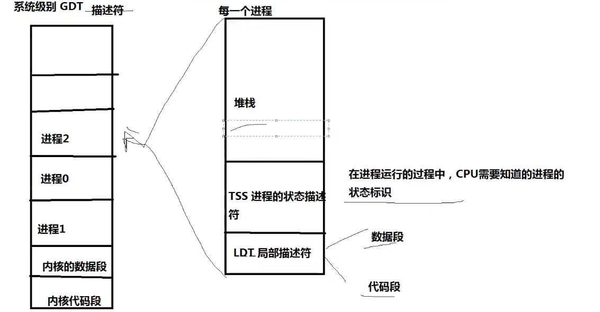
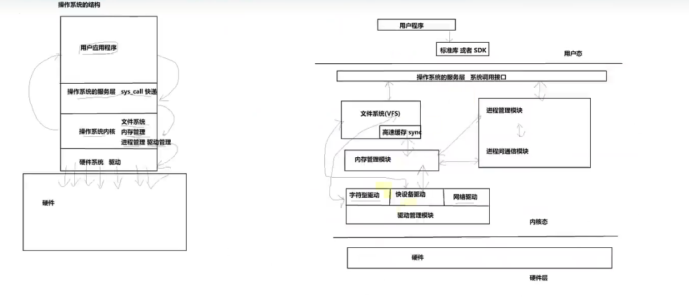
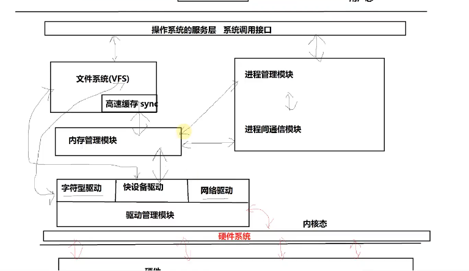
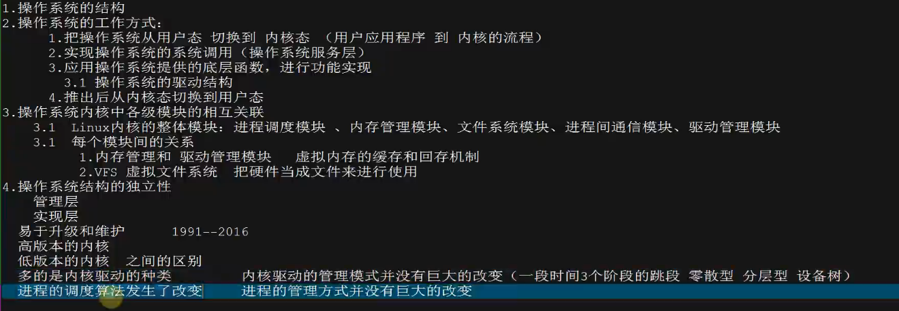
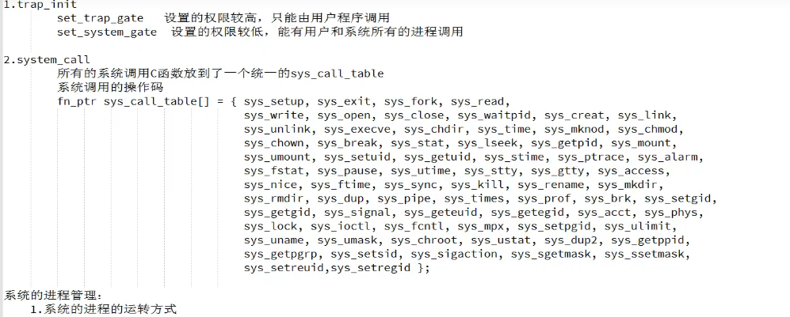
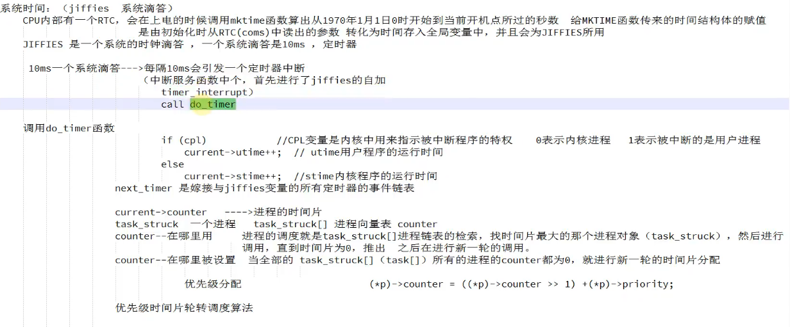
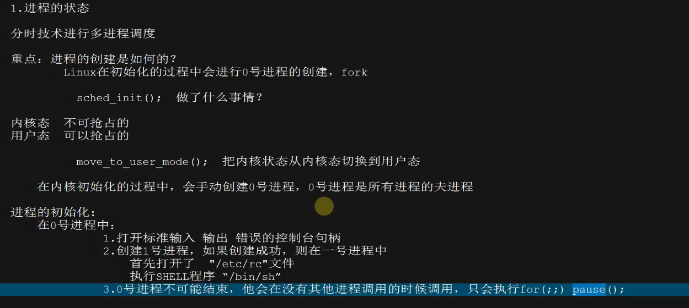

## 基本功

- 关于数据结构组成和数据结构之间联系的小结

- 关于执行过程以及函数调用关系的小结。


1. 由于Windows文件不分辨大小写，但Linux区分，导致Linux源代码放到Windows上部分会发生文件名冲突
2. 由于Linux需要支持很多体系结构和兼容各种情况，使用大量宏来编译。
3. 项目太大，简单搜索需要花费大量的时间。

### 宏内核 & 微内核

Linux属于宏内核/单内核

### 源码下载

```
www.kernel.org   2.4.0
```

### linux 2.4.0内核目录



### 版本



### API

```
https://deepinout.com/linux-kernel-api/device-driver-and-device-management/linux-kernel-api__class_create.html
```

### LDT

局部描述符

- 数据段
- 代码段

### TSS

进程状态描述符

- 在进程运行的过程中，CPU需要知道的进程的状态标识

### GDT



## 学习内容

- 内存管理
  - 虚拟内存、物理内存映射
  - 内存池
  - 内存缺页、内存溢出、内存泄漏
  - ？？？malloc分配原理、malloc 1K和数据malloc 1M数据有什么区别
- 进程管理
  - 进程调度与通信模式
  - fork、execve、clone区别？docker
  - ...
- 文件系统
  - 日志效率
    - 如何提供日志吞吐量
  - Mysql落盘
    - fwrite
    - fsync
    - aio
  - vfs原理
- 操作系统调用
- 网络协议栈
- 虚拟化
  - 网卡
  - KVM

### 框架







### 中断体系

#### 目的

1.硬件的中断响应  ---> 内核驱动的中断

2.系统调用的函数响应（sys_call） ---> 系统调用

3.自定义中断 ---> 软件的软中断模式

4.信号中断（`kill -signalnum`） ---> 对了解信号的使用  创建  等

5.系统的异常和错误 ---> 系统的异常获取 了解系统异常的作用

#### Linux中断机制

- 硬中断和软中断
  - 硬中断：
    - 由电脑主机的`8259A`类似的硬件中断控制芯片发出的中断
    - ARM中断控制器发出的中断
  - 软中断
    - 异常
      - CPU自行保留的中断
      - 系统调用异常
- 代码结构（`linux 0.11`）
  - `asm.s`     `traps.c`
  - `system_call.s`   `frok.c  signal.c  exit.c sys.c`

#### 中断的工作流程

- 函数执行流程
  1. 做CPU工作模式的转化
  2. 进行寄存器的拷贝和压栈
  3. 设置中断异常向量表
  4. 保存正常返回的函数返回值
  5. 跳转到对应的中断服务函数上运行
  6. 进行模式的复原以及寄存器的复原
  7. 跳转回正常的函数地址继续运行
- Linux中断工作流程
  1. 将所有的寄存器值入栈
  2. 将异常码（中断号）入栈
  3. 将当前的函数返回值等进行入栈（为了在中断执行后能够找到在哪中断的，能够复原）
  4. 调用对应的中断服务函数
  5. 出栈函数返回值等
  6. 返回所有入栈的寄存器值
- ​                    中断前的处理过程，中断的恢复过程          中断的执行过程
- 硬件中断的处理过程             `asm.s`                                     `traps.c`
- 软件及系统调用的处理过程     `system_call.s`       `frok.c  signal.c  exit.c sys.c`




### 进程管理及调度

内核态：不可抢占

用户态：可以抢占

```
void main(void)		/* This really IS void, no error here. */
{			/* The startup routine assumes (well, ...) this */
/*
 * Interrupts are still disabled. Do necessary setups, then
 * enable them
 */
 	ROOT_DEV = ORIG_ROOT_DEV;
 	drive_info = DRIVE_INFO;
	memory_end = (1<<20) + (EXT_MEM_K<<10);
	memory_end &= 0xfffff000;
	if (memory_end > 16*1024*1024)
		memory_end = 16*1024*1024;
	if (memory_end > 12*1024*1024) 
		buffer_memory_end = 4*1024*1024;
	else if (memory_end > 6*1024*1024)
		buffer_memory_end = 2*1024*1024;
	else
		buffer_memory_end = 1*1024*1024;
	main_memory_start = buffer_memory_end;
#ifdef RAMDISK
	main_memory_start += rd_init(main_memory_start, RAMDISK*1024);
#endif
	mem_init(main_memory_start,memory_end);
	trap_init();
	blk_dev_init();
	chr_dev_init();
	tty_init();
	time_init();
	sched_init();
	buffer_init(buffer_memory_end);
	hd_init();
	floppy_init();
	sti();
	move_to_user_mode();
	if (!fork()) {		/* we count on this going ok */
		init();
	}
/*
 *   NOTE!!   For any other task 'pause()' would mean we have to get a
 * signal to awaken, but task0 is the sole exception (see 'schedule()')
 * as task 0 gets activated at every idle moment (when no other tasks
 * can run). For task0 'pause()' just means we go check if some other
 * task can run, and if not we return here.
 */
	for(;;) pause();
}
```


#### 基石






#### 初始化---main.c

```
void init(void)
{
	int pid,i;

	setup((void *) &drive_info);
	(void) open("/dev/tty0",O_RDWR,0);
	(void) dup(0);
	(void) dup(0);
	printf("%d buffers = %d bytes buffer space\n\r",NR_BUFFERS,
		NR_BUFFERS*BLOCK_SIZE);
	printf("Free mem: %d bytes\n\r",memory_end-main_memory_start);
	if (!(pid=fork())) {
		close(0);
		if (open("/etc/rc",O_RDONLY,0))
			_exit(1);
		execve("/bin/sh",argv_rc,envp_rc);
		_exit(2);
	}
	if (pid>0)
		while (pid != wait(&i))
			/* nothing */;
	while (1) {
		if ((pid=fork())<0) {
			printf("Fork failed in init\r\n");
			continue;
		}
		if (!pid) {
			close(0);close(1);close(2);
			setsid();
			(void) open("/dev/tty0",O_RDWR,0);
			(void) dup(0);
			(void) dup(0);
			_exit(execve("/bin/sh",argv,envp));
		}
		while (1)
			if (pid == wait(&i))
				break;
		printf("\n\rchild %d died with code %04x\n\r",pid,i);
		sync();
	}
	_exit(0);	/* NOTE! _exit, not exit() */
}
```

#### 创建

```
.align 2
_sys_fork:
	call _find_empty_process
	testl %eax,%eax
	js 1f
	push %gs
	pushl %esi
	pushl %edi
	pushl %ebp
	pushl %eax
	call _copy_process
	addl $20,%esp
1:	ret
```

_sys_fork(`system_call.c`)

- find_empty_process(`fork.c`)	//找到进程空位给当前任务，分配好`PID`

- copy_process(`fork.c`)

  - get_free_page    //创建task_struct内核空间

  - 进行赋值拷贝子进程

  - ```
    if (last_task_used_math == current)
    		__asm__("clts ; fnsave %0"::"m" (p->tss.i387));
    ```

    如果当前进程使用了协处理器，那就设置当前创建进程的协处理器

  - copy_mem(nr,p)  //打开老进程向新进程  代码段、数据段（`LDT`）的拷贝

  - 如果父进程打开了某个文件，那么子进程也同样打开了某个文件，则文件的占用计数`+1`

    ```
    	for (i=0; i<NR_OPEN;i++)
    		if (f=p->filp[i])
    			f->f_count++;
    ```

  - 设置进程的`LDT`和`TSS`，并且结合之前的拷贝，组合成一个进程，并且返回进程的`PID`

    ```
    set_tss_desc(gdt+(nr<<1)+FIRST_TSS_ENTRY,&(p->tss));
    set_ldt_desc(gdt+(nr<<1)+FIRST_LDT_ENTRY,&(p->ldt));
    p->state = TASK_RUNNING;	/* do this last, just in case */
    	return last_pid;
    ```

    

进程的创建就是对0号进程或者当前进程的复制

- 0号进程复制        结构体的复制   把task[0]对应的task_struct复制给新的进程
- 对于栈堆的拷贝   当进程做创建的时候要复制原有栈堆

#### 调度

```
/*
 *  'schedule()' is the scheduler function. This is GOOD CODE! There
 * probably won't be any reason to change this, as it should work well
 * in all circumstances (ie gives IO-bound processes good response etc).
 * The one thing you might take a look at is the signal-handler code here.
 *
 *   NOTE!!  Task 0 is the 'idle' task, which gets called when no other
 * tasks can run. It can not be killed, and it cannot sleep. The 'state'
 * information in task[0] is never used.
 */
void schedule(void)
{
	int i,next,c;
	struct task_struct ** p;

/* check alarm, wake up any interruptible tasks that have got a signal */

	for(p = &LAST_TASK ; p > &FIRST_TASK ; --p)
		if (*p) {
			if ((*p)->alarm && (*p)->alarm < jiffies) {//告警信号
					(*p)->signal |= (1<<(SIGALRM-1));
					(*p)->alarm = 0;
				}
			if (((*p)->signal & ~(_BLOCKABLE & (*p)->blocked)) &&
			(*p)->state==TASK_INTERRUPTIBLE)//信号为空，并且当前运行状态不可为阻塞且是可中断
				(*p)->state=TASK_RUNNING;
		}//如果当前状态为可中断睡眠状态，接收到非屏蔽信号，则当前状态可以设置为运行状态

/* this is the scheduler proper: */

	while (1) {
		c = -1;
		next = 0;
		i = NR_TASKS;
		p = &task[NR_TASKS];
		while (--i) {
			if (!*--p)
				continue;
			if ((*p)->state == TASK_RUNNING && (*p)->counter > c)
				c = (*p)->counter, next = i;
		}//轮询
		if (c) break;
		for(p = &LAST_TASK ; p > &FIRST_TASK ; --p)//时间片轮转调度
			if (*p)
				(*p)->counter = ((*p)->counter >> 1) +
						(*p)->priority;//当前任务所有时间片为空且任务空间依旧存在，则时间片重分配
	}
	switch_to(next);//切换
}
```

