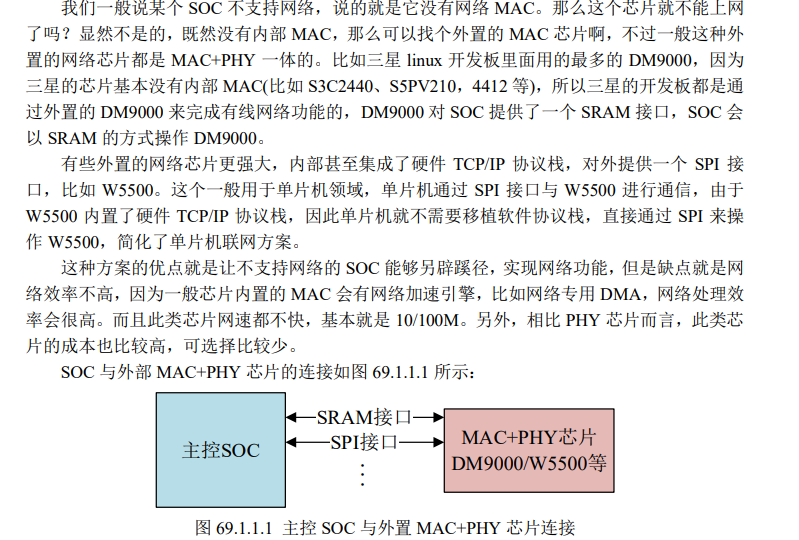
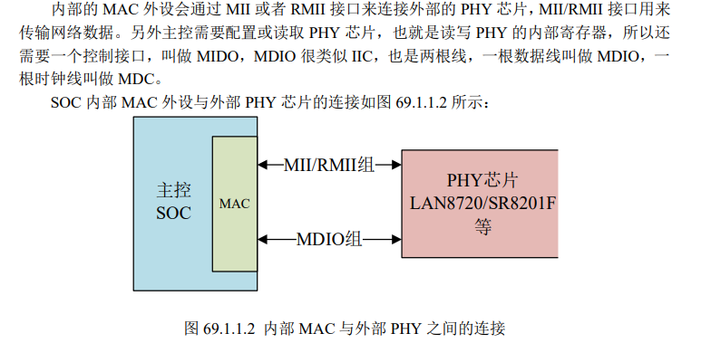
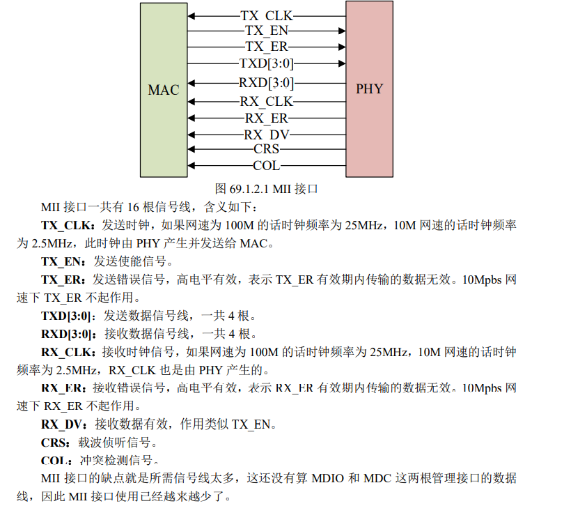
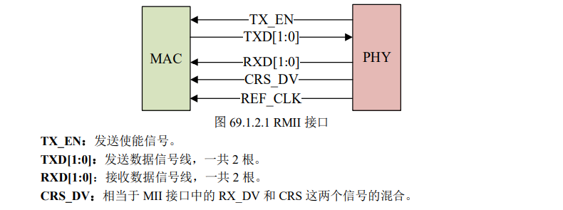
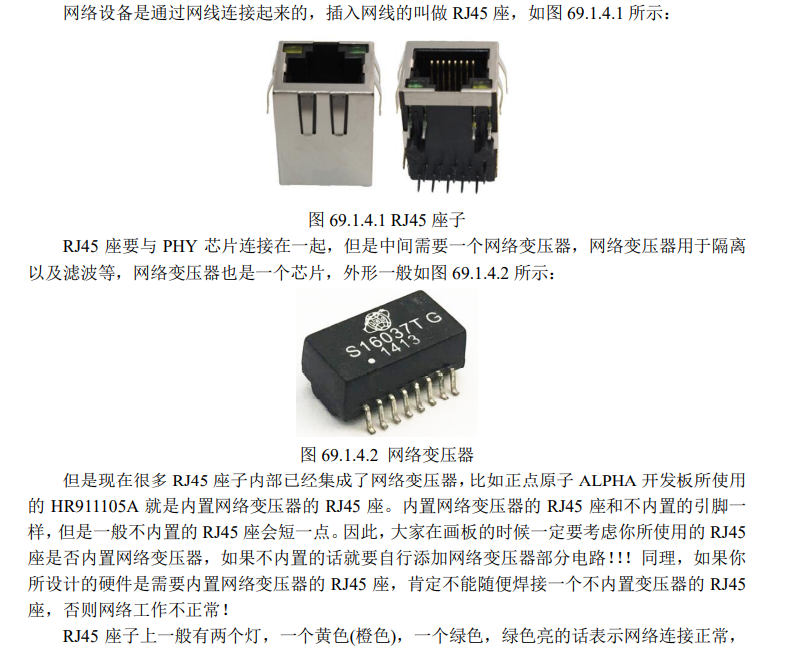
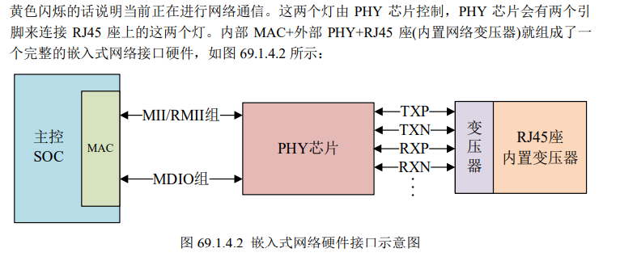
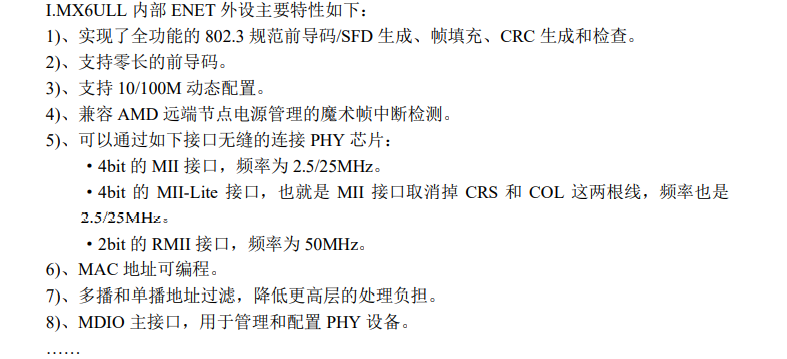

## 网络设备

### 概念

#### OSI

七层：物理层、数据链路层、网络层、传输层、会话层、表示层、应用层

#### TCP/IP

四层：网络访问层（Network Access） 互联网络层（Internet）

​			主机到主机（Host To Host ）  	应用层（Application）

#### 硬件

##### MAC+PHY

1. **SOC 内部没有网络 MAC 外设**

   

2. **SOC 内部集成网络 MAC 外设**

   - 内部 MAC 外设会有专用的加速模块，比如专用的 `DMA`，加速网速数据的处理。 

   - 网速快，可以支持 `10/100/1000M` 网速。

   - 外接 `PHY` 可选择性多，成本低。

     

##### MII/RMII 接口

内部 `MAC` 通过 `MII/RMII` 接口来与外部的 `PHY` 芯片连接，完成网络数据传输

`MII` 全称是 Media Independent Interface，直译过来就是介质独立接口



`RMII` 全称是 `Reduced Media Independent Interface`，翻译过来就是精简的介质独立接口，也就是 `MII` 接口的精简版本。`RMII` 接口只需要 7 根数据线，相比 `MII` 直接减少了 9 根。




除了 `MII` 和 `RMII` 以外，还有其他接口，比如 `GMII、RGMII、SMII、SMII` 等，关于其他 接口基本都是大同小异的。

##### MDIO 接口 

`MDIO` 全称是 `Management Data Input/Output`，直译过来就是管理数据输入输出接口，是一 个简单的两线串行接口，一根 `MDIO` 数据线，一根 `MDC` 时钟线。驱动程序可以通过 `MDIO` 和 `MDC` 这两根线访问 `PHY` 芯片的任意一个寄存器。

`MDIO` 接口支持多达 32 个 `PHY`。同一时刻 内只能对一个 `PHY` 进行操作，那么如何区分这 32 个 PHY 芯片呢？

和 `IIC` 一样，使用器件地址 即可。

同一 `MDIO` 接口下的所有 `PHY` 芯片，其器件地址不能冲突，必须保证唯一，具体器件 地址值要查阅相应的 PHY 数据手册。

 因此，`MAC` 和外部 `PHY` 芯片进行连接的时候主要是 `MII/RMII` 和 `MDIO` 接口，另外可能 还需要复位、中断等其他引脚。

##### RJ45接口





##### I.MX6ULL ENET 接口简介

`ENET` 外设有一个专用的 `DMA`， 此 DMA 用于在 `ENET` 外设和 `SOC` 之间传输数据，并且支持可编程的增强型的缓冲描述符，用 以支持 `IEEE 1588`。



`I.MX6ULL` 的 `ENET` 外设内容比较多，详细的介绍请查阅`《I.MX6ULL 参考手册》`的`“Chapter 22 10/100-Mbps Ethernet MAC(ENET)”`章节。

##### PHY前16个寄存器

前16个寄存器为通用模型，适用于所有phy器件，方便软件基本通信的实现。

- BCR(Basic Control Rgsister)寄存器，地址为0   我们说的配置 PHY 芯片，重点就是配置 BCR 寄存器
- BSR(Basic Status Register)寄存器，地址为1     状态寄存器，可以获取到PHY芯片的工作状态，通过读取 BSR 寄存器的值我们可以得到当前的连接速度、双工状态和连接状态等。
-  LAN8720A 的 PHY ID 寄存器 1 和 ID 寄存器 2，地址为 2 和 3，这两个寄存器组成一个 32 位的唯一 ID 值。
- LAN8720A 的特殊控制/状态寄存器，此寄存器地址为 31，特殊控制/状态寄存器中我们关心的是 bit2~bit4 这三位，因为通过这 3 位来确定连接的状态和速度。

### 软件

#### net_device

```
struct net_device {
	char			name[IFNAMSIZ];//网络设备的名字
	struct hlist_node	name_hlist;
	char 			*ifalias;
	/*
	 *	I/O specific fields
	 *	FIXME: Merge these and struct ifmap into one
	 */
	unsigned long		mem_end;//共享内存结束地址
	unsigned long		mem_start;
	unsigned long		base_addr;//网络设备 I/O 地址
	int			irq;//网络设备的中断号

	atomic_t		carrier_changes;

	/*
	 *	Some hardware also needs these fields (state,dev_list,
	 *	napi_list,unreg_list,close_list) but they are not
	 *	part of the usual set specified in Space.c.
	 */

	unsigned long		state;

	struct list_head	dev_list;//全局网络设备列表
	struct list_head	napi_list;//napi 网络设备的列表入口
	struct list_head	unreg_list;//注销(unregister)的网络设备列表入口
	struct list_head	close_list;//是关闭的网络设备列表入口
	struct list_head	ptype_all;
	struct list_head	ptype_specific;

	struct {
		struct list_head upper;
		struct list_head lower;
	} adj_list;

	struct {
		struct list_head upper;
		struct list_head lower;
	} all_adj_list;

	netdev_features_t	features;
	netdev_features_t	hw_features;
	netdev_features_t	wanted_features;
	netdev_features_t	vlan_features;
	netdev_features_t	hw_enc_features;
	netdev_features_t	mpls_features;

	int			ifindex;
	int			group;

	struct net_device_stats	stats;

	atomic_long_t		rx_dropped;
	atomic_long_t		tx_dropped;

#ifdef CONFIG_WIRELESS_EXT
	const struct iw_handler_def *	wireless_handlers;
	struct iw_public_data *	wireless_data;
#endif
	const struct net_device_ops *netdev_ops;//网络设备的操作集函数，包含了一系列的网络设备操作回调函数，类似字符设备中的 file_operations
	const struct ethtool_ops *ethtool_ops;//网络管理工具相关函数集，用户空间网络管理工具会调用此结构体中的相关函数获取网卡状态或者配置网卡
#ifdef CONFIG_NET_SWITCHDEV
	const struct switchdev_ops *switchdev_ops;
#endif
#ifdef CONFIG_NET_L3_MASTER_DEV
	const struct l3mdev_ops	*l3mdev_ops;
#endif

	const struct header_ops *header_ops;//头部的相关操作函数集，比如创建、解析、缓冲等

	unsigned int		flags;//flags 是网络接口标志，标志类型定义在 include/uapi/linux/if.h 文件中，为一个枚举类型
	unsigned int		priv_flags;

	unsigned short		gflags;
	unsigned short		padded;

	unsigned char		operstate;
	unsigned char		link_mode;

	unsigned char		if_port;//if_port 指定接口的端口类型，如果设备支持多端口的话就通过 if_port 来指定所使用的端口类型。可选的端口类型定义在 include/uapi/linux/netdevice.h 中，为一个枚举类型
	unsigned char		dma;//网络设备所使用的 DMA 通道，不是所有的设备都会用到 DMA

	unsigned int		mtu;//是网络最大传输单元，为 1500
	unsigned short		type;//于指定 ARP 模块的类型，以太网的 ARP 接口为 ARPHRD_ETHER，Linux内核所支持的 ARP 协议定义在 include/uapi/linux/if_arp.h 中
	unsigned short		hard_header_len;
	unsigned short		min_header_len;

	unsigned short		needed_headroom;
	unsigned short		needed_tailroom;

	/* Interface address info. */
	unsigned char		perm_addr[MAX_ADDR_LEN];//永久的硬件地址，如果某个网卡设备有永久的硬件地址，那么就会填充 perm_addr
	unsigned char		addr_assign_type;
	unsigned char		addr_len;//硬件地址长度
	unsigned short		neigh_priv_len;
	unsigned short          dev_id;
	unsigned short          dev_port;
	spinlock_t		addr_list_lock;
	unsigned char		name_assign_type;
	bool			uc_promisc;
	struct netdev_hw_addr_list	uc;
	struct netdev_hw_addr_list	mc;
	struct netdev_hw_addr_list	dev_addrs;

#ifdef CONFIG_SYSFS
	struct kset		*queues_kset;
#endif
	unsigned int		promiscuity;
	unsigned int		allmulti;


	/* Protocol specific pointers */

#if IS_ENABLED(CONFIG_VLAN_8021Q)
	struct vlan_info __rcu	*vlan_info;
#endif
#if IS_ENABLED(CONFIG_NET_DSA)
	struct dsa_switch_tree	*dsa_ptr;
#endif
#if IS_ENABLED(CONFIG_TIPC)
	struct tipc_bearer __rcu *tipc_ptr;
#endif
	void 			*atalk_ptr;
	struct in_device __rcu	*ip_ptr;
	struct dn_dev __rcu     *dn_ptr;
	struct inet6_dev __rcu	*ip6_ptr;
	void			*ax25_ptr;
	struct wireless_dev	*ieee80211_ptr;
	struct wpan_dev		*ieee802154_ptr;
#if IS_ENABLED(CONFIG_MPLS_ROUTING)
	struct mpls_dev __rcu	*mpls_ptr;
#endif

/*
 * Cache lines mostly used on receive path (including eth_type_trans())
 */
	unsigned long		last_rx;//最后接收的数据包时间戳，记录的是 jiffies

	/* Interface address info used in eth_type_trans() */
	unsigned char		*dev_addr;//也是硬件地址，是当前分配的 MAC 地址，可以通过软件修改


#ifdef CONFIG_SYSFS
	struct netdev_rx_queue	*_rx;//接收队列

	unsigned int		num_rx_queues;//接收队列数量，在调用 register_netdev 注册网络设备的时候会分配指定数量的接收队列
	unsigned int		real_num_rx_queues;//当前活动的队列数量

#endif

	unsigned long		gro_flush_timeout;
	rx_handler_func_t __rcu	*rx_handler;
	void __rcu		*rx_handler_data;

#ifdef CONFIG_NET_CLS_ACT
	struct tcf_proto __rcu  *ingress_cl_list;
#endif
	struct netdev_queue __rcu *ingress_queue;
#ifdef CONFIG_NETFILTER_INGRESS
	struct list_head	nf_hooks_ingress;
#endif

	unsigned char		broadcast[MAX_ADDR_LEN];
#ifdef CONFIG_RFS_ACCEL
	struct cpu_rmap		*rx_cpu_rmap;
#endif
	struct hlist_node	index_hlist;

/*
 * Cache lines mostly used on transmit path
 */
	struct netdev_queue	*_tx ____cacheline_aligned_in_smp;//是发送队列
	unsigned int		num_tx_queues;//是发送队列数量，通过 alloc_netdev_mq 函数分配指定数量的发送队列
	unsigned int		real_num_tx_queues;//当前有效的发送队列数量
	struct Qdisc		*qdisc;
	unsigned long		tx_queue_len;
	spinlock_t		tx_global_lock;
	int			watchdog_timeo;

#ifdef CONFIG_XPS
	struct xps_dev_maps __rcu *xps_maps;
#endif

#ifdef CONFIG_NET_SWITCHDEV
	u32			offload_fwd_mark;
#endif

	/* These may be needed for future network-power-down code. */

	/*
	 * trans_start here is expensive for high speed devices on SMP,
	 * please use netdev_queue->trans_start instead.
	 */
	unsigned long		trans_start;//最后的数据包发送的时间戳，记录的是 jiffies

	struct timer_list	watchdog_timer;

	int __percpu		*pcpu_refcnt;
	struct list_head	todo_list;

	struct list_head	link_watch_list;

	enum { NETREG_UNINITIALIZED=0,
	       NETREG_REGISTERED,	/* completed register_netdevice */
	       NETREG_UNREGISTERING,	/* called unregister_netdevice */
	       NETREG_UNREGISTERED,	/* completed unregister todo */
	       NETREG_RELEASED,		/* called free_netdev */
	       NETREG_DUMMY,		/* dummy device for NAPI poll */
	} reg_state:8;

	bool dismantle;

	enum {
		RTNL_LINK_INITIALIZED,
		RTNL_LINK_INITIALIZING,
	} rtnl_link_state:16;

	void (*destructor)(struct net_device *dev);

#ifdef CONFIG_NETPOLL
	struct netpoll_info __rcu	*npinfo;
#endif

	possible_net_t			nd_net;

	/* mid-layer private */
	union {
		void					*ml_priv;
		struct pcpu_lstats __percpu		*lstats;
		struct pcpu_sw_netstats __percpu	*tstats;
		struct pcpu_dstats __percpu		*dstats;
		struct pcpu_vstats __percpu		*vstats;
	};

	struct garp_port __rcu	*garp_port;
	struct mrp_port __rcu	*mrp_port;

	struct device	dev;
	const struct attribute_group *sysfs_groups[4];
	const struct attribute_group *sysfs_rx_queue_group;

	const struct rtnl_link_ops *rtnl_link_ops;

	/* for setting kernel sock attribute on TCP connection setup */
#define GSO_MAX_SIZE		65536
	unsigned int		gso_max_size;
#define GSO_MAX_SEGS		65535
	u16			gso_max_segs;
	u16			gso_min_segs;
#ifdef CONFIG_DCB
	const struct dcbnl_rtnl_ops *dcbnl_ops;
#endif
	u8 num_tc;
	struct netdev_tc_txq tc_to_txq[TC_MAX_QUEUE];
	u8 prio_tc_map[TC_BITMASK + 1];

#if IS_ENABLED(CONFIG_FCOE)
	unsigned int		fcoe_ddp_xid;
#endif
#if IS_ENABLED(CONFIG_CGROUP_NET_PRIO)
	struct netprio_map __rcu *priomap;
#endif
	struct phy_device *phydev;//对应的 PHY 设备
	struct lock_class_key *qdisc_tx_busylock;
	bool proto_down;
};

```


### 操作方法

#### init

- alloc_etherdev  //针对以太网设备的
  - ether_setup
- //指定struct net_device_ops并做net_device的相关指定
- netdev_priv	//指定skb方便后面找到并释放
- register_netdev

#### net_device_ops.open

- 使能网络外设时钟。
- 申请网络所使用的环形缓冲区。
- 初始化 `MAC` 外设。
- 绑定接口对应的 `PHY`。 
- 如果使用 `NAPI` 的话要使能 `NAPI` 模块，通过 `napi_enable` 函数来使能。
- 开启 `PHY`。
- 调用 `netif_tx_start_all_queues` 来使能传输队列，也可能调用 `netif_start_queue` 函数。

#### net_device_ops.ndo_stop

- 停止 PHY。
- 停止 NAPI 功能。
- 停止发送功能。
- 关闭 MAC。
- 断开 PHY 连接。
- 关闭网络时钟。
- 释放数据缓冲区。

#### net_device_ops.ndo_start_xmit

- //获取发送包的缓冲区起始地址和数据包的长度，如果数据包的长度小于以太网允许的最短数据包的长度，则对数据包进行填充以满足最小长度
- //记录发送时间和skb结构指针（方便发送完后释放）
- send_packet//真正发送数据包
  - //依旧是数据包长度的判断
  - //取出源IP地址和目标IP地址，然后将最后一个字节交换
  - //指定接受数据包的网络设备

//数据包发送完后释放skb，在中断处理函数中进一步调用tx_done函数。

### skb

skb有数据包长度要求，必须大于最短数据包长度

- head	skb头部，以太网协议包头一般是14个字节，但是一般需要skb_reverse来让数据头以16字节对齐
- data     数据包内容
- tail        数据包结尾
- end	  skb结尾

#### skb_reverse

参数：skb,len

data和tail向end方向偏移len个字节	

#### skb_put

tail向end方向偏移len个字节

一般就用这个来放数据

#### skb_push

data向head方向偏移len个字节

#### skb_pull	

data向end方向偏移len个字节

### NAPI

NAPI 是一种高效的网络处理技术。

 NAPI 的核心思想就是不全部采用中断来读取网络数据，而是采用中断来唤醒数据接收服务程序，在接收服务程序中采用 POLL 的方法来轮询处理数据。

这种方法的好处就是可以提高短数 据包的接收效率，减少中断处理的时间。

1、初始化 NAPI

```
void netif_napi_add(struct net_device *dev, 
					struct napi_struct *napi, 
					int (*poll)(struct napi_struct *, int), 
                    int weight)
 	dev：每个 NAPI 必须关联一个网络设备，此参数指定 NAPI 要关联的网络设备。 
 	napi：要初始化的 NAPI 实例。 
 	poll：NAPI 所使用的轮询函数，非常重要，一般在此轮询函数中完成网络数据接收的工作。 
 	weight：NAPI 默认权重(weight)，一般为 NAPI_POLL_WEIGHT。
```

2、删除 NAPI 

```
void netif_napi_del(struct napi_struct *napi) 
 	napi：要删除的 NAPI。 返回值：无。 
```

3、使能 NAPI 

```
inline void napi_enable(struct napi_struct *n) 
	n：要使能的 NAPI。 返回值：无。
```

 4、关闭 NAPI 

```
 void napi_disable(struct napi_struct *n)
 	n：要关闭的 NAPI。 返回值：无。 
```

5、检查 NAPI 

```
 inline bool napi_schedule_prep(struct napi_struct *n) 
 	n：要检查的 NAPI。 返回值：如果可以调度就返回真，如果不可调度就返回假。
```

 6、NAPI 调度 

```
void __napi_schedule(struct napi_struct *n) 
	n：要调度的 NAPI。 返回值：无。  
```

```
__static inline void napi_schedule(struct napi_struct *n) 
{ 
    if (napi_schedule_prep(n))
    __napi_schedule(n); 
} 
```

 napi_schedule 函 数 就 是 对 napi_schedule_prep 和 __napi_schedule 的简单封装，一次完成判断和调度。

 7、NAPI 处理完成 

需要调用 napi_complete 函数来标记 NAPI 处理完成

```
inline void napi_complete(struct napi_struct *n) 
	函数参数和返回值含义如下： n：处理完成的 NAPI。 返回值：无。
```

### 测试命令

#### ethtool

```
https://www.cnblogs.com/zhongguiyao/p/13942778.html
```

#### ifconfig

#### ping 

#### route

#### gateway 