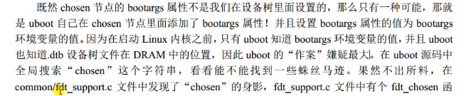
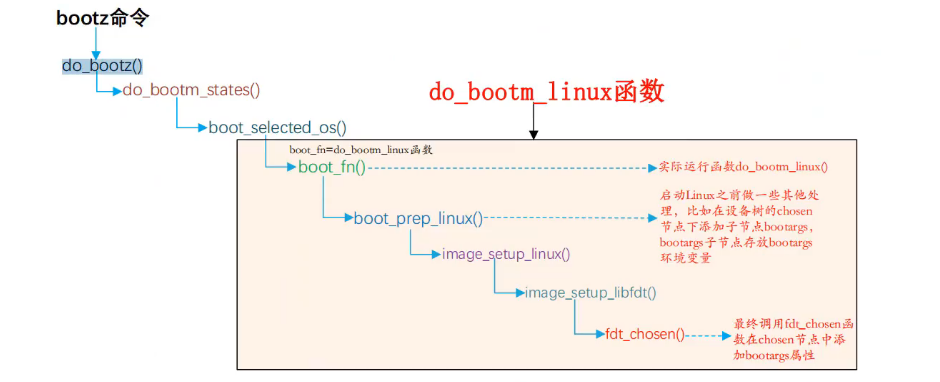

## 设备树

疑问：为什么设备树文件引入在某个驱动文件里面不用包含其头文件？

设备树文件在uboot加载时解析成一系列文件，内核在装载时会解析形成的文件进而装载设备驱动，其中如果需要使用到参数需要加入如：`#include <linux/of_gpio.h>`等一系列头文件。

```
https://blog.csdn.net/thisway_diy/article/details/84336817
```

设备树意义：

1. 平台识别
2. 实时配置
3. 设备植入

- dts：作为设备树源码，一般一个硬件包含1个dts文件。
- dtsi：可以作为共性部分，以C语言的特性包含在dts文件中，或者配置某些硬件的“okay”**使能**
- dtc：设备树编译工具，把dts文件编译成dtb文件。
- dtb：设备树二进制文件，可以反编译

因为会涉及到很多硬件信息的绑定，详细的可以查阅 Linux 内核源码下的文档`Documentation/devicetree/bindings`。

根节点以/{}开头，一个设备文件中只有一个，并且所有的设备文件最后都会组成一个根节点。

```
aliases{
uart0=&uart_0};取别名，以后用uart_0作为标签访问。

uart_0  :  uart@360000{  				//标签：节点@设备地址 
	compatible = "firefly,rk3399","forlinx,rk3399" //决定绑定在哪个设备，在前有优先权。
	#address-cells = <1>; 	//表示用一个32位的数来描述地址
	#size-cells = <1>;		//表示用1个32位的数来描述该地址的大小
	//正确解释一个reg属性需要用到前面两个属性，
	ranges = <0 0x360000 0x1000>;	//子地址 父地址 子地址空间区域大小 
	reg = <0x360000 0x1000>;//理解为基地址+偏移地址
	interrupt-parent = <&gic>;
	
	ch34x0:ch34x@370000{
		compatible:"****";
		reg = <0x370000 0x1000>;
		interrupts = <GIC_SPI 62 IRQ_TYPE_LEVEL_HIGH>;
	  /**SPI为0，共享的外设中断；62为中断号；第三个参数为中断触发类型。
		*中断类型为;0：SPI共享外设中断，可以连接到一个SOC的多个ARM核;
		*1:PPI:私有外设中断（即只能连接到一个特定的ARM核）
		**/
		
	};
};
```

```
gic:interrupt-controller@1094000{
	compatible = "****";
	#interrupt-cells = <3>;//决定cells描述有几个
	interrupt-controller;//定义一个接受中断的节点，即中断控制器。
};
```

```
chosen{
	bootargs = "console=ttysWK,9600";
};//并不是一个真的设备，只是为固件和操作系统传递参数的地方，如引导参数。
u-boot根据
```






```
#address-cells = <1>;//表示用一个32位的数来描述地址

#size-cells = <0>;//表示用0个32位的数来描述该地址的大小

上面两个信息#address-cells和#size-cells主要用来描述子节点里面reg的信息

reg里面的个数，应该是address-cells + size-cells的整数倍

cs-gpios = <&gpio3 26 GPIO_ACTIVE_HIGH>;  GPIO3_C2  高电平有效
```

###  pinctrl子系统

```
https://blog.csdn.net/engineer0/article/details/119703669
https://blog.csdn.net/u012830148/article/details/80609337
https://blog.csdn.net/qq_20553613/article/details/103931924
```

pinctrl对于pin管理功能：

- 关联设备树，根据设备树pin信息在内核起来后进行配置pin引脚
- pin复用功能管理
- pin电气特性设置

```
/* &节点标签 追加属性 */
&iomuxc {
	/* 表示使用的引脚具有哪些状态 */
  	pinctrl-names = "default"，"init","sleep";
  	/* 引用了其它的节点，见下 */
  	pinctrl-0 = <&pinctrl_hog_1>; //当设置为default状态使用 pinctrl-0 引脚组
  	pinctrl-1 =<&xxx>; //代表init状态
  	pinctrl-2 =<&yyy>; //代表sleep状态
 	 ...
 	 /* 引脚组节点，包含若干个引脚的配置信息 */
  	pinctrl_uart1: uart1grp {
  		/* imx6ull的pinctrl子系统用此属性名（fsl,pins）来记录引脚的配置信息，其它开发板同类节点可能不叫 fsl,pins */
  		fsl,pins = <
  			MX6UL_PAD_UART1_TX_DATA__UART1_DCE_TX 0x1b0b1
  			MX6UL_PAD_UART1_RX_DATA__UART1_DCE_RX 0x1b0b1
  		>;
  	};
  ...
}
```

- **fsl,pins**
  结合imx6ull的pinctrl子系统驱动使用
  以该属性来标识引脚的配置信息
  别的开发板可能使用别的名字
- **fsl,pins属性值**
  一个宏+一个十六进制数

```
#define MX6UL_PAD_UART1_TX_DATA__UART1_DCE_TX 0x0084 0x0310 0x0000 0 0
```

|       mux_reg        |      conf_reg      |                  input_reg                  |    mux_mode    |     input_val      |
| :------------------: | :----------------: | :-----------------------------------------: | :------------: | :----------------: |
| 复用寄存器的偏移地址 | 属性寄存器偏移地址 | 引脚输入设置寄存器偏移地址，此处没有设置为0 | 复用寄存器的值 | 输入设置寄存器的值 |
|        0x0084        |       0x0310       |                      0                      |       0        |         0          |

### 框架

在proc/device-tree中有对应的设备树生成节点文件

#### soc

描述寄存器映射信息，
