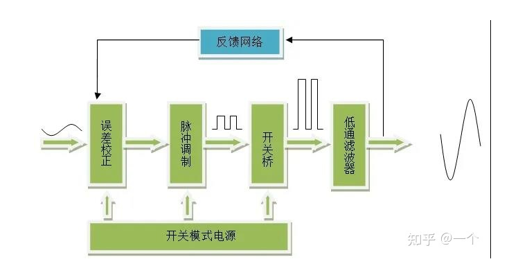
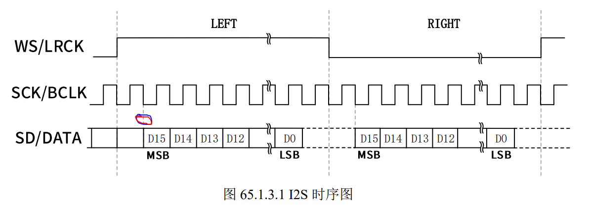

### 本质

`DAC`、`ADC`、`DSP`等组合成`“ Audio CODEC”`音频解码芯片

常见音频采样率有 `8K、44.1K、48K、192K 甚至 384K 和 768K`， 采样位数常见的有 `8 位、16 位、24 位、32 位`。采样率和采样位数越高，那么音频 `CODEC` 越 能真实的还原声音，也就是大家说的 `HIFI`。

### 概念

#### A/B/C/D 类功率放大器

- A类功放——模拟功放，失真小，效率低，适用于发烧友，音质高的场合

- B类功放——不重要，目前主流的是**AB类功放**，结合B类提高效率和A类失真小的优点做了均衡。

- C类功放——模拟功放，效率最高，失真最大。

- D类功放——数字功放，效率高，省电，功率可以做到很大，但数码味重，高频有问题

  

①误差校正：用于消除功放产生的失真。方法是，将功放输出的信号采样与输入信号比较，用负反馈方式消除功放产生的失真。

②脉冲调制：将音乐信号变换为开关控制信号，用以控制开关桥。

③开关桥：是数字功放的功率放大部分。功率管采用场效应管，工作在开关状态，因此可以获得90%以上的效率。

④低通滤波器：将功率脉冲信号转换为音乐信号。开关桥输出的是大功率的脉冲信号，不能直接送喇叭。

⑤开关模式电源：给功放各部分电路供电。相较于模拟功放的环牛电源，开关电源的优势主要是：重量轻，能稳压。

#### DSP功放

在功放的基础上加入数字信号处理，让电脑可以根据环境对音质做出更好的改善处理，相比高昂价格的DSP处理器，其性价比高。例如：杜比环绕音

音量调试、分频调试、延时调试、eq均衡调试

#### I2S（WM8960）--SAI

**SCK**：

串行时钟信号，也叫做**位时钟(BCLK)**，音频数据的**每一位数据都对应一个SCK**，立体声都是双声道的，因此 `SCK=2×采样率×采样位数`。比如采样率为`44.1KHz、16 位`的立体声音频，那么 `SCK=2×44100×16=1411200Hz=1.4112MHz`。 

**WS**：

字段(声道)选择信号，也叫做 `LRCK`，也叫做**帧时钟**，用于切换左右声道数据，WS 为 “1”表示正在传输左声道的数据，WS 为“0”表示正在传输右声道的数据。WS 的频率等于采 样率，比如采样率为 44.1KHz 的音频，WS=44.1KHz。

 **SD**：

串行数据信号，也就是我们实际的音频数据，如果要同时实现放音和录音，那么就需 要 2 根数据线，比如 `WM8960（Audio CODEC）` 的 `ADCDAT` 和 `DACDAT`，就是分别用于录音和放音。不管音频数据是多少位的，**数据的最高位都是最先传输的**。

**数据的最高位总是出现在一帧开始后(LRCK 变化)的第 2 个 SCK 脉冲处。**

```
另外，有时候为了使音频 CODEC 芯片与主控制器之间能够更好的同步，会引入另外一个 叫做 MCLK 的信号，也叫做主时钟或系统时钟，一般是采样率的 256 倍或 384 倍。
```



SAI比I2S强大，特别是在专用的音频接口，灵活性高，配置多样化。

##### 设备树

**compatible：**

兼容属性，属性值要设置为`“wlf,wm8960”`。所以大家在 linux 内核里面全局搜索“wlf,wm8960”的话就会找到WM8960的I2C驱动文件，此文件为`sound/soc/codecs/wm8960.c`。

**reg：**

设置 WM8960 的 I2C 地址，在正点原子的 ALPHA 开发板中 WM8960 的 I2C 地址为 0X1A。

 还要几个其他的可选属性：

 **wlf,shared-lrclk：**

这是一个 bool 类型的属性，如果添加了此属性，WM8960 的 R24 寄存器 的 LRCM 位(bit2)就会置 1。当 LRCM 为 1 的时候只有当 ADC 和 DAC 全部关闭以后 ADCLRC 和 DACLRC 时钟才会关闭。

 **wlf,capless：**

这也是一个 bool 类型的属性，如果添加了此属性，OUT3 引脚将会使能，并且 为了响应耳机插入响应事件，HP_L 和 HP_R 这两个引脚都会关闭。


配置好I2C、SAI和sound节点，相应引脚和时钟也要配置好。

```
> Device Drivers 
 	-> Sound card support (SOUND [=y]) 
 		-> Advanced Linux Sound Architecture (SND [=y]) 
			-> <> OSS Mixer API //不选择
			-> <> OSS PCM (digital audio) API //不选择

```

然后在`make menuconfig`中取消`ALSA`模拟`OSS`,打开`ASRC`和`audio support`。

```
-> Device Drivers 
	-> Sound card support (SOUND [=y]) 
		-> Advanced Linux Sound Architecture (SND [=y]) 
			 -> ALSA for SoC audio support (SND_SOC [=y]) 
 				-> SoC Audio for Freescale CPUs
					-> <*> Asynchronous Sample Rate Converter (ASRC) module support //选中
					-> <*> SoC Audio support for i.MX boards with wm8960 //选中

```

系统最终启动以后会打印出 ALSA 设备列表，现在的音频 CODEC 驱动基本都是 ALSA 架 构的，本章的 WM8960 驱动也是根据 ALSA 架构编写的。

播放和录音需要下载和移植`alsa-lib` 和 `alsa-utils`，注意有效路径。

可以结合LCD驱动和mplayer库进行音视频开发。