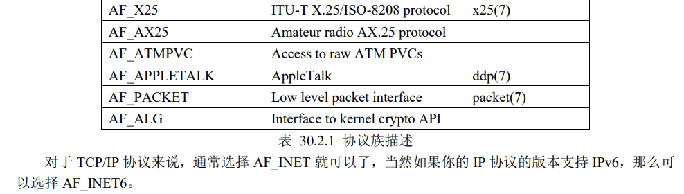

# Linux系统编程

## man

```
https://www.cnblogs.com/oxspirt/p/8137675.html
```

Linux的man很强大，该手册分成很多section，使用man时可以指定不同的section来浏览，各个section意义如下： 
1 - commands
2 - system calls
3 - library calls
4 - special files
5 - file formats and convertions
6 - games for linux
7 - macro packages and conventions
8 - system management commands
9 - 其他
解释一下, 
1、是普通的命令
2、是系统调用,如open,write之类的(通过这个，至少可以很方便的查到调用这个函数，需要加什么头文件)
3、是库函数,如printf,fread
4、是特殊文件,也就是/dev下的各种设备文件
5、是指文件的格式,比如passwd, 就会说明这个文件中各个字段的含义
6、是给游戏留的,由各个游戏自己定义
7、是附件还有一些变量,比如向environ这种全局变量在这里就有说明
8、是系统管理用的命令,这些命令只能由root使用,如ifconfig
想要指定section就直接在man的后面加上数字,比如 :

```
man 1 ls
man 3 printf
```


对于像open,kill这种既有命令,又有系统调用的来说,man open则显示的是open(1),也就是从最前面的section开始,如果想查看open系统调用的话,就得man 2 open。

关于库函数和系统调用。

库函数是高层的，完全运行在用户空间， 为程序员提供调用真正的在幕后完成实际事务的系统调用的更方便的接口。系统调用在内核态运行并且由内核自己提供。标准C库函数`printf()` 可以被看做是一个通用的输出语句，但它实际做的是将数据转化为符合格式的字符串并且调用系统调用 `write()` 输出这些字符串。

## POSIX（统一接口）

```
https://publications.opengroup.org/t101
```


## 文件管理

### 静态文件

**扇区**

一般都是512个字节，磁盘存储的单位

**块(block)**

等于多个扇区  8/4k，一般读取写入的单位

**inode**

```
ls -il	//列出所有信息包括inode
```

可以表示不同的文件，有个inode表提供读取文件，里面存储的是文件大小、所有者、文件权限、时间戳、数据存储块地址（block）

**PCB**

进程控制块，内核为每一个进程创建PCB，为了方便管理进程。

包含：进程的状态、运行特征......

有个fd表（文件描述符），除了序号（键），（值）还有对应的指针，指向存储的**inode指针**\文件状态\偏移量

### 文件I/O

标准输入、标准输出、标准错误  0、1、2

```
/* Standard file descriptors.  */
#define	STDIN_FILENO	0	/* Standard input.  */
#define	STDOUT_FILENO	1	/* Standard output.  */
#define	STDERR_FILENO	2	/* Standard error output.  */
```

内核(页缓存区4K)和用户态IO交互

int fd;

#### open

fd = open(filepath,flags,mode/auth) auth:wrx一般不用

##### flags


**O_TRUNC**

调用这个标志会将原本的内容丢弃，文件大小变为0

**O_APPEND**

调用这个标志打开文件会自动将偏移量定义到文件末尾

##### mode/auth

#### 

#### lseek

lseek(fd,offset,whence)

#### read & write

write(fd,buffer,buf_len);

read(fd,buf,buf_len);

#### close

close(fd);

### errno

```
#include <errno.h>
errno变量，不需要定义，在.h文件中已经定义好了
strerror(errno)	//提示具体错误，返回值为string，要加printf
perror("hello")	//允许加入自己的字符串,不加printf，直接输出：hello:"具体错误提示"

```

### exit、_exit、_Exit

调用_exit()函数会清除其使用的内存空间，并销毁其在内核中的各种数据结构，关闭进程的所有文件描述符，并结束进程、将控制权交给操作系统。

```
#include <unistd.h>
void _exit(int status);//调用函数需要传入 status 状态标志，0 表示正常结束、若为其它值则表示程序执行过程中检测到有错误发生。
```

exit()函数_exit()函数都是用来终止进程的，exit()是一个标准 C 库函数，而_exit()和_Exit()是系统调用。 执行 exit()会执行一些清理工作，最后调用_exit()函数。结束进程还是推荐exit()函数。

```
#include <stdlib.h>
void exit(int status);
```


### 空洞文件

```
ls -lh hole_file	//查看文件逻辑大小
du -h  hole_file	//查看真实文件大小
```

指的是结合lseek将文件偏移量设置在偏移地址量和开头之间空白未write的空间，这部分空间即文件空间，相应的文件叫做空洞文件。

文件空洞部分实际上并不会占用任何物理空间，直到在某个时刻对空洞部分进行写入数据时才会为它 分配对应的空间，但是空洞文件形成时，逻辑上该文件的大小是包含了空洞部分的大小的，这点需要注意。

空洞文件有什么用呢？空洞文件对多线程共同操作文件是及其有用的，有时候我们创建 一个很大的文件，如果单个线程从头开始依次构建该文件需要很长的时间，有一种思路就是将文件分为多段，然后使用多线程来操作，每个线程负责其中一段数据的写入。

### dup

```
dup
指向同一个inode结构体，继承同样的权限，偏移量相同
int  dup(int oldfd);//而是返回一个当前可用文件描述符中的最小数值，通过这一新的文件描述符也可以访问该文件。

int dup2(int oldfd,int newfd);//允许用户指定newfd，成功返回值为创建的新fd，如果已经存在，则关闭newfd，返回错误。
int dup2(oldfd,1)//重定向“标准输出文件描述符”到当前的文件描述符
```

#### 坑

意义：实现不同进程之间的文件共享，保证数据不会被覆盖，但是不同进程之间直接dup是会出错的，因为PCB隔离，inode不同，需要用到IPC，后续再做赘述。

### 文件共享&竞争与冒险&原子操作

文件共享在进程间可能存在覆盖的风险，所以需要原子操作：

- O_APPEND
- pread&pwrite    传入偏移量，同步移动和写入，写完后，不会改变偏移量
- O_EXCL    判断文件是否存在、创建文件，保证创建文件的步骤不会被重复执行。

### 截断文件

```
#include <unistd.h>
#include <sys/types.h>
int truncate(const char *path, off_t length);
int ftruncate(int fd, off_t length);//在此之前必须打开文件并获取到文件的可写权限

```

`ftruncate()`使用文件描述符 fd 来指定目标文件，而 `truncate()`则直接使用文件路 径 `path` 来指定目标文件，其功能一样。

多则裁，少则补，调用后不改变偏移量。

### fcntl & ioctl

```
#include <unistd.h>
#include <fcntl.h>
int fcntl(int fd, int cmd, ... /* arg */ )
```


`cmd=F_SETFL` 时，需要传入第三个参数， 此参数表示需要设置的文件状态标志。

这些标志指的就是我们在调用 open 函数时传入的 flags 标志，可以指定一个或多个（通过位或 | 运算 符组合），但是文件权限标志（`O_RDONLY、O_WRONLY、O_RDWR`）以及文件创建标志（`O_CREAT、 O_EXCL、O_NOCTTY、O_TRUNC`）不能被设置、会被忽略；在 Linux 系统中，只有 `O_APPEND、O_ASYNC、O_DIRECT、O_NOATIME 以及 O_NONBLOCK` 这些标志。

```
#include <sys/ioctl.h>
int ioctl(int fd, unsigned long request, ...);
```

ioctl()可以认为是一个文件 IO 操作的杂物箱，可以处理的事情非常杂、不统一，一般用于操作特殊文件 或硬件外设，此函数将会在进阶篇中使用到，譬如可以通过 ioctl 获取 LCD 相关信息。

### 标准I/O

FILE*

stdin   stdout stderr 


用户态创建IO缓存区IO交互，提高系统性能

#### **fopen**

```
#include <stdio.h>
FILE *fopen(const char *path, const char *mode);
```

##### 	**mode**

- r+：可读可写 `O_RDWR`
- w+：可读可写，不存在则创建，如果文件存在，则格式化为0后写入，`O_RDWR | O_CREAT | O_TRUNC`
- a+：追加，可读写，不存在则创建`O_RDWR | O_CREAT | O_APPEND`
- 默认权限：`S_IRUSR | S_IWUSR | S_IRGRP | S_IWGRP | S_IROTH | S_IWOTH (0666)`

#### **fwrite** & **fread**

```
#include  
size_t fread(void *ptr, size_t size, size_t nmemb, FILE *stream); 
size_t fwrite(const void *ptr, size_t size, size_t nmemb, FILE *stream);
//size为每个数据项的大小（多少字节），nmemb为有多少个数据项，所以传输的大小为size*nmemb
```


#### **fseek**

成功返回 0；发生错误将返回-1，并且会设置 errno 以指示错误原因；

与 lseek()函数的返回值 意义不同，这里要注意！

#### **fclose**

#### 

#### feof & ferror


### 格式化I/O

```
#include <stdio.h>
int printf(const char *format, ...);
int fprintf(FILE *stream, const char *format, ...);
int dprintf(int fd, const char *format, ...);
int sprintf(char *buf, const char *format, ...);
int snprintf(char *buf, size_t size, const char *format, ...);

int scanf(const char *format, ...);
int fscanf(FILE *stream, const char *format, ...);
int sscanf(const char *str, const char *format, ...);
```

### I/O缓冲

用户缓冲区

（交换区）

内核缓冲区

磁盘

#### sync

只有在对磁盘设备的写入操作完成之后，函数才会返回.

```
#include <unistd.h>

void sync(void);//系统调用 sync()会将所有文件 I/O 内核缓冲区中的文件内容数据和元数据全部更新到磁盘设备中，该函数没有参数、也无返回值，意味着它不是对某一个指定的文件进行数据更新，而是刷新所有文件 I/O 内核缓冲区。linux中函数返回是在对磁盘设备的写入操作完成之后，其他系统只是调用一下I/O，并不等。

int fsync(int fd)//系统调用 fsync()将参数 fd 所指文件的内容数据和元数据写入磁盘

int fdatasync(int fd);//系统调用 fdatasync()与 fsync()类似，不同之处在于 fdatasync()仅将参数 fd 所指文件的内容数据写入磁盘，并不包括文件的元数据
```


### 直接I/O

绕过内核缓冲，O_DIRECT

因为直接 I/O 涉及到对磁盘设备的直接访问，所以在执行直接 I/O 时，必须要遵守以下三个对齐限制要 求： 

-  应用程序中用于存放数据的缓冲区，其内存起始地址必须以块大小的整数倍进行对齐； 
- 写文件时，文件的位置偏移量必须是块大小的整数倍；
- 写入到文件的数据大小必须是块大小的整数倍。

如果不满足以上任何一个要求，调用 write()均为以错误返回 `Invalid argument`。

以上所说的块大小指的 是磁盘设备的物理块大小（block size），常见的块大小包括 512 字节、1024 字节、2048 以及 4096 字节，那 我们如何确定磁盘分区的块大小呢？

可以使用 tune2fs 命令进行查看，如下所示： `tune2fs -l /dev/sda1 | grep "Block size"`

 -l 后面指定了需要查看的磁盘分区，可以使用 `df -h` 命令查看 Ubuntu 系统的根文件系统所挂载的磁盘分 区：

```
/** 使用宏定义 O_DIRECT 需要在程序中定义宏_GNU_SOURCE
 ** 不然提示 O_DIRECT 找不到 
 **/
 
 /** 定义一个用于存放数据的 buf，起始地址以 4096 字节进行对其 **/
static char buf[8192] __attribute((aligned (4096)));

```

直接 I/O 方式效率、性能比较低，绝大部分应用程序不会使用直接 I/O 方式对文件进行 I/O 操作，通常 只在一些特殊的应用场合下才可能会使用，那我们可以使用直接 I/O 方式来**测试磁盘设备的读写速率**，这种 测试方式相比普通 I/O 方式就会更加准确。

### stdio缓冲

- setvbuf

  ```
  #include <stdio.h>
  int setvbuf(FILE *stream, char *buf, int mode, size_t size);
  ```

  

- setbuf

  ```
  void setbuf(FILE *stream, char *buf);
  
  setvbuf(stream, buf, buf ? _IOFBF : _IONBF, BUFSIZ);//要么将 buf 设置为 NULL 以表示无缓冲，要么指向由调用者分配的 BUFSIZ 个字节大小的缓冲区（BUFSIZ 定义于头文件<stdio.h>中，该值通常为 8192）
  ```

- setbuffer

  ```
  void setbuffer(FILE *stream, char *buf, size_t size);
  
  setvbuf(stream, buf, buf ? _IOFBF : _IONBF, size);
  ```

- fflush

  ```
  int fflush(FILE *stream);
  ```

- 关闭文件时刷新stdio缓冲区

  ```
  fclose(stdout);
  ```

- 程序退出时刷新stdio缓冲区

### 文件描述符与FILE指针互转

```
#include <stdio.h>
int fileno(FILE *stream);
FILE *fdopen(int fd, const char *mode);
```

### 文件属性与目录

linux有七种文件类型，按stat：

- ‘-’: 普通文件
  - 二进制文件
  - 文本文件
- 'd': 目录文件
- 'c': 字符设备文件
- 'b': 块设备文件
- 'l':  符号链接文件
- 's': 套接字文件
- 'p'：管道文件

#### stat函数

```
#include <sys/types.h>
#include <sys/stat.h>
#include <unistd.h>
int stat(const char *pathname, struct stat *buf);
    pathname：用于指定一个需要查看属性的文件路径。
    buf：struct stat 类型指针，用于指向一个 struct stat 结构体变量。调用 stat 函数的时候需要传入一个 struct stat 变量的指针，获取到的文件属性信息就记录在 struct stat 结构体中，稍后给大家介绍 struct stat 结构体中有记录了哪些信息。
    返回值：成功返回 0；失败返回-1，并设置 error。

```

#### struct stat

```
struct stat
{
 dev_t st_dev; /* 文件所在设备的 ID */
 ino_t st_ino; /* 文件对应 inode 节点编号 */
 mode_t st_mode; /* 文件对应的模式 */
 nlink_t st_nlink; /* 文件的链接数 */
 uid_t st_uid; /* 文件所有者的用户 ID */
 gid_t st_gid; /* 文件所有者的组 ID */
 dev_t st_rdev; /* 设备号（指针对设备文件） */
 off_t st_size; /* 文件大小（以字节为单位） */
 blksize_t st_blksize; /* 文件内容存储的块大小 */
 blkcnt_t st_blocks; /* 文件内容所占块数 */
 struct timespec st_atim; /* 文件最后被访问的时间 */
 struct timespec st_mtim; /* 文件内容最后被修改的时间 */
 struct timespec st_ctim; /* 文件状态最后被改变的时间 */
};
```

#### st_mode


```
S_IRWXU 00700 owner has read, write, and execute permission
S_IRUSR 00400 owner has read permission
S_IWUSR 00200 owner has write permission
S_IXUSR 00100 owner has execute permission
S_IRWXG 00070 group has read, write, and execute permission
S_IRGRP 00040 group has read permission
S_IWGRP 00020 group has write permission
S_IXGRP 00010 group has execute permission
S_IRWXO 00007 others (not in group) have read, write, and execute permission
S_IROTH 00004 others have read permission
S_IWOTH 00002 others have write permission
S_IXOTH 00001 others have execute permission
```

```
S_IFSOCK 0140000 socket（套接字文件）
S_IFLNK 0120000 symbolic link（链接文件）
S_IFREG 0100000 regular file（普通文件）
S_IFBLK 0060000 block device（块设备文件）
S_IFDIR 0040000 directory（目录）
S_IFCHR 0020000 character device（字符设备文件）
S_IFIFO 0010000 FIFO（管道文件）
```

```
/* 判断是不是普通文件 */
if ((st.st_mode & S_IFMT) == S_IFREG) {
/* 是 */
}
/* 判断是不是链接文件 */
if ((st.st_mode & S_IFMT) == S_IFLNK) {
/* 是 */
}
S_IFMT 宏是文件类型字段位掩码：
S_IFMT 0170000
```

####  struct timespec

```
struct timespec
{
 time_t tv_sec; /* 秒 */
 syscall_slong_t tv_nsec; /* 纳秒 */
};
```

在 Linux 系统中，time_t 时间指的是一个时间段，从某一个时间点到某一个时间点所**经过**的秒数，譬如 对于文件的三个时间属性来说，指的是从过去的某一个时间点（这个时间点是一个**起始基准时间点**）到文件最后被访问、文件内容最后被修改、文件状态最后被改变的这个时间点所经过的秒数。time_t 时间在 Linux 下被称为日历时间.

#### fstat & lstat

```
#include <sys/types.h>
#include <sys/stat.h>
#include <unistd.h>
int fstat(int fd, struct stat *buf);
```

fstat 与 stat 区别在于，stat 是从文件名出发得到文件属性信息，不需要先打开文件；而 fstat 函数则是从 文件描述符出发得到文件属性信息，所以使用 fstat 函数之前需要先打开文件得到文件描述符。

```
#include <sys/types.h>
#include <sys/stat.h>
#include <unistd.h>
int lstat(const char *pathname, struct stat *buf);
```

lstat()与 stat、fstat 的区别在于，对于符号链接文件，stat、fstat 查阅的是符号链接文件所指向的文件对 应的文件属性信息，而 lstat 查阅的是符号链接文件本身的属性信息。

#### chown

```
#include <unistd.h>
int chown(const char *pathname, uid_t owner, gid_t group);
```

#### access

用户权限检查

```
#include <unistd.h>
int access(const char *pathname, int mode);
⚫ F_OK：检查文件是否存在
⚫ R_OK：检查是否拥有读权限
⚫ W_OK：检查是否拥有写权限
⚫ X_OK：检查是否拥有执行权限
除了可以单独使用之外，还可以通过按位或运算符" | "组合在一起。
返回值：检查项通过则返回 0，表示拥有相应的权限并且文件存在；否则返回-1，如果多个检查项组合在一起，只要其中任何一项不通过都会返回-1。

```

#### umask

umask 权限掩码是进程的一种属性，用于指明该进程新建文件或目录时，应屏蔽哪些权限位。进程的 umask 通常继承至其父进程.

```
#include <sys/types.h>
#include <sys/stat.h>
mode_t umask(mode_t mask);
```

## 系统信息与资源

### 系统信息

- uname     //获取有关当前操作系统内核的名称和信息

  ```
  #include <sys/utsname.h>
  int uname(struct utsname *buf);
  
  struct utsname {
       char sysname[]; /* 当前操作系统的名称 */
       char nodename[]; /* 网络上的名称（主机名） */
       char release[]; /* 操作系统内核版本 */
       char version[]; /* 操作系统发行版本 */
       char machine[]; /* 硬件架构类型 */
       #ifdef _GNU_SOURCE
       char domainname[];/* 当前域名 */
       #endif
  };
  
  ```

- sysinfo      //获取系统统计信息

  ```
  #include <sys/sysinfo.h>
  int sysinfo(struct sysinfo *info);
  ```

- gethostname    //=struct utsname.nodename获取主机名

  ```
  #include <unistd.h>
  int gethostname(char *name, size_t len);
  ```

- sysconf       //可在运行时获取系统的一些配置信息，譬如页大小（page size）、主机名 的最大长度、进程可以打开的最大文件数、每个用户 ID 的最大并发进程数等。

  ```
  #include <unistd.h>
  long sysconf(int name);
  ```

- 时间

  - jiffies

  - time进程

    ```
    #include <time.h>
    time_t time(time_t *tloc);
    ```

  - gettimeofday     //time()获取到的时间只能精确到秒，如果想要获取更加精确的时间可以使用系统调用 gettimeofday 来实 现，gettimeofday()函数提供微秒级时间精度.

    ```
    #include <sys/time.h>
    int gettimeofday(struct timeval *tv, struct timezone *tz);
    ```

  - 时间转换函数

    - ctime

      ```
      #include <time.h>
      char *ctime(const time_t *timep);
      char *ctime_r(const time_t *timep, char *buf);
      ```

    - localtime

      ```
      #include <time.h>
      struct tm *localtime(const time_t *timep);
      struct tm *localtime_r(const time_t *timep, struct tm *result);
      ```

    - gmtime

      ```
      #include <time.h>
      struct tm *gmtime(const time_t *timep);
      struct tm *gmtime_r(const time_t *timep, struct tm *result);
      ```

    - mktime

      ```
      #include <time.h>
      time_t mktime(struct tm *tm);
      ```

    - asctime

      ```
      #include <time.h>
      char *asctime(const struct tm *tm);
      char *asctime_r(const struct tm *tm, char *buf);
      ```

      

### 进程时间

### 休眠

- sleep 

  ```
  #include <unistd.h>
  unsigned int sleep(unsigned int seconds);
  ```

- usleep

  ```
  #include <unistd.h>
  int usleep(useconds_t usec);
  ```

- nanosleep

  ```
  #include <time.h>
  int nanosleep(const struct timespec *req, struct timespec *rem);
  ```

### 申请堆空间

```
#include <stdlib.h>
void *malloc(size_t size);
void free(void *ptr);
void *calloc(size_t nmemb, size_t size);//calloc()在堆中动态地分配 nmemb 个长度为 size 的连续空间，并将每一个字节都初始化为 0。所以它的结果是分配了 nmemb * size 个字节长度的内存空间，并且每个字节的值都是 0。

int posix_memalign(void **memptr, size_t alignment, size_t size);
void *aligned_alloc(size_t alignment, size_t size);
void *valloc(size_t size);

#include <malloc.h>

void *memalign(size_t alignment, size_t size);
void *pvalloc(size_t size);
```

free调用问题

Linux 系统中，当一个进程终止时，内核会自动关闭 它没有关闭的所有文件（该进程打开的文件，但是在进程终止时未调用 close()关闭它）。

同样，对于内存来 说，也是如此！当进程终止时，内核会将其占用的所有内存都返还给操作系统，这包括在堆内存中由 malloc() 函数所分配的内存空间。

基于内存的这一自动释放机制，很多应用程序通常会省略对 free()函数的调用。 

这在程序中分配了多块内存的情况下可能会特别有用，因为加入多次对 free()的调用不但会消耗品大量 的 CPU 时间，而且可能会使代码趋于复杂。

 虽然依靠终止进程来自动释放内存对大多数程序来说是可以接受的，但最好能够在程序中显式调用 free()释放内存，

首先其一，显式调用 free()能使程序具有更好的可读性和可维护性；

其二，对于很多程序来 说，申请的内存并不是在程序的生命周期中一直需要，大多数情况下，都是根据代码需求动态申请、释放的， 如果申请的内存对程序来说已经不再需要了，那么就已经把它释放、归还给操作系统，如果持续占用，将会导致内存泄漏，也就是人们常说的“你的程序在吃内存”！

### proc文件系统

proc 文件系统是一个虚拟文件系统，它以文件系统的方式为应用层访问系统内核数据提供了接口，用 户和应用程序可以通过 proc 文件系统得到系统信息和进程相关信息，对 proc 文件系统的读写作为与内核 进行通信的一种手段。

但是与普通文件不同的是，proc 文件系统是动态创建的，文件本身并不存在于磁盘 当中、只存在于内存当中,与 devfs 一样，都被称为虚拟文件系统。

/proc 目录下除了文件夹之外，还有很多的虚拟文件，譬如 buddyinfo、cgroups、cmdline、version 等等， 不同的文件记录了不同信息，关于这些文件记录的信息和意思如下：

⚫ cmdline：内核启动参数；

⚫ cpuinfo：CPU 相关信息； 

⚫ iomem：IO 设备的内存使用情况；

⚫ interrupts：显示被占用的中断号和占用者相关的信息；

⚫ ioports：IO 端口的使用情况； 

⚫ kcore：系统物理内存映像，不可读取； 

⚫ loadavg：系统平均负载； 

⚫ meminfo：物理内存和交换分区使用情况； 

⚫ modules：加载的模块列表； 

⚫ mounts：挂载的文件系统列表； 

⚫ partitions：系统识别的分区表； 

⚫ swaps：交换分区的利用情况； 

⚫ version：内核版本信息； 

⚫ uptime：系统运行时间；

## 进程与线程

pid_t fork()函数

<unistd.h>

执行fork函数后，返回两次（两个基本一样的父子进程并行）

子进程返回创建成功的返回值为0

父进程返回新的子进程的PID（叫做复制进程更为贴切）

相当于链表，父进程指向新的子进程的PID

### exec函数族

l：代表以列表形式传参(list)

v：代表以矢量数组形式传参(vector)

p：代表使用环境变量Path来寻找指定执行文件

e：代表用户提供自定义的环境变量

int execl(const char *path, const char *arg, ...)

int execlp(const char *file, const char *arg, ...)

int execv(const char *path, char *const argv[])

int execve(const char *path, char *const argv[],char *const envp[])

返回值:

成功：不返回

失败：-1

\## 要点总结

\- l后缀和v后缀必须两者选其一来使用

\- p后缀和e后缀是可选的，可用可不用

\- 组合后缀的相关函数还有很多，可自己进一步了解

exce函数有可能执行失败，需要预防

\- 新程序的文件路径出错

\- 传参或者是自定义环境变量时，没有加NULL

\- 新程序没有执行权限

 

\#include <unistd.h>

\#include <stdlib.h>

进程退出

main中return

void _exit(int status);//不管就退出

void exit(int status);//先看IO缓冲区的数据处理完再退出

 

等待子进程的退出

\#include <sys/wait.h>

pid_t wait(int *status)

返回值

\- 成功：退出的子进程的pid

\- 失败：-1

\#### 处理子进程退出状态值的宏

\- WIFEXITED(status) ：如果子进程正常退出，则该宏为真

\- WEXITSTATUS(status)：如果子进程正常退出，则该宏获取子进程的退出值

 

\#### 进程状态:

\- TASK_RUNNING:就绪/运行状态（调度器负责，时间片用完运行变就绪）

\- TASK_INTERRUPTIBLE:可中断睡眠状态

\- TASK_UNINTERRUPTIBLE:不可中断睡眠状态

\- TASK_TRACED:调试态（GDB）

\- TASK_STOPPED:暂停状态（信号）

\- EXIT_ZOMBIE:僵死状态（僵尸进程，在exit后PCB并不会立即销毁，而是等待父进程调用wait函数（获取退出状态）的调用才会销毁进入死亡态）

\- EXIT_DEAD:死亡态

 

\### 进程组

作用:对相同类型的进程进行管理

\#### 进程组的诞生

\- 在shell里面直接执行一个应用程序，对于大部分进程来说，自己就是进程组的首进程。进程组只有一个进程

\- 如果进程调用了fork函数，那么父子进程同属一个进程组，父进程为首进程

\- 在shell中通过管道执行连接起来的应用程序，两个程序同属一个进程组，第一个程序为进程组的首进程

进程组id：pgid，由首进程pid决定

\#### 会话

作用：管理进程组

\#### 会话的诞生

\- 调用setsid函数，新建一个会话，应用程序作为会话的第一个进程，称为会话首进程

\- 用户在终端正确登录之后，启动shell时linux系统会创建一个新的会话，shell进程作为会话首进程

会话id：会话首进程id，SID

\#### 前台进程组

shell进程启动时，默认是前台进程组的首进程。

前台进程组的首进程会占用会话所关联的终端来运行，shell启动其他应用程序时，其他程序成为首进程

\#### 后台进程组

后台进程中的程序是不会占用终端

在shell进程里启动程序时，加上&符号可以指定程序运行在后台进程组里面

ctrl+z使运行进程变成后台进程，停止执行（挂起）

ctrl+| 进程退出，核心转储，可以进行分析

ctrl+c中断进程，进程终止

jobs:查看有哪些后台进程组

fg+job id可以把后台进程组切换为前台进程组

\#### 终端

\- 物理终端

 \- 串口终端

 \- lcd终端

\- 伪终端

 \- ssh远程连接产生的终端

 \- 桌面系统启动的终端

\- 虚拟终端

 linux内核自带的，ctrl+alt+f0~f6可以打开7个虚拟终端

 

会话管理前后台进程组，一般关联终端，终端关闭后，会话中的进程会关掉。

守护进程不受终端影响，终端关闭后依然在后台运行。

如何创建守护进程

1.创建一个子进程，父进程直接退出。

fork()函数

2.创建一个新的会话，摆脱终端的影响

setsid()函数

3.改变守护进程的当前工作目录，改为”/”根目录

chrdir()函数

4.重设文件权限掩码为0

新建文件的权限受文件权限掩码影响

umask:022，只写000010010

新建文件默认权限:066,110110110

真正的文件执行权限：666&~umask  644 rw—r—r—

umask()函数

5.关闭不必要的文件描述符（摆脱与终端的关联）

 0,1,2：标准输入、输出、出错

close()函数


实现的功能可以自己编写

​                               

普通进程伪装成守护进程

nohup

 

aux

axjf

\- a:显示一个终端所有的进程

\- u:显示进程的归属用户及内存使用情况

\- x:显示没有关联控制终端的进程

\- j:显示进程归属的进程组id、会话id、父进程id

\- f:以ascii形式显示出进程的层次关系

\## ps aux

\- user：进程是哪个用户产生的

\- pid:进程的身份证号码

\- %cpu:表示进程占用了cpu计算能力的百分比

\- %mem:表示进程占用了系统内存的百分比

\- vsz:进程使用的虚拟内存大小

\- rss:进程使用的物理内存大小

\- tty:表示进程关联的终端

\- stat:表示进程当前状态

\- start:表示进程的启动时间

\- time:记录进程的运行时间

\- command:表示进程执行的具体程序

 

\#### ps axjf

\- ppid:表示进程的父进程id

\- pid:进程的身份证号码

\- pgid:进程所在进程组的id

\- sid：进程所在会话的id

\- tty:表示进程关联的终端

\- tpgid:值为-1，表示进程为守护进程

\- stat:表示进程当前状态

\- uid:启动进程的用户id

\- time:记录进程的运行时间

\- command:表示进程的层次关系

 

\### ps -l

列说明：

 

F： 代表这个程序的旗标 (flag)， 4 代表使用者为 super user

S： 睡眠 Sleeping 休眠中, 受阻, 在等待某个条件的形成或接受到信号。

UID： 用户ID（User ID）

PID： 进程ID（Process ID）

PPID： 父进程的进程ID（Parent Process id）

C： CPU 使用的资源百分比

PRI： 这个是 Priority (优先执行序) 的缩写，详细后面介绍

NI： 这个是 Nice 值，在下一小节我们会持续介绍

ADDR： 这个是 kernel function，指出该程序在内存的那个部分。如果是个 running的程序，一般就是 "-"

SZ： 使用掉的内存大小

WCHAN： 目前这个程序是否正在运作当中，若为 - 表示正在运作

TTY： 登入者的终端机位置

TIME： 使用掉的 CPU 时间。

CMD 所下达的指令为何

 

其中STAT状态位常见的状态字符有

D   //无法中断的休眠状态（通常 IO 的进程）； 

R   //正在运行可中在队列中可过行的； 

S   //处于休眠状态； 

T   //停止或被追踪； 

W   //进入内存交换 （从内核2.6开始无效）； 

X   //死掉的进程 （基本很少见）； 

Z   //僵尸进程； 

<   //优先级高的进程 

N   //优先级较低的进程 

L   //有些页被锁进内存； 

s   //进程的领导者（在它之下有子进程）； 

l   //多线程，克隆线程（使用 CLONE_THREAD, 类似 NPTL pthreads）； 

\+   //位于后台的进程组；

 

僵尸进程是子进程退出，父进程没有wait（）回收处理

托孤进程是父进程先退出，子进程交给init()进程

 

kill按进程号PID终止进程

killall按照进程名称终止进程 例如： killall vim


## IPC（进程间通信） 

### 进程间通信

\- 数据传输

\- 资源共享

\- 事件通知

\- 进程控制

###  Linux系统下的ipc

\- 早期unix系统ipc

 \- 管道

管道包括三种：

-  普通管道 pipe：通常有两种限制，一是单工，数据只能单向传输；二是只能在父子或者兄弟进程间 使用；

-  流管道 s_pipe：去除了普通管道的第一种限制，为半双工，可以双向传输；只能在父子或兄弟进程间使用；

-  有名管道 name_pipe（FIFO）：去除了普通管道的第二种限制，并且允许在不相关（不是父子或兄 弟关系）的进程间进行通讯。

 \- 信号

```
#include <signal.h>
typedef void (*sig_t)(int);
sig_t signal(int signum, sig_t handler);
int sigaction(int signum, const struct sigaction *act, struct sigaction *oldact);
```

 \- fifo

\- system-v ipc（贝尔实验室）

 \- system-v 消息队列

 \- system-v 信号量

 \- system-v 共享内存

\- socket ipc（BSD）

\- posix ipc(IEEE)

 \- posix 消息队列

 \- posix 信号量

 \- posix 共享内存

####  管道

```
#include <unistd.h>
函数原型:
int pipe(int pipefd[2]);
    返回值:
    成功:0
    失败:-1
```

特点

\- 特殊文件(没有名字)，无法使用open，但是可以使用close。

\- 只能通过子进程继承文件描述符的形式来使用

\- write和read操作可能会阻塞进程

\- 所有文件描述符被关闭之后，无名管道被销毁

使用步骤

\- 父进程pipe无名管道

\- fork子进程

\- close无用端口

\- write/read读写端口

\- close读写端口

 

```
#include <sys/types.h>
#include <sys/state.h>

函数原型:
int mkfifo(const char *filename,mode_t mode)

返回值:
    成功:0
    失败:-1
```

特点

\- 有文件名，可以使用open函数打开

\- 任意进程间数据传输

\- write和read操作可能会阻塞进程

\- write具有"原子性"（检测管道缓存区是否还有空间，保证数据的完整发送）

\#### 使用步骤

\- 第一个进程mkfifo有名管道

\- open有名管道，write/read数据

\- close有名管道

\- 第二个进程open有名管道，read/write数据

\- close有名管道

####  信号

| 信号名 | 信号编号 | 产生原因   | 默认处理方式    |

| ------- | -------- | ------------ | ------------------- |

| SIGHUP | 1    | 关闭终端   | 终止        |

| SIGINT | 2    | ctrl+c    | 终止        |

| SIGQUIT | 3    | ctrl+\    | 终止+转储      |

| SIGABRT | 6    | abort()   | 终止+转储      |

| SIGPE  | 8    | 算术错误   | 终止        |

| SIGKILL | 9    | kill -9 pid | 终止，不可捕获/忽略 |

| SIGUSR1 | 10    | 自定义    | 忽略        |

| SIGSEGV | 11    | 段错误    | 终止+转储      |

| SIGUSR2 | 12    | 自定义    | 忽略        |

| SIGALRM | 14    | alarm()   | 终止         |

| SIGTERM | 15    | kill pid   | 终止        |

| SIGCHLD | 17    | (子)状态变化 | 忽略        |

| SIGTOP | 19    | ctrl+z    | 暂停，不可捕获/忽略 |

 

```
include<signal.h>

函数原型:
typedef void (*sighandler_t)(int);
sighandler_t signal(int signum,sighandler_t handler);

参数:
- signum： 要设置的信号
- handler：
 \- SIG_IGN：忽略
 \- SIG_DFL：默认
 \- void (*sighandler_t)(int)：自定义

返回值：
    成功：上一次设置的handler
    失败：SIG_ERR
```

- kill           //函数kill不做字面意思，只传递信号


```
#include <sys/types.h>
#include <signal.h>

原型函数:
int kill(pid_t pid,int sig);
参数:
    - pid：进程id
    - sig：要发送的信号
返回值:
    成功：0
    失败：-1
```

-  raise函数（自己阻塞自己）


头文件:

```
#include <signal.h>
原型函数:
int raise(int sig);
参数:
    sig：发送信号
返回值：
    成功：0
    失败：非0
```

-  屏蔽信号集

屏蔽某些信号

\- 手动

\- 自动

\#### 未处理信号集

信号如果被屏蔽，则记录在未处理信号集中

\- 非实时信号(1~31)，不排队,只留一个

\- 实时信号(34~64)，排队，保留全部

\#### 信号集相关API

```
int sigemptyset(sigset_t *set);
 将信号集合初始化为0

int sigfillset(sigset_t *set);
将信号集合初始化为1

int sigaddset(sigset_t *set,int signum);
 将信号集合某一位设置为1

int sigdelset(sigset_t *set,int signum);
将信号集合某一位设置为0

int sigprocmask(int how,const sigset_t *set,sigset_t *oldset);
 使用设置好的信号集去修改信号屏蔽集
 参数how:
    SIG_BLOCK:屏蔽某个信号(屏蔽集 | set)
    SIG_UNBLOCK:打开某个信号(屏蔽集 & (~set))
 参数oldset：
    保存旧的屏蔽集的值，NULL表示不保存
```


### system-V ipc特点

\- 独立于进程

\- 没有文件名和文件描述符

\- IPC对象具有key和ID

#### 消息队列用法

\- 定义一个唯一key(ftok)

\- 构造消息对象(msgget)

\- 发送特定类型消息(msgsnd)

\- 接受特定类型消息(msgrcv)

\- 删除消息队列(msgctl)

####  ftok函数

功能：获取一个key

函数原型：

```
key_t ftok(const char *path,int proj_id)
参数：
 path：一个合法路径
 proj_id：一个整数

返回值
    成功：合法键值
    失败：-1
```


#### msgget函数

功能：获取消息队列ID

函数原型：

```
int msgget(key_t key,int msgflg)

参数：
 key：消息队列的键值
 msgflg：
    IPC_CREAT：如果消息队列不存在，则创建
    mode：访问权
返回值：
    成功：该消息队列的ID
    失败：-
```


#### msgsnd函数

功能：发送消息到消息队列

函数原型：

```
int msgsnd(int msqid,const void *msgp,size_t msgsz,int msgflg);

参数：
msqid：消息队列ID
msgp：消息缓存区
 struct msgbuf
  {
   long mtype;  //消息标识
   char mtext[1]; //消息内容
  }
msgsz：消息正文的字节数
msgflg：
	IPC_NOWAIT：非阻塞发送
	 0：阻塞发送
返回值：
    成功：0
    失败：-1
```


#### msgrcv函数

```
功能：从消息队列读取消息
函数原型：
ssize_t msgrcv(int msqid,void *msgp,size_t msgsz,long msgtyp,int msgflg)

参数：
msqid：消息队列I
msgp：消息缓存区
msgsz：消息正文的字节数
msgtyp：要接受消息的标识
msgflg：
    IPC_NOWAIT：非阻塞读取
    MSG_NOERROR：截断消息
    0：阻塞读取

返回值：
成功：0
失败：-1
```


#### msgctl函数

功能：设置或获取消息队列的相关属性

函数原型：

```
int msgctl(int msgqid,int cmd,struct maqid_ds *buf)
msgqid：消息队列的ID
cmd
    IPC_STAT：获取消息队列的属性信息
    IPC_SET：设置消息队列的属性
    IPC_RMID：删除消息队列
buf：相关结构体缓冲区
```

 

父子进程的内存映像、变量、寄存器以及所有其它东西都是相同的。

区别：进程标识符和PCB

父进程得到子进程PID，子进程靠getpid（）得到自身。

僵死状态：子进程结束时，父进程没有在等待它。

托孤进程：子进程还未结束，父进程就已经结束。

进程和信号的关系及处理逻辑？

## Network（网络编程）


别名：socket编程

### socket

```
#include <sys/types.h> /* See NOTES */
#include <sys/socket.h>
int socket(int domain, int type, int protocol);
```

socket()函数类似于 open()函数，它用于创建一个网络通信端点（打开一个网络通信），如果成功则返回 一个网络文件描述符，通常把这个文件描述符称为 socket 描述符（socket descriptor），这个 socket 描述符跟 文件描述符一样，后续的操作都有用到它，把它作为参数，通过它来进行一些读写操作。





### bind

```
int bind(int sockfd, const struct sockaddr *addr, socklen_t addrlen);
struct sockaddr_in {
     sa_family_t sin_family; /* 协议族 */
     in_port_t sin_port; /* 端口号 */
     struct in_addr sin_addr; /* IP 地址 */
     unsigned char sin_zero[8];
};

eg:
struct sockaddr_in socket_addr;
memset(&socket_addr, 0x0, sizeof(socket_addr)); //清零
//填充变量
socket_addr.sin_family = AF_INET;
socket_addr.sin_addr.s_addr = htonl(INADDR_ANY);
socket_addr.sin_port = htons(5555);
//将地址与套接字进行关联、绑定
bind(socket_fd, (struct sockaddr *)&socket_addr, sizeof(socket_addr));
```

### listen

listen()函数只能在服务器进程中使用，让服务器进程进入监听状态，等待客户端的连接请求，listen()函 数在一般在 bind()函数之后调用，在 accept()函数之前调用

```
 int listen(int sockfd, int backlog);
```

### accept

服务器调用 listen()函数之后，就会进入到监听状态，等待客户端的连接请求，使用 accept()函数获取客 户端的连接请求并建立连接。

```
 int accept(int sockfd, struct sockaddr *addr, socklen_t *addrlen); 
```

#### 服务器进入流程

为了能够正常让客户端能正常连接到服务器，服务器必须遵循以下处理流程：

①、调用 socket()函数打开套接字； 

②、调用 bind()函数将套接字与一个端口号以及 IP 地址进行绑定； 

③、调用 listen()函数让服务器进程进入监听状态，监听客户端的连接请求； 

④、调用 accept()函数处理到来的连接请求。

### connect

```
 int connect(int sockfd, const struct sockaddr *addr, socklen_t addrlen); 
```

该函数用于客户端应用程序中，客户端调用 connect()函数将套接字 sockfd 与远程服务器进行连接，参 数 addr 指定了待**连接的服务器的 IP 地址以及端口号**等信息，参数 addrlen 指定了 addr 指向的 struct sockaddr 对象的字节大小。

 客户端通过 connect()函数请求与服务器建立连接，对于 TCP 连接来说，调用该函数将发生 TCP 连接的 **握手过程**，并最终建立一个 TCP 连接。

而对于 UDP 协议来说，调用这个函数只是在 sockfd 中记录服务器 IP 地址与端口号，而不发送任何数据。

 函数调用成功则返回 0，失败返回-1，并设置 errno 以指示错误原因。

### 发送&接收API

- read
- recv
- write
- aend

### 记住不用时调用close释放资源

### IP地址格式转换

```
#include <arpa/inet.h>
int inet_pton(int af, const char *src, void *dst);//将点分十进制表示的字符串形式转换成二进制 Ipv4 或 Ipv6 地址。
const char *inet_ntop(int af, const void *src, char *dst, socklen_t size);
ntohs =net to host short int 16位
htons=host to net short int 16位
ntohl =net to host long int 32位
htonl=host to net long int 32位
htonl()表示将32位的主机字节顺序转化为32位的网络字节顺序 htons()表示将16位的主机字节顺序转化为16位的网络字节顺序（ip地址是32位的端口号是16位的 ）
```

