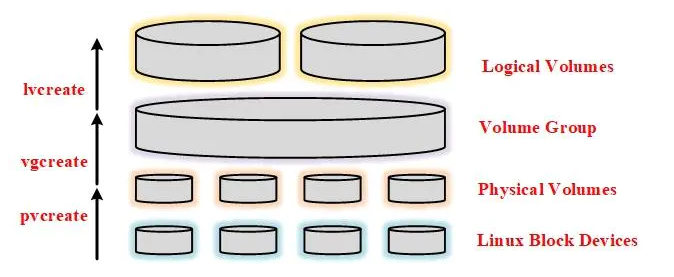

## 磁盘

### 挂载

```
mount -t  vfat /dev/sda1 /mnt/usb_disk/ -o iocharset=utf8   //vfat表示fat文件系统，-o iocharset=utf8为设置硬盘编码格式
```

拔出U盘需要先执行一个`sync`命令同步，然后再使用`unmount`进行U盘卸载。

注意：卸载之前需要退出`/mnt/usb_disk`目录，否则会提示设备忙，卸载失败。

```
df -h //查看挂载情况
```

### LVM

```
https://www.jianshu.com/p/a1bb79824b15
```

**Logical Volume Manager**

它是Linux环境下磁盘分区进行管理的一种机制，LVM是建立在磁盘和分区之一、硬盘分区与文件系统之间的一个逻辑层，来提高硬盘分区管理的灵活性。
 通过LVM，系统管理员可以轻松管理磁盘分区；先把硬盘制作成多个或仅一个分区，LVM把所有的分区制作成物理卷，可灵活的把多个物理卷组成一个卷组，在卷组基础上创建逻辑卷，最后在这个逻辑卷上制作文件系统、挂载使用即可。



**1）物理卷（Physical Volumes）：**

在LVM系统中的最底层，可以是物理硬盘上的分区，创建分区时必须指定分区格式为LVM所支持的格式即8e。硬盘分区后（还未格式化为文件系统）使用pvcreate命令可以将分区创建为pv。

 **2）卷组（Volume Group）：**

在PV基础上，通过vgcreate将一个或多个PV组合成VG，VG整合了多个PV，就如同整合了多个分区的硬盘一样。一旦PV被创建，可动态的将PV添加到VG中来实现扩容，且在LVM中可以创建多个VG。另外，创建VG时会将VG所有的空间根据指定的PE大小划分为多个PE，在LVM模式下的存储都以PE为单元，类似于文件系统的Block.
 **3）逻辑卷（Logical Volumes）：**

VG相当于是整合过的硬盘，那么LV就相当于分区，只不过该分区时通过VG来划分的，可动态缩减或扩容。VG中有很多PE单元，可以指定将多少个PE划分给一个LV，也可以直接指定大小（如多少兆）来划分。划分为LV之后就相当于划分了分区，只需在对LV进行格式化即可变成文件系统。
 **4）物理扩展（PE）：**

也称物理区域，是LVM中最小的存储单位也是物理卷中可用于分配的最小单位，PE是构成VG的基本单位，就如同block是构成分区的基本单位一样，PE的大小可以设定，也决定了LVM的灵活性。
 **5）逻辑扩展（LE）：**

PE是物理存储单元，而LE是逻辑存储单元，也即为LV中的逻辑存储单元，和PE的大小是一样的。

从VG中划分LV，实际上是从VG中划分PE，只不过划分LV后它就不再称为PE，而成为LE。