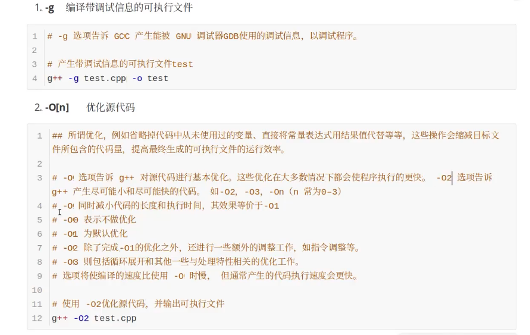
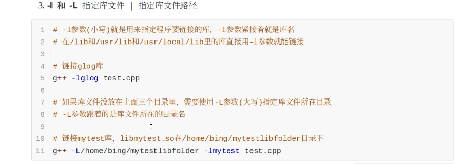
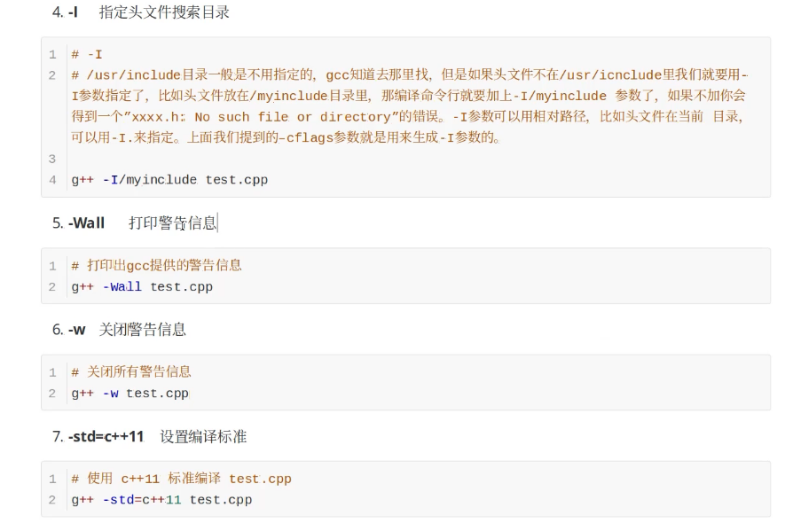
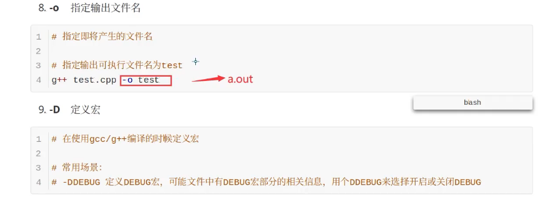
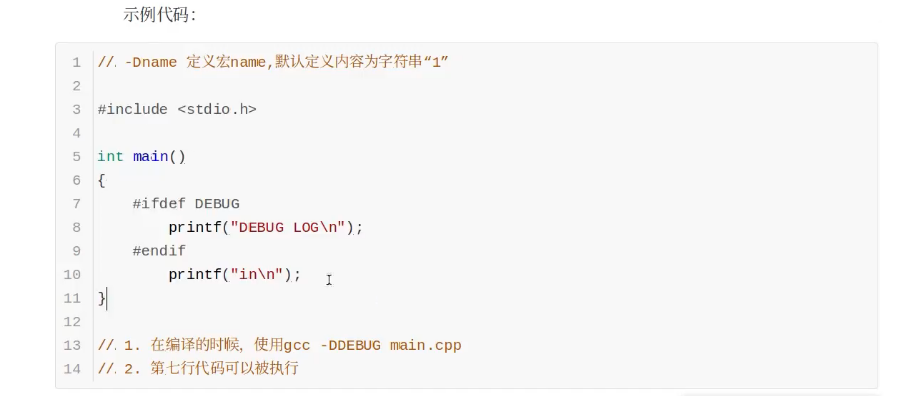

### 输出文件类型

```

```


### 主流编译器

```
https://blog.csdn.net/ZCShouCSDN/article/details/89553323
```

#### 编译过程

1. 预处理		//.i文件

   #扩展预处理宏定义、头文件

   gcc -E test.c -o test.i

2. 编译            //.s文件

   #-S编译选项告诉gcc在为C代码生成汇编文件后停止

   gcc -S test.i -o test.s

3. 汇编           //.o文件

   #-c选项告诉gcc编译器把代码编译成机器语言的目标代码

   gcc -c test.s -o test.o

4. 链接           //bin文件

   #生成可执行文件

   gxx test.o -o test

#### 参数












