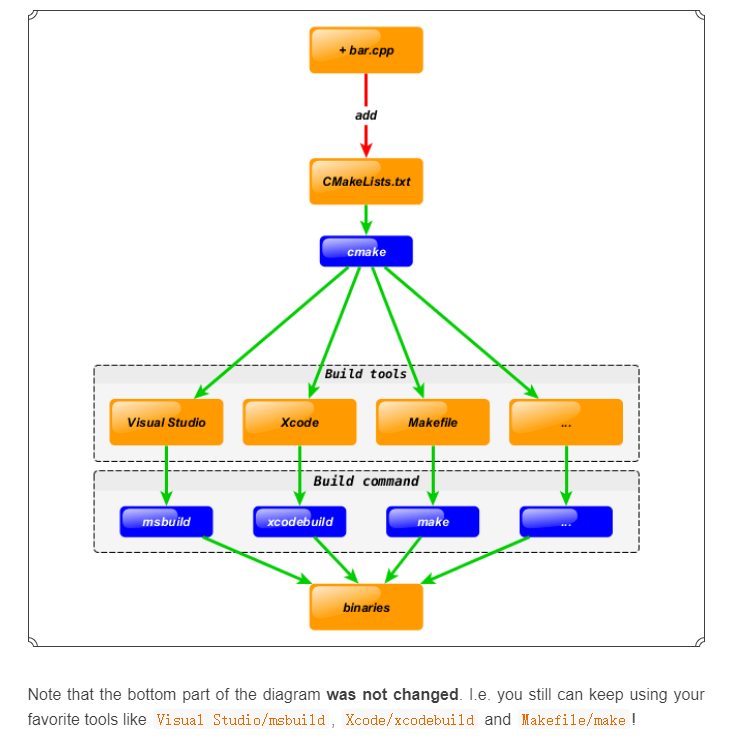
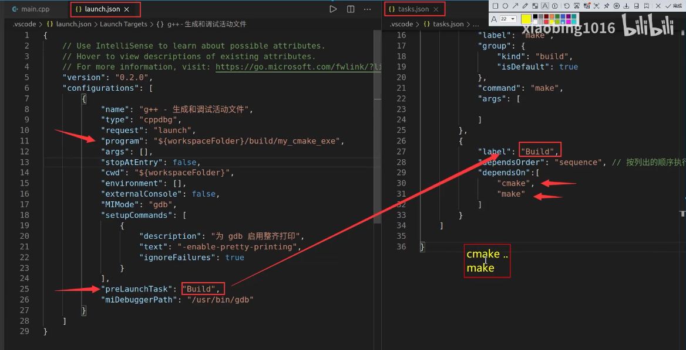
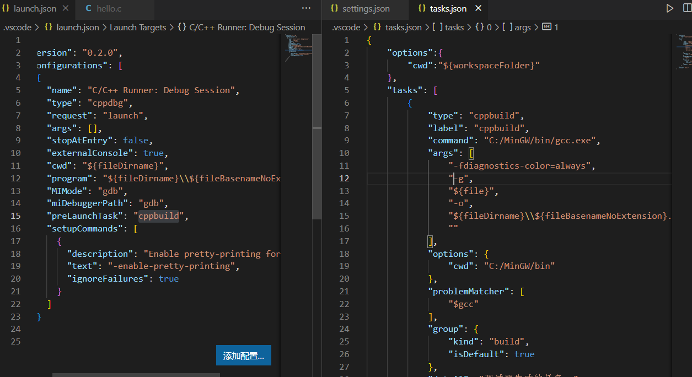

```
https://segmentfault.com/a/1190000019934297
```

### 编译过程

1. 预处理		//.i文件

   #扩展预处理宏定义、头文件

   gcc -E test.c -o test.i

2. 编译            //.s文件

   #-S编译选项告诉gcc在为C代码生成汇编文件后停止

   gcc -S test.i -o test.s

3. 汇编           //.o文件

   #-c选项告诉gcc编译器把代码编译成机器语言的目标代码

   gcc -c test.s -o test.o

4. 链接           //bin文件

   #生成可执行文件

   gxx test.o -o test

**CMake**是一个**跨平台**的安装**编译工具**，可以用**简单**的语句来描述**所有平台**的安装(编译过程)。



### 语法

#### 语法特性

- **基本语法格式：指令(参数 1 参数 2…)**

- - 参数使用**括弧**括起（例外：shell环境变量：$ENV{}）
  - 参数之间使用**空格**或**分号**分开

- **指令是大小写无关的，参数和变量是大小写相关的**

  ```
  set(HELLO hello.cpp)
  add_executable(hello main.cpp hello.cpp)
  ADD_EXECUTABLE(hello main.cpp ${HELLO})
  ```

- **变量使用${}方式取值，但是在 IF 控制语句中是直接使用变量名**

#### 重要指令和CMake常用变量

#####  重要指令

- **cmake_minimum_required** **- 指定CMake的最小版本要求**

  ```
  # CMake最小版本要求为2.8.3
  cmake_minimum_required(VERSION 2.8.3)
  ```

- - 语法：**cmake_minimum_required(VERSION versionNumber [FATAL_ERROR])**

- **project** **- 定义工程名称，并可指定工程支持的语言** 

  ```
  # 指定工程名为HELLOWORLD
  project(HELLOWORLD)
  ```

- - 语法：**project(projectname [CXX] [C] [Java])**
  - tips：[ ]为可选项, eg: project(HELLOWORLD C)

- **set** **- 显式的定义变量** 

  ```
  # 定义SRC变量，其值为main.cpp hello.cpp
  set(SRC main.cpp hello.cpp)
  ```

- - 语法：**set(VAR [VALUE] [CACHE TYPE DOCSTRING [FORCE]])**

- **include_directories - 向工程添加多个特定的头文件搜索路径** --->相当于指定g++编译器的-I参数

  ```
  # 将/usr/include/myincludefolder 和 ./include 添加到头文件搜索路径
  include_directories(/usr/include/myincludefolder ./include)
  ```

- - 语法：**include_directories([AFTER|BEFORE] [SYSTEM] dir1 dir2 …)**

- **link_directories** **- 向工程添加多个特定的库文件搜索路径** --->相当于指定g++编译器的-L参数

  ```
  # 将/usr/lib/mylibfolder 和 ./lib 添加到库文件搜索路径
  link_directories(/usr/lib/mylibfolder ./lib)
  ```

- - 语法：link_directories(dir1 dir2 …) 

- **add_library** **- 生成库文件**

  ```
  # 通过变量 SRC 生成 libhello.so 共享库
  add_library(hello SHARED ${SRC})
  ```

- - 语法：**add_library(libname [SHARED|STATIC|MODULE] [EXCLUDE_FROM_ALL] source1 source2 … sourceN)**

- **add_compile_options** - 添加编译参数

  ```
  # 添加编译参数 -Wall -std=c++11
  add_compile_options(-Wall -std=c++11 -O2)
  ```

- - 语法：**add_compile_options(**

- **add_executable** **- 生成可执行文件**

  ```
  # 编译main.cpp生成可执行文件main
  add_executable(main main.cpp)
  ```

- - 语法：**add_library(exename source1 source2 … sourceN)**

- **target_link_libraries** - 为 target 添加需要链接的共享库  --->相同于指定g++编译器-l参数

  ```
  # 将hello动态库文件链接到可执行文件main
  target_link_libraries(main hello)
  ```

- - 语法：**target_link_libraries(target library1library2…)**

- **add_subdirectory - 向当前工程添加存放源文件的子目录，并可以指定中间二进制和目标二进制存放的位置**

  ```
  # 添加src子目录，src中需有一个CMakeLists.txt
  add_subdirectory(src)
  ```

- - 语法：**add_subdirectory(source_dir [binary_dir] [EXCLUDE_FROM_ALL])**

- **aux_source_directory - 发现一个目录下所有的源代码文件并将列表存储在一个变量中，这个指令临时被用来自动构建源文件列表**

  ```
  # 定义SRC变量，其值为当前目录下所有的源代码文件
  aux_source_directory(. SRC)
  # 编译SRC变量所代表的源代码文件，生成main可执行文件
  add_executable(main ${SRC})
  ```

- - 语法：**aux_source_directory(dir VARIABLE)**

####  CMake常用变量

- **CMAKE_C_FLAGS  gcc编译选项**

  **CMAKE_CXX_FLAGS  g++编译选项**

  ```
  # 在CMAKE_CXX_FLAGS编译选项后追加-std=c++11
  set( CMAKE_CXX_FLAGS "${CMAKE_CXX_FLAGS} -std=c++11")
  ```

  **CMAKE_BUILD_TYPE  编译类型(Debug, Release)**

  ```
  # 设定编译类型为debug，调试时需要选择debug
  set(CMAKE_BUILD_TYPE Debug) 
  # 设定编译类型为release，发布时需要选择release
  set(CMAKE_BUILD_TYPE Release) 
  ```

  **CMAKE_BINARY_DIR**

  **PROJECT_BINARY_DIR**

  **<projectname>__BINARY_DIR**

- 1. 这三个变量指代的内容是一致的。
  2. 如果是 in source build，指的就是工程顶层目录。
  3. 如果是 out-of-source 编译,指的是工程编译发生的目录。
  4. PROJECT_BINARY_DIR 跟其他指令稍有区别，不过现在，你可以理解为他们是一致的。

- **CMAKE_SOURCE_DIR**

  **PROJECT_SOURCE_DIR**
  **<projectname>__SOURCE_DIR**

- 1. 这三个变量指代的内容是一致的,不论采用何种编译方式,都是工程顶层目录。
  2. 也就是在 in source build时,他跟 CMAKE_BINARY_DIR 等变量一致。
  3. PROJECT_SOURCE_DIR 跟其他指令稍有区别,现在,你可以理解为他们是一致的。

------

- **CMAKE_C_COMPILER：指定C编译器**

  - ```
    #set( CMAKE_CXX_COMPILER "$ENV{CROSS_COMPILE}g++")#rk3399
    #set( CMAKE_C_COMPILER "$ENV{CROSS_COMPILE}gcc")
    ```

    

- **CMAKE_CXX_COMPILER：指定C++编译器**

- **EXECUTABLE_OUTPUT_PATH：可执行文件输出的存放路径**

- **LIBRARY_OUTPUT_PATH：库文件输出的存放路径**

###  CMake编译工程

CMake目录结构：项目主目录存在一个CMakeLists.txt文件

**两种方式设置编译规则**：

1. 包含源文件的子文件夹包含CMakeLists.txt文件，主目录的CMakeLists.txt通过add_subdirectory添加子目录即可；
2. 包含源文件的子文件夹未包含CMakeLists.txt文件，子目录编译规则体现在主目录的CMakeLists.txt中；

#### 编译流程

**在 linux 平台下使用 CMake 构建C/C++工程的流程如下:**

- 手动编写 CMakeLists.txt。
- 执行命令 `cmake PATH`生成 Makefile ( PATH 是顶层CMakeLists.txt 所在的目录 )。
- 执行命令`make` 进行编译。

------

```
# important tips
.          # 表示当前目录
./         # 表示当前目录

..      # 表示上级目录
../     # 表示上级目录
```

------

#### 两种构建方式

- **内部构建(in-source build)**：不推荐使用

  内部构建会在同级目录下产生一大堆中间文件，这些中间文件并不是我们最终所需要的，和工程源文件放在一起会显得杂乱无章。

  ```
  ## 内部构建
  
  # 在当前目录下，编译本目录的CMakeLists.txt，生成Makefile和其他文件
  cmake .
  # 执行make命令，生成target
  make
  ```

- **外部构建(out-of-source build)**：==推荐使用==

  将编译输出文件与源文件放到不同目录中

  ```
  ## 外部构建
  
  # 1. 在当前目录下，创建build文件夹
  mkdir build 
  # 2. 进入到build文件夹
  cd build
  # 3. 编译上级目录的CMakeLists.txt，生成Makefile和其他文件
  cmake ..
  # 4. 执行make命令，生成target
  make
  ```

### 【实战】CMake代码实践

针对第五章写的两个小项目来写对应的CMakeLists.txt

####  最小CMake工程

```
# Set the minimum version of CMake that can be used
cmake_minimum_required(VERSION 3.0)

# Set the project name
project (HELLO)

# Add an executable
add_executable(hello_cmake main.cpp)#g++ hello.cpp -o hello_cmake
```

#### 多目录工程 - 直接编译

```
# Set the minimum version of CMake that can be used
cmake_minimum_required(VERSION 3.0)

#project name
project(SWAP)

#head file pat
include_directories( include )

#source directory files to var
add_subdirectory( src DIR_SRCS )

#add executable file  
add_executable(swap_02 ${TEST_MATH})

#add link library  
target_link_libraries(${FS_BUILD_BINARY_PREFIX}sqrt ${LIBRARIES}) 
```

#### 多目录工程 - 生成库编译

```
# Set the minimum version of CMake that can be used
cmake_minimum_required(VERSION 3.0)

#project name  
project(SWAP_LIBRARY)

#add compile options
add_compile_options("-Wall -std=c++11")

#set CMAKE_BUILD_TYPE
set( CMAKE_BUILD_TYPE Debug ) 

# set output binary path  
set(EXECUTABLE_OUTPUT_PATH ${PROJECT_BINARY_DIR}/bin)

############################################################
# Create a library
############################################################

#Generate the static library from the library sources
add_library( swap_library STATIC src/Swap.cpp )

target_include_directories( swap_lib PUBLIC ${PROJECT_SOURCE_DIR}/include )

############################################################
# Create an executable
############################################################

# Add an executable with the above sources
add_executable( swap_01 main.cpp )

# link the new swap_01 target with the swap_lib target
target_link_libraries( swap_01 swap_liby )
```

### json实现所见即所得

launch.json：调试文件；task.json：编译指令等集成在这里

program：可执行文件linux默认为a.out，windows为*.exe

preLaunchTask：launch.json对应tasks.json的label名字，调试工程前需要做的编译操作




