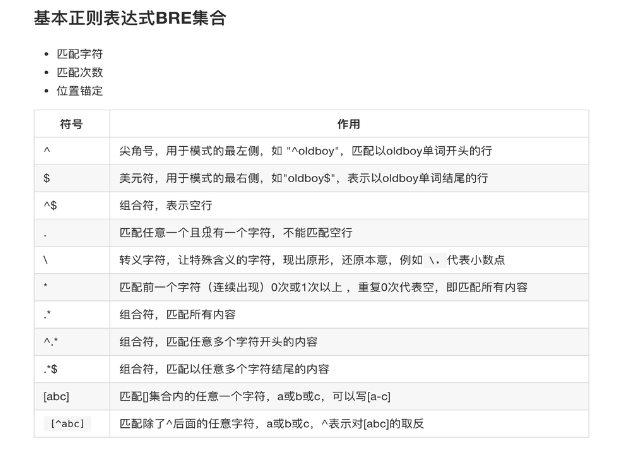
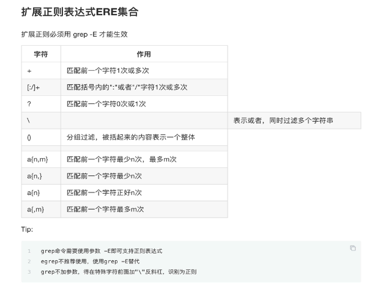

```
https://www.cnblogs.com/along21/p/10366886.html
```

## bash

```
#!/bin/bash
```

`alias`：别名

```
alias egrep='egrep --color=auto'
alias fgrep='fgrep --color=auto'
alias grep='grep --color=auto'
alias l='ls -CF'
alias la='ls -A'
alias ll='ls -alF'
alias ls='ls --color=auto'
```

### history

```
!!		   #执行上一次输入的命令
!行号		  #执行对应行号的命令
!关键字	 #上一个关键字相关的命令
```

### Tab键

```
tab补全信息
双击tab提示补全信息
```

## 正则表达式（REGEXP）

```
基本正则表达式：BRE
扩展正则表达式：ERE
```

通过特殊符号的复制，可以让linux管理员快速过滤、替换、处理所需要的字符串、文本。

仅受三剑客（sed、awk、grep）支持，其他命令不接受。

基本正则表达式（BRE、Basic Regular Expression）

```
^$.[]*
```

扩展正则表达式（ERE 、Extended Regular Expression）

```
增加了（）{}？+|等
```






## Linux三剑客

文本处理工具，均支持正则表达式

- grep:文本过滤工具，（模式：pattern）工具
- sed:streanm editor，流编辑器，文本编辑工具
- awk:linux的文本报告生成工具。

### grep

```
Global search REgular expression and Print out the line
```

文本搜索工具，根据用户指定的“模式（过滤条件）”对目标文件逐行进行匹配检查，打印匹配结果。

-  -A<显示行数>：除了显示符合范本样式的那一列之外，并显示该行之后的内容。
-  -B<显示行数>：除了显示符合样式的那一行之外，并显示该行之前的内容。
-  -C<显示行数>：除了显示符合样式的那一行之外，并显示该行之前后的内容。
-  -c：统计匹配的行数
-  **-e ：实现多个选项间的逻辑or 关系**
-  **-E：扩展的正则表达式**
-  -f FILE：从FILE获取PATTERN匹配
-  -F ：相当于fgrep
-  -i --ignore-case #忽略字符大小写的差别。
-  -n：显示匹配的行号
-  -o：仅显示匹配到的字符串
-  -q： 静默模式，不输出任何信息
-  -s：不显示错误信息。
-  **-v：显示不被pattern 匹配到的行，相当于[^] 反向匹配**
-  -w ：匹配 整个单词

```
grep '.' file -n	#找出除空行之外的行
grep '^$' file -vn	#找出除空行之外的行
grep '.*e' file -n	#贪婪匹配，从行首直到找到e字符，不管有没有到末尾

grep 'go?d'  -En 	#找出匹配到go开头，出现0或1次的d缀在后面
grep 'g(oo|la)'d -En#找出good或者glad，用（）表示通用领域
grep 'g..d' -En 	#找出g..d 
```

#### 分组和后向引用

- 分组：\(\) 将一个或多个字符捆绑在一起，当作一个整体进行处理

　　分组括号中的模式匹配到的内容会被正则表达式引擎记录于内部的变量中，这些变量的命名方式为: \1, \2, \3, ...

- 后向引用

引用前面的分组括号中的模式所匹配字符，而非模式本身

\1 表示从左侧起第一个左括号以及与之匹配右括号之间的模式所匹配到的字符

\2 表示从左侧起第2个左括号以及与之匹配右括号之间的模式所匹配到的字符，以此类推

\& 表示前面的分组中所有字符

### sed

Stream Editor

对文件进行快速增删改查

sed 是一种流编辑器，它一次处理一**行**内容。处理时，把当前处理的行存储在临时缓冲区中，称为“**模式空间**”（patternspace ），接着用sed 命令处理缓冲区中的内容，处理完成后，把缓冲区的内容送往屏幕。然后读入下行，执行下一个循环。如果没有使诸如‘D’ 的特殊命令，那会在两个循环之间清空模式空间，但不会清空**保留空间**。这样不断重复，直到文件末尾。**文件内容并没有改变**，除非你使用**重定向存储输出或-i**。

功能：主要用来自动编辑一个或多个文件, 简化对文件的反复操作

#### **常用选项options**

-  **-n**：不输出模式空间内容到屏幕，即不自动打印，只打印匹配到的行
-  **-e：**多点编辑，对每行处理时，可以有多个Script
-  **-f**：把Script写到文件当中，在执行sed时-f 指定文件路径，如果是多个Script，换行写
-  **-r**：支持**扩展的正则**表达式
-  **-i**：直接将处理的结果写入文件
-  **-i.bak**：在将处理的结果写入文件之前备份一份

 

#### 地址定界

-  不给地址：对全文进行处理
- 单地址：
  -  \#: 指定的行
  -  /pattern/：被此处模式所能够匹配到的每一行
- 地址范围：
  -  \#,#
  -  \#,+#
  -  /pat1/,/pat2/
  -  \#,/pat1/
- ~：步进
  -  sed -n **'1~2p'** 只打印奇数行 （1~2 从第1行，一次加2行）
  -  sed -n **'2~2p'** 只打印偶数行

 

#### **编辑命令command**

-  **d：删除**模式空间匹配的行，并立即启用下一轮循环
-  **p：打印**当前模式空间内容，追加到默认输出之后
-  **a**：在指定行**后面追加**文本，支持使用\n实现多行追加
-  **i**：在行**前面插入**文本，支持使用\n实现多行追加
-  **c**：**替换**行为单行或多行文本，支持使用\n实现多行追加
-  w：保存模式匹配的行至指定文件
-  r：读取指定文件的文本至模式空间中匹配到的行后
-  =：为模式空间中的行打印行号
-  **!**：模式空间中匹配行**取反**处理
- s///：查找替换，支持使用其它分隔符，如：s@@@，s###；
  -  **加g表示行内全局替换；**
  -  在替换时，可以加一下命令，实现大小写转换
  -  \l：把下个字符转换成小写。
  -  \L：把replacement字母转换成小写，直到\U或\E出现。
  -  \u：把下个字符转换成大写。
  -  \U：把replacement字母转换成大写，直到\L或\E出现。
  -  \E：停止以\L或\U开始的大小写转换

```
ifconfig | sed -e '2s/^.*inet//' -e '2s/net.*$//p' -n
ifconfig | sed '2p' -n| sed 's/^.*inet//'| sed 's/net.*$//'去除IP地址
```

### awk

awk是一种编程语言，用于在linux/unix下对文本和数据进行处理。数据可以来自标准输入(stdin)、一个或多个文件，或其它命令的输出。它**支持用户自定义函数**和动态正则表达式等先进功能，是linux/unix下的一个强大编程工具。它在命令行中使用，但更多是作为脚本来使用。**awk有很多内建的功能**，比如数组、函数等，这是它和C语言的相同之处，灵活性是awk最大的优势。

　　awk其实不仅仅是工具软件，还是一种编程语言。不过，本文只介绍它的命令行用法，对于大多数场合，应该足够用了。

-  -F fs：fs指定输入分隔符，fs可以是字符串或正则表达式，如-F:
-  -v var=value：赋值一个用户定义变量，将外部变量传递给awk
-  -f scripfile：从脚本文件中读取awk命令

#### 内置变量

- **FS** ：**输入字段分隔符**，**默认为空白字符**
- **OFS** ：**输出字段分隔符**，默认为空白字符
-  RS ：**输入记录分隔符**，指定输入时的换行符，原换行符仍有效
-  ORS ：**输出记录分隔符**，输出时用指定符号代替换行符
-  **NF** ：字段数量，**共有**多少字段， **$NF引用最后一列，$(NF-1)引用倒数第2列**
-  **NR** ：**行号**，后可跟多个文件，第二个文件行号继续从第一个文件最后行号开始
-  FNR ：各文件分别计数, 行号，后跟一个文件和NR一样，跟多个文件，第二个文件**行号从1开始**
-  FILENAME ：**当前文件名**
-  ARGC ：**命令行参数**的个数
-  ARGV ：数组，保存的是命令行所给定的各参数，**查看参数**
