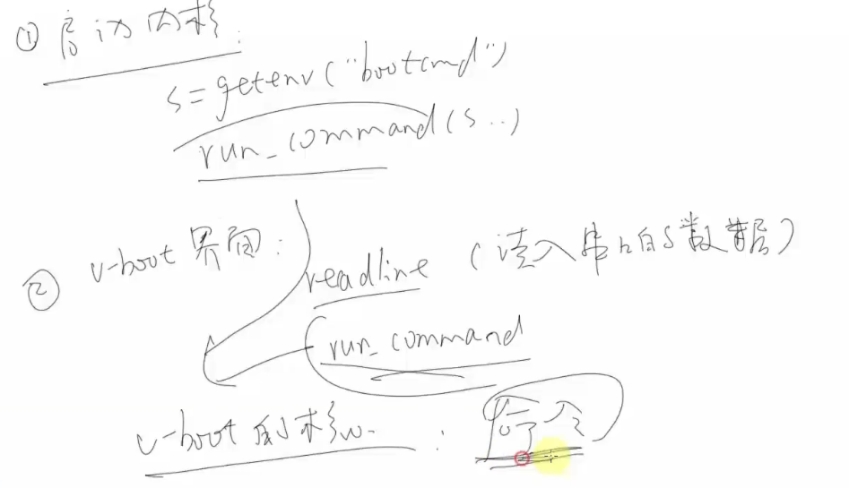

# Bootloader

上电后开发板从固化的ROM中加载程序，把u-boot从flash中引导入SDRAM，首先是加载小部分初始化SDRAM，然后将u-boot大部分内容加载，再把u-boot程序的入口加载进去，将内核加载进去后再加载系统文件根目录。（注意后面的不同芯片架构步骤也有不同，仅供参考）


BL1和BL2就是我们的u-boot

参考视频：

```
https://www.bilibili.com/video/BV1mV411h725?p=10&vd_source=0aba3a940ac8a077c3f146e344027e1d
```

## u-boot

Linux主流BootLoader引导程序。

### 


u-boot\board\rockchip\evb_rk3399

### Start.S

u-boot\arch\arm\cpu\armv8

《ARM-V* architecture reference manual》

ENTRY()等宏定义

可以通过aarch64-linux-gnu-objdump -S u-boot反汇编验证u-boot\arch\arm\cpu\armv8\start.S文件


### 功能

理解为复杂的单片机程序

- 硬件相关初始化
  - 看门狗
  - 网卡
  - 烧写Flash
  - 串口
- 从Flash读出内核
- 启动内核

### 初始化

- 单片机初始化
  - 关看门狗
  - 初始化时钟
  - 初始化SDRAM
  - 把程序从NAND -> SDRAM
  - 设置SP......
- u-boot初始化
  - 硬件初始化
    - 设SVC模式
    - 关看门狗
    - 屏蔽中断
    - 初始化时钟
    - 初始化SDRAM
    - 设置栈、SP寄存器指向某块内存
  - 调用C函数
    - 读出内核flash -> sdram
    - 清bss段
    - 启动内核

### 命令组成

从以下文件解析u-boot命令结构组成解析

common/command.c    u-boot.lds    config.mk   Makefile ...

eg:   s = env_get("bootdelay");

#### 命令编辑

hello.c  ->  do_hello作为入口函数象征命令 ->

在文件夹下Makefile加入hello.o

### 内核启动

bootcmd


bootm_headers_t

- 根据头部image_header_t移动到合适的地方do_bootm

- 启动do_bootm_linux
  - 设置参数
  - 跳到入口地址
    - theKernel
    - setup_start_tag(bd);
    - setup_memory_tags(bd);
    - setup_commandline_tag(bd, commandline);
    - .......
    - setup_end_tag(bd);



### u-boot启动流程及分析

在此之前通过rom初始化好DDR、SP等

然后进行中断向量表的初始化

### u-boot源码分析

1. 因为uboot会使用到一些经过编译才生成的文件，因此我们在分析uboot的时候，需要先编译一下uboot。

2. arch/arm/cpu/u-boot.lds就是整个uboot的链接脚本，u-boot目录下的lds文件就是根据其生成的

3. board/freescale/mx6ul_14x14_evk 重点

4. configs 目录是uboot的默认配置文件目录。此目录下都是以defconfig结尾的，这些配置文件对应不同的板子。

5. net主要是tftp\nfs等

6. 移植uboot时重点关注

   board/freescale/

   configs/*defconfig

7. 执行`make  *defconfig`生成.config，替换成对应目录下的`*defconfig`，里面有详细的uboot配置

8. 顶层README非常重要，需要读一下

9. 顶层Makefile

   

#### 顶层Makefile

```
$(MAKE)	 -c SUB_DIR	//到指定子文件夹中make，即嵌套
export VARIBLE	//导出变量给子目录
SHELL和MAKEFLAGS这两个变量除非使用unexport声明，否则始终贯穿传递所有子文件
```


```
make *defconfig
```


```
make
```


```
bootz:zImage 
bootm/i:uImage
```


